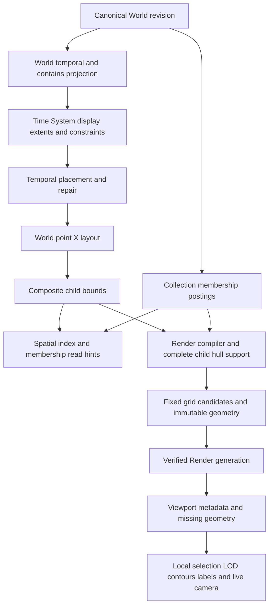

# Collection separation and shared Event layout architecture review

Date: 2026-10-10. Status: investigation and proposed design, not an adopted layout policy. Source and observed public Atropos SHA: `da75b82dbad83b830aac7d6363756baa4a702a44`. Production code, accepted specifications, canonical data, configuration and served pointers are unchanged.

The current layout cannot intentionally separate mostly independent Collections because Collection membership never reaches its placement algorithm. It preserves one World/Event identity and temporal Y, but its lateral forces optimize point separation and selected factual links rather than Collection readability. The best candidate is a **stable, constrained lateral layout with a separate Collection affiliation model and separate Collection overlay geometry**. A coarse placement stage is useful, but a strict Collection tree with one owner per Event is unsuitable for overlapping sets. Shared Events stay canonical and connect to multiple contexts; they do not act as unrestricted springs between whole Collections.

This recommendation is conditional on experiments, especially broad overlapping selections and shared Composite Events. It also requires reconciling the accepted membership invalidation rule before production adoption. The isolated fixed-anchor experiment establishes feasibility for exclusive cores, not the quality of automatic center placement or the full proposed architecture.

## 1. Current architecture

### Semantic authority

[CON-003.2–.7](../../constitution/CON-003-world-truth.md) defines Collection membership as selection, not ownership or ontological containment. One Event can belong to zero or many Collections within one World. A Composite is an Event with active `contains` children, not a Collection or a separate canonical entity type. [TS-002](../../technical-specifications/TS-002-canonical-data-model.md), lines 46–52, allows multiple containment parents in an acyclic graph and explicitly forbids inventing `contains` from membership. [TS-005.3](../../technical-specifications/TS-005-derived-models.md), lines 20–26, distinguishes Collection overlays from Composite regions and forbids selection changes from recomputing World layout or moving the camera.

An architectural constraint needs explicit attention: **TS-005.4, line 30, says membership changes invalidate selection/discovery indexes only.** A continuously membership-driven reoptimization would conflict with this accepted rule, even if Event dates and identity were preserved. Keep that rule during research. A production proposal must either preserve existing coordinates on membership-only changes through a reproducible placement ledger, or explicitly amend the dependency/invalidation policy after review. This report does not edit accepted authority.

### Evidence map

Paths and line numbers refer to the inspected SHA. Comments describing a module as “inactive” or “prototype” are not sufficient to establish runtime status; call sites below establish the active path.

| Ref | File, functions and lines                                                                                                                                                                                   | Confirmed responsibility                                                                                                                                                                                                                                                                                    |
| --- | ----------------------------------------------------------------------------------------------------------------------------------------------------------------------------------------------------------- | ----------------------------------------------------------------------------------------------------------------------------------------------------------------------------------------------------------------------------------------------------------------------------------------------------------- |
| S1  | `packages/contracts/src/v5.ts:16–32,55–69`; `packages/domain/src/v5.ts:94–110`                                                                                                                              | World-scoped Event and Relation records; separate unique Collection/Event membership pairs. Collections have no canonical coordinates.                                                                                                                                                                      |
| S2  | `packages/projections/src/v5-temporal.ts:16–86`, `projectV5WorldTemporal`                                                                                                                                   | Validates World state, derives Composite classification from `contains`, adapts all World Events into one temporal scope, then invokes relational-time projection. Collection membership does not constrain time.                                                                                           |
| S3  | `packages/graph-presentation/src/v5-world-layout.ts:19–22,67–209,214–222`, `prepareV5LayoutInput`, `buildV5WorldLayout`                                                                                     | Sorted World input per Time System; scalar adaptation; finite extents, ordering constraints, contains/causes links and anchored ancestor closure. No Collections or memberships in the input type; `dataset.canons=[]`. Fixed canonical engine selection.                                                   |
| S4  | `packages/graph-presentation/src/layout-engine.ts:55–69,190–301,303–357,379–445`                                                                                                                            | Pure browser/server engine registry: `legacy-force` and `deterministic-slots`. Production chooses legacy force with auto repulsion, 24 neighbors per side, 10 display-year window. Output is one shape per placed Event.                                                                                    |
| S5  | `packages/graph-presentation/src/urdr-chart-plane.ts:25–38,312–322,1165–1378,1548–1595,1998–2094`                                                                                                           | Seed points at X=0 except legacy fixed anchors; temporal placement/repair first, then lateral placement, then Composite bounds and display parent selection. X spacing 110, Y spacing 140.                                                                                                                  |
| S6  | Same file, `ContainedChildEnvelopeRegionStrategy:144–195`, `deriveCompositeRegions:1742–1842`, `normalizeContainedByAssignments:1102–1132`                                                                  | Low-level Composite shape is merged child bounds. Partial solved support can be emitted with diagnostics. One display `containedBy` is chosen for multiple parents; authored links are not deleted. This is not Collection hierarchy.                                                                       |
| S7  | `packages/graph-presentation/src/v5-render-hull.ts:18–94`, `buildRenderConcaveHull`; `v5-render-publication.ts:223–337,395–474`                                                                             | Compiler independently resolves authored child support bottom-up, detects cycles, builds Y-sweep polygons with convex fallback and 0.001-unit snapping, and publishes Composite support/completeness, anchor, padding and transition metadata.                                                              |
| S8  | `packages/graph-presentation/src/v5-spatial-publication.ts:31–68,75–102,143–174,188–209`                                                                                                                    | Builds World temporal/layout artifacts, attaches memberships after layout, builds spatial indexes, proves selected viewport membership completeness, optionally compiles Render artifacts.                                                                                                                  |
| S9  | `apps/lachesis-worker/src/index.ts:179–238,387–411`; `render-scheduler.ts:38–59,84–138`; `render-backfill.ts`                                                                                               | Exact-revision offline compilation/publication. Shadow mode can compile with canonical publication; deferred scheduler waits for queued writes, coalesces completed revisions and builds Render generations. Backfill uses the same producer. No incremental previous-position input is passed.             |
| S10 | `packages/graph-presentation/src/v5-render-publication.ts:477–516,548–584,595–615,667–803`; `v5-render-grid.ts:24–34,88–138`                                                                                | Stable Event/representation IDs, straight factual relation paths, externalized large geometry, fixed signed grid, closed-geometry replicas/overflow, bounded candidate selection and ancestor closure. Frame `(0,0)`, base span `4096×16384`, levels `−8..12`; not recomputed from occupied bounds.         |
| S11 | `packages/publication/src/v5-render-generation.ts:40–175,179–242`; `v5-render-index.ts:45–46,106–171`                                                                                                       | Content-derived immutable generation, authenticated asset indexes, upload/readback verification and guarded Render pointer replacement against canonical source revision/root.                                                                                                                              |
| S12 | `apps/atropos-web/src/components/v5-graph-page.tsx:85–121`; `v5-atropos-root.tsx:96–125`; `lib/v5-graph-read-loader.ts:50–94`                                                                               | Normal GraphShell uses Render viewport data when compatible generation exists. Revision-scoped client survives Collection toggles. `tileData=0` is the semantic-reader fallback; `renderTiles=1` selects a separate preview path.                                                                           |
| S13 | `apps/atropos-web/src/lib/v5-render-tile-client.ts:356–369`; `v5-render-viewport-client.ts:70–160,212–249`; `v5-render-density.ts:62–119`; `v5-render-viewport.ts:52–88`                                    | Normal `loadViewport` delegates to viewport client, not global manifest enumeration. Bounded metadata/geometry caches (default 16 MiB, pinned working set may exceed target), generation/revision guards, local membership filtering, density/ancestry admission and prepared World hulls.                  |
| S14 | `apps/atropos-web/src/urdr-port/src/components/graph-shell.tsx:2305–2358,2744–2756,3114–3120,3198–3201`; `components/geographic-renderer/live-camera.ts:3–68`; `composite-geometry-worker-client.ts:28–103` | Live camera channel; 120ms scene cadence, 32ms support checks, 96px preparation overscan/64px renewal. Worker prepares contour/spline geometry with one running and one latest pending job; renderer remains on main thread. These are screen geometry jobs, not World Event placement.                     |
| S15 | `apps/atropos-web/src/labs/layout/types.ts:5–52`; `layout-lab.tsx:62–77`; `load-snapshot.ts:128–155`; `geometry.ts:27–110`; `app/labs/layout/snapshot/route.ts`                                             | Isolated Lab snapshot includes membership outside `LayoutInput`. Lab computes candidates synchronously in `useMemo`, compares paired views, derives Composite geometry with the shared hull function, and saves local presets. Snapshot loader authenticates public data and pins current served root once. |

### Pipeline and coordinates



Membership reaches the indexes/compiler, not point placement. Neither the layout output nor current Render compiler emits a Collection hull primitive or a spatial Collection center. Published hulls are Event/Composite representations (`event:<id>:hull`), with `collectionIds` attached as selection metadata [S7, S10]. The specification permits a Collection overlay, but that intention must not be mistaken for an implemented enclosing Collection polygon.

Y is time: `(display scalar − board center)×140`; v5 uses center zero [S3, S5]. Gregorian scalar is an adapter-derived picosecond difference from year zero divided by `31,556,952×10^12`, an approximate mean-year display coordinate. It is not the canonical Gregorian date or a newly authored duration. Other Time Systems use their own adapters; unsupported conversion and non-finite/one-sided spans stay unplaced on this axis. Regions can become placeable from anchored descendants. Finite intervals are redistributed and jointly repaired against bounds/order; exact points must stay exact. Composite envelope Y and midpoint are descendant presentation support, not asserted Event time.

X is a non-temporal lateral coordinate. This allows horizontal separation, not arbitrary two-dimensional packing or a Collection-level time shift. Current legacy “canonId” is the private World scope token, not a Collection owner. Do not recover country lanes or old Canon-specific factual layouts from that name.

### What the lateral force actually does

`legacy-force` is a custom synchronous one-dimensional relaxation, not a general d3 graph simulation. Defaults are 32 iterations, inverse-square repulsion 0.03, semantic/temporal attraction 0.12, structural causes attraction 0.22, and step cap 0.22 lane units. Initial non-anchor X is zero. Equal-X tie direction follows Event ID collation. Cooling and clipping make coefficients interact; repulsion is not a collision guarantee [S4, S5].

Only already placed point endpoints participate in forces. Current v5 causes enter semantic links, so `causesAttraction` is a no-op for this adapter; `temporalAttraction` attracts causes and supplied temporal-constraint endpoint pairs. Multiple edges on one unordered pair take the largest coefficient rather than summing. `contains` creates hierarchy/support, not point X attraction. Relations involving Composite regions therefore do not automatically act like springs between their descendant points.

At **more than 500 total canonical Events**, including Composite and unplaced records, auto repulsion switches from all point pairs to temporally sorted peers: at most 24 each side within 10 display years. A dense row can have distant X points repelling each other while nearby X points outside the temporal-neighbor rank are not considered. A new Event can change the peer graph; bounded locality is not a collision or stability guarantee.

`deterministic-slots` greedily assigns the first temporally available lane, ordered by placed year then Event ID. It changes X before Composite derivation and preserves temporal mechanics. It has no Collection knowledge or general hull/label collision solver. It is a useful control, not a demonstrated Collection-separation solution [S4].

### Geometry, loading and stability are different layers

Compiler hulls use direct point support and child polygons. With at least three distinct direct Y samples, their boundary follows left/right extrema at those Y bands, sampling child polygons there; otherwise it uses a convex fallback [S7]. This can bridge empty time or lateral space. The function is a Y-sweep envelope, not an alpha-shape that arbitrarily separates disconnected membership components. The runtime adds screen-space padding/splines and changes hull/point/child visibility. Published bounds, full support, child-ID hints, padded paint bounds and viewport clipping are different objects; hints truncate at 128 children while full support can remain complete.

Zoom/pan/filtering do not rerun published Event X placement. They change visibility, relation filtering, labels, padded contour preparation and camera projection [S12–S14]. Spatial tile level is distinct from semantic LOD; negative/coarse levels must not erase still-large authored Composites. Density omission and delayed/partial assets can change what is visible without moving world coordinates. The 128 candidate cap is per bucket, not proof that every viewport transports only 128 candidates.

Tile replication also does not duplicate canonical Events: replicas deduplicate by stable representation ID; hull/point forms belong to the same entity. Fixed grid addresses resist new extrema, but do not stabilize recomputed Event X. Exact-revision publication rebuilds layout without previous coordinates, then publishes a verified generation. Atomic generation replacement avoids mixed artifacts; it does not prevent jumps between valid layouts.

The older `semantic-layout.ts` scoped adapter, `urdr-static-bake.ts` and URDR provenance are not the active v5 World placement choke point. [TS-009](../../technical-specifications/TS-009-latent-3d-graph-layout.md) is explicitly a draft historical latent-3D/JointJS proposal. It does not authorize 3D layout or describe the current custom WebGL2 plus native SVG pipeline. [CURRENT](../../implementation/CURRENT.md) and [IP-015 evidence](../ip015/checkpoint-2026-10-10.md) supersede older renderer/continuity descriptions. Public `/__status` matched the inspected SHA; it reported healthy public surfaces but an existing failed smoke result. This review does not claim a clean production smoke baseline.

## 2. Root cause analysis

The structural issue is an objective/input mismatch, compounded by stateless rebuilds and a containment-oriented geometry convention. Repelling Event points can spread them without forming coherent Collection regions. Attractive factual edges can shorten relations without separating unrelated contexts. A uniform force adjustment cannot distinguish two graphs with identical Events/facts/time but different Collection selections.

| Scenario                                                    | Current behavior and threats                                                                                                                                                                                                                                                                | Distinction needed                                                                               |
| ----------------------------------------------------------- | ------------------------------------------------------------------------------------------------------------------------------------------------------------------------------------------------------------------------------------------------------------------------------------------- | ------------------------------------------------------------------------------------------------ |
| A. No shared Events                                         | Concurrent independent Collections can interleave across the same X band. All-pairs repulsion distributes ID-ranked points; bounded repulsion uses temporal neighbors, not membership. No guarantee of coherent regions.                                                                    | Point separation is not Collection separation.                                                   |
| B. A few shared Events                                      | Adding membership alone does not move anything. Shared identity is preserved; no membership spring pulls Collections together. Any attraction is from qualifying Event-to-Event factual edges. Enclosing all members in a future Collection hull would stretch across other cores.          | Do not blame a current membership force that does not exist.                                     |
| C. Many shared Events                                       | Coordinates remain membership-blind. Many genuine causes/order links can affect point positions, while membership alone cannot. Broad overlap can be semantically appropriate; separation of entire all-member sets may be impossible.                                                      | Measure distinctive cores and actual set similarity, not universal disjointness.                 |
| D. One Event in 3+ Collections                              | One canonical shape with all memberships; no special k-way placement mechanism. With factual links it can participate as a point in relaxation; a shared Composite derives a region instead. Pairwise projection of membership in a candidate could falsely amplify its influence to O(k²). | A single hyperedge/incident Event, not k cloned Events or k(k−1)/2 independent facts.            |
| E. Large Collection includes smaller overlapping selections | There is no canonical Collection hierarchy. If membership is a subset, its independent packed region would contradict sharing or force moves. A broad theme can cover several separated event neighborhoods.                                                                                | Broad selection overlay can be multi-part; subset does not mean authored Event `contains`.       |
| F. New Events/Collections                                   | Membership-only additions leave placement unchanged. Dated Events change ID ties, force sums, local peer ranks, or interval clusters. A 500→501 transition changes the algorithm branch even for one unplaced Event. Every publication rebuild starts fresh.                                | Publication atomicity, fixed grid and incremental coordinate stability solve different problems. |

Current failure risks include interleaving, lateral fragmentation, genuine factual attraction connecting remote contexts, and large Composite envelopes caused by scattered actual descendants. A “misleading Collection hull” is currently a design risk, not an observed bug in an implemented Collection hull. A large valid Composite can legitimately span contexts. The user’s permission to exclude shared Events from a Collection hull must **not** be transferred to excluding authored children from Composite support.

Rendering/publication failures require separate diagnosis: absent parent metadata, truncated child hints mistaken for complete support, visibility-budget omission, stale generation errors or unfinished contour work can hide a coherent published region. Moving nodes or changing forces will not fix those failures. Conversely, a smooth renderer cannot make membership-blind coordinates coherent.

### Current public history is not the mostly-independent fixture

The authenticated read-only Lab snapshot observed at source/served **56** has **539 Events, 651 Relations, seven Collections**. The shared engine produces **430 point shapes, 109 Composite regions, no unplaced Events** on the selected Time System. Snapshot input digest: `a04bfed02a65e60cc3a7e9b2b5ab3fca0d0e9e2a7643c63710eb0c6c1694e9d0`; source root: `d2a6f32a3aec21e222c094363615c9f7ac4f8c3e0654106e3206c2c37d546a54`. The compressed public snapshot is retained in the evidence directory.

| Collections                      | Sizes     | Shared Events | Jaccard | Shared / smaller Collection |
| -------------------------------- | --------- | ------------: | ------: | --------------------------: |
| Korean / Japanese history        | 389 / 237 |           145 |   0.301 |                       0.612 |
| Korean / Chinese history         | 389 / 211 |           146 |   0.322 |                       0.692 |
| Japanese / Chinese history       | 237 / 211 |            48 |   0.120 |                       0.227 |
| Later Jin–Qing / Chinese history | 116 / 211 |           116 |   0.550 |                       1.000 |

These are membership counts including Composite identities, not independently dated atomic facts or evidence of political similarity. The observed Later Jin–Qing subset is selection inclusion, not an authored hierarchy. Actual history validation must preserve its substantial shared context. It cannot substitute for a controlled no-overlap fixture, nor justify country-specific rules.

## 3. Alternatives matrix

Let N be placed Events, E factual layout edges, M membership incidences, C Collections, K bounded spatial/temporal peers and I iterations. Costs below are expected algorithmic costs, not measured promises. Dense incidence, deep Composite support and tile replication can dominate any placement method.

| Candidate                                                         | Separation and shared Event behavior                                                                                                                                                                                                 | Semantic coordinates and stability                                                                                                                                       | Cost at 1k / 10k / 100k; incremental behavior                                                                                                                                                                                                                     | Compatibility, migration and failure modes                                                                                                                                                                                                             |
| ----------------------------------------------------------------- | ------------------------------------------------------------------------------------------------------------------------------------------------------------------------------------------------------------------------------------ | ------------------------------------------------------------------------------------------------------------------------------------------------------------------------ | ----------------------------------------------------------------------------------------------------------------------------------------------------------------------------------------------------------------------------------------------------------------- | ------------------------------------------------------------------------------------------------------------------------------------------------------------------------------------------------------------------------------------------------------ |
| Revised current forces/constraints                                | Without membership input, no intentional separation. Add normalized membership anchors, true local collision constraints and previous-position penalties to make it a viable candidate. Shared attraction must be capped.            | Keep Y fixed after temporal solve. Deterministic initialization/tie order and previous placement required; cooling alone is not stability.                               | Current X cost O(I(N²+E)) below cutoff or O(N log N + I(NK+E)) above. 1k practical offline; 10k/100k bounded branch plausible. Full pair mode unsuitable at 100k. Warm-start local updates feasible but changing force neighborhoods causes drift.                | Low/medium engine cost, medium/high dependency change. Same output fits tiles. Failure: tuning compensates clipping rather than objective, unrestricted springs collapse contexts, centers drift, temporal peers miss X collisions.                    |
| Strict hierarchical Collection placement then local Event packing | Good exclusive-core separation; fails when an Event belongs to multiple containers. Choosing an owner or duplicating the Event is unacceptable. A DAG/fuzzy affiliation stage avoids those errors but is no longer strict hierarchy. | Only lateral center/width packing is allowed. A free 2D hierarchy moves time. Persistent centers and slots needed.                                                       | O(C log C + N log N + M) for simple packing; dense conflict/order optimization more costly. All scales plausible offline with bounded overlaps. Stable insertion into reserved slots; full repacking cascades.                                                    | Medium/high cost: new centers, footprints and membership input. Existing publication can consume final Event shapes. Failure: arbitrary primary Collection, umbrella widths dominate, lane explosion, shared Composites cut across regions.            |
| Constraint/energy minimization                                    | Explicit separation, local cohesion and stability; supports one shared variable plus soft incidence constraints. No reason to require force simulation.                                                                              | Hard Y/bounds/order preserved. Fixed lateral ordering gives tractable continuous subproblems; optimizing all orders/crossings is combinatorial.                          | Sparse projected-gradient/coordinate or specialized QP subproblems roughly O(I(NK+E+M)), plus order search. 1k good experimentation; 10k/100k need temporal bands, multilevel warm starts and bounded constraints. Dense generic global solve can be prohibitive. | Medium/high cost; excellent artifact compatibility. Failure: infeasible hard containment/separation, local minima, solver tolerance/tie drift, uncalibrated weights. Incremental trust regions help.                                                   |
| Hypergraph/bipartite incidence layout                             | Natural one-Event/many-Collection representation. Maintains incidence without clique duplication. Pure spring embedding still collapses highly shared/broad selections.                                                              | Constrain Event Y; Collection center is a derived navigation anchor, not a date. Deterministic spectral/iterative methods need anchored orientation and prior positions. | O(I(M+E+NK)) for sparse relaxation. 1k/10k practical offline; 100k plausible if M sparse. Clique expansion costs sum of membership degrees squared and must be avoided/capped. Local incidence edits can trigger global spectral changes.                         | Medium/high input and model cost, same final shape contract. Failure: umbrella/hub collapse, eigenspace flips, disconnected-component drift, equal treatment of specificity and collection size.                                                       |
| Membership-aware communities                                      | Uses sets to form overlapping contexts; can give related Collections adjacency and split broad Collections into components. Communities are derived presentation structure, not new Events or truth.                                 | Constrained lateral projection required; unconstrained community graph algorithms distort Y. Stable cluster handles and hysteresis needed.                               | Sparse algorithms near O(I(E+M)) are feasible at all three scales; full C² comparison and dense clique projection are not. Local updates can change partitions globally.                                                                                          | Medium/high cost. Useful coarse evidence, not sufficient placement by itself. Failure: threshold-induced community switches, treating similar titles as facts, excluding sparse or uncollected Events, optimizing modularity rather than reader tasks. |
| Hybrid affiliation, stable lateral placement, separate hulls      | Separates distinctive cores; shared nodes retain one identity with multiple incidence cues. Broad/subset selections can span or overlap cores without demanding another packed territory.                                            | Temporal stage unchanged; centers/order persisted; shared nodes solved after coarse footprints or with tightly bounded feedback. Composite support remains authored.     | Target O(N log N + M + E + I(NK+M)) with sparse context neighbors; practical at 1k, prototype at 10k, worker/multilevel at 100k. Local insertion is stable until capacity exceeded; explicit rebalance is separate.                                               | Preferred candidate, medium/high total cost but staged. Failure: arbitrary anchor order, too many connectors, uncertain core definition, genuine shared Composite width, placement ledger dependency. Needs explicit membership invalidation policy.   |
| Overlay-only, preserve current Event positions                    | Can communicate Collections by contours, labels and highlights but cannot guarantee spatially separate Event cores when they interleave. Shared memberships remain exact.                                                            | Strongest coordinate compatibility/stability; no Event movement.                                                                                                         | Footprint computation O(N+M) plus hull work, offline at all sizes. Membership updates change overlays only.                                                                                                                                                       | Lowest risk and fully fits current invalidation semantics. Valuable control/first visualization experiment; failure: colored tangled overlays hide rather than resolve interleaving.                                                                   |
| Latent 3D or multiple context copies                              | Extra depth can untangle a view but canonical projection still lacks Collection objective. Context copies violate the explicit no-duplication goal.                                                                                  | Rotation/alternate coordinates complicate camera/semantic interpretation. TS-009 remains draft.                                                                          | Additional multi-view optimization and geometry costs; no evidence justifies it here.                                                                                                                                                                             | High cost, weak fit to current renderer/read contract. Do not adopt for this task.                                                                                                                                                                     |

The hierarchical hypothesis survives only in a limited form: **coarse context placement followed by one World Event solve**, with overlapping affiliation rather than nested ownership. It should compete with a flat constrained membership-aware solve. The experiment must be allowed to favor the flatter approach if coarse stages waste width, hurt genuine relationships or require frequent rebalancing.

## 4. Recommended design

### Separate four concepts explicitly

| Concept                   | Proposed representation                                                                    | May determine                                                                                                      |
| ------------------------- | ------------------------------------------------------------------------------------------ | ------------------------------------------------------------------------------------------------------------------ |
| Collection membership     | Exact canonical incidence pairs, 0..N per Event                                            | Selection, explanation, derived affinity; never ownership or invented factual edges.                               |
| Collection spatial center | Revision/versioned presentation descriptor, possibly several anchors over temporal support | Navigation labels, coarse adjacency/footprints; not a canonical Event/date or obligatory centroid of every member. |
| Event coordinates         | One World/Event/Time-System placement, with temporal provenance                            | Point position and descendant support for Composite geometry; independent of active Collection filter.             |
| Collection hull/overlay   | Derived core/multi-part contour plus incidence metadata and outside-core members           | Selection context visualization; no assertion that every member is contained.                                      |

### Proposed algorithm sequence

1. **Keep the current World temporal solve and placeability policy.** Pass its repaired Y to lateral candidates; retain exact dates, finite intervals, unsupported-system diagnostics and authored contains DAG. Changing temporal interpretation is outside this proposal.
2. **Build sparse affiliation from the immutable full snapshot.** Keep exact membership separate from factual edges. For experiments use exclusive members as an unambiguous core. For real histories with few exclusive members, test distinctive membership signatures and overlapping local communities; do not delete the broader membership. No country names, title keywords, authored importance or primary owner fields enter layout.
3. **Identify broad selection overlays before packing.** Exact subset/duplicate sets can reuse context footprints; partially overlapping umbrella sets can use several footprint components. They must not all be independent massive attractors. “Broad” is a presentation classification supported by incidence and temporal distribution, with thresholds tested on fixtures, not an inferred ontological hierarchy. Adding an umbrella should leave existing Event coordinates unchanged.
4. **Choose a stable coarse lateral order and occupancy profiles.** For a first candidate use one X anchor per distinctive core. Estimate needed half-width from concurrent occupancy in temporal bands, not total Event count. A millennia-long sparse Collection does not need the width of a dense one-day cluster. Reserve capacity. Place mostly independent cores with readable gaps where they coexist in time; use normalized affinity to propose adjacency. Freeze existing order/centers during routine updates; allocate new cores into capacity/free space. Later test piecewise X support profiles if fixed bands waste width; avoid wavy centers that make a Collection hard to follow.
5. **Solve Event X once with local constraints and prior-placement bounds.** Exclusive/distinctive core Events prefer their relevant support profile, with local collision/order constraints. Shared point Events get a single X variable at their factual Y. Use normalized, robust incidence distances and prior position; a weighted median/Huber compromise is a starting point, not an automatic global barycenter. Start with no shared-node feedback into coarse centers; permit bounded feedback only if human/metric comparisons show genuine improvements. Keep uncollected Events in World context and ensure direct navigation remains possible.
6. **Preserve shared Composite semantics.** An Imjin War Event with contains children is a region derived from those children, not an independently movable shared leaf. Solve each descendant point once, then derive the shared region/LOD anchor from full authored support. Its region may legitimately cross several contexts. Do not use its large envelope to repel every Collection or coerce all descendants into a single country lane. Incidence cues reference the Composite identity and visible hull/point representation. Nested multi-parent DAG cases require complete support checks, not a new tree owner.
7. **Generate Collection overlays independently of Composite hulls.** Compare lightly filled core contours, sparse bands and labels first. Allow disconnected components and holes when that is clearer than a long enclosing bridge. Shared/outlying members can have bounded membership connectors, border cues or an explicit outside-core count/list. A connector is a selection relationship, visually and interactively distinct from a factual Relation; it must never be persisted as `contains`/`causes`. At overview scale aggregate by context pair/signature without creating aggregate Events; on focus show actual incident Collections. Do not paint every membership edge at once.
8. **Publish completed geometry, not live simulation.** Feed final World shapes into the current spatial/Render generation infrastructure. New Collection descriptors/overlay representation kinds need a versioned contract and their own candidate budgets. Do not disguise them as Composite Events. Preserve fixed addresses, external geometry, support metadata, ancestor closure, stable representation IDs and immutable generation validation.

### How shared Events influence Collections

Membership is genuine set overlap, not necessarily causal or geographic closeness. Use it to inform coarse **adjacency preference**, not as an unbounded spring. A single Imjin War shared among three largely independent cores can occupy their boundary/common corridor and show three affiliations while each core remains coherent. Collections with many common Events may share a context footprint or lie adjacent. A small selection entirely inside a larger one should not force two separated territories.

Record both weighted Jaccard and directed inclusion fractions; raw shared count biases large Collections, while Jaccard alone understates a small subset. Give a k-membership Event a bounded total influence, using its incidence directly. A coarse graph projection, if needed, must distribute a fixed total budget among pairs rather than count one Event as k(k−1)/2 equal independent relationships. Estimate affinities sparsely from postings/signature aggregates; sample/cap high-degree signatures with explicit diagnostics rather than materializing all pairs at 100k.

The coarse solve should use normalized affinity as an adjacency ranking before choosing separation/gaps. This avoids the requirement that a small amount of sharing must shorten every Collection center distance. A stronger design with soft shared feedback is a competing experiment, not the default assumption.

### Stable publication and incremental placement

Add a presentation-only layout input version containing membership projection, previous-placement/anchor ledger, algorithm/parameters, allocation policy, temporal digest and all dependency hashes. The pure engine must have no store access; the publication worker supplies previous inputs. A previous layout is a reproducibility input, not an unrecorded warm-start hint. Immutable checkpoints plus deterministic replay/ledger export must rebuild the same result without relying on current store state.

Existing positions/order survive membership-only changes and distant additions. New Event placement uses nearby occupancy, relevant affiliations and actual factual neighbors. Touch only affected closure plus a measured local guard band. Changes to dates or contains may legitimately alter Y or large support; report these separately from gratuitous lateral movement. Reject silent fallback to a global rebuild. If reserve capacity is exhausted or constraints are infeasible, emit diagnostics and schedule an explicit new layout epoch/rebalance with measured displacement.

Zero displacement for all old Events, unrestricted insertion into a full fixed-width core, and hard collision avoidance cannot always be achieved simultaneously. Prefer unchanged unaffected regions, bounded local moves and explicit rebalance over pretending there is no trade-off. The first migration from membership-blind coordinates necessarily changes many positions; that is a versioned, reviewed one-time layout change, not a normal navigation update.

Membership-only reassignment cannot both relocate existing Events into a newly separated region and preserve their existing coordinates. During routine publication, keep the coordinates and express the new selection through overlays. Adopt a relocation/rebalance only as a deliberate presentation policy change. TS-005.4 must describe the ledger and which initial placement dependencies are permitted before any production membership-informed placement is adopted.

### Computation ownership

| Stage                                                                                                                                                 | Location                                                              | Boundary                                                                                                                                                                        |
| ----------------------------------------------------------------------------------------------------------------------------------------------------- | --------------------------------------------------------------------- | ------------------------------------------------------------------------------------------------------------------------------------------------------------------------------- |
| Temporal solve, affiliation summaries, coarse ordering, Event X solve, complete authored support, core overlays, indexes/tiles and incremental ledger | Offline Lachesis/publication worker                                   | Complete immutable World inputs; explicit revision/digests, runtime/storage budgets and no served switch until verification.                                                    |
| Candidate layout experiments                                                                                                                          | Existing isolated Lab; dedicated browser worker for larger candidates | Snapshot and preset only. Current synchronous Lab is useful at history scale but should not run 100k placement on the UI thread. No promotion endpoint.                         |
| Padded contour/spline preparation and bounded geometry caching                                                                                        | Existing browser geometry worker                                      | Visible support only; latest-wins cancellation/guards. Never reassign World Event coordinates from partial tiles.                                                               |
| Camera transforms, filtering, LOD/interpolation, final labels, selection/highlight and bounded affiliation cue admission                              | Interactive renderer/main thread                                      | Keep current WebGL2/native SVG engine and realtime camera lifecycle. No World layout solve, full incidence traversal or per-gesture hull rebuilding from incomplete membership. |

## 5. Objective function and calibration

This is a constrained optimization problem, but not a universal “make every Collection disjoint” objective. Let `x_i` be the single lateral coordinate of point Event i, `y_i` the accepted temporal placement, `c_b(y)` a context/core profile, `R_b` its footprint, and `x_i⁰,c_b⁰` previous published placement. Broad Collection overlays may reference multiple b. The variables are point X and derived context descriptors; Composite support derives from children.

**Hard priorities:** identity uniqueness; canonical membership and factual relations unchanged; exact Y/temporal bounds and valid ordering unchanged; unsupported Events remain explicit; authored containment support/completeness preserved; one revision/generation per scene; finite coordinates; reproducible inputs. Use constraints and diagnostics for these, not penalty weights. In high density, display omission is already permitted; full labels and non-overlapping filled regions at every scale cannot be hard requirements.

For fixed lateral order and chosen footprints, use a sparse energy such as:

```text
minimize over x and permitted core descriptors:
  Ecollision
  + λsep Ecore-separation
  + λcoh Edistinctive-core-cohesion
  + λshare Eshared-incidence
  + λfact Efactual-relation-length
  + λstable Eprevious-placement
  + λshape Eoverlay-complexity
subject to semantic invariants, local order and movement budgets
```

These λ symbols identify trade-offs; they are **not proposed numerical constants**. Prefer a lexicographic/Pareto workflow and explicit trust regions to hiding priorities inside one weighted sum.

For a fixed local ordering, a collision constraint can be `x_j − x_i ≥ r_i + r_j + gap` for concurrently displayed support pairs; the temporal coordinate never becomes a collision escape variable. For unrelated cores in a temporal band, apply separation to occupied intervals `c_b ± w_b`, not to all-member hull bounds. Soft separation can be the squared normalized gap deficit, averaged over occupied bands and core pairs, with related-pair contributions reduced by measured affinity. Density cases that cannot meet the chosen reading scale need explicit visibility/overflow policy rather than contradictory hard constraints.

A concrete shared-point term is `mean_i sum_(c in memberships(i)) (1/d_i) × Huber((x_i − port_c(y_i))/s_c)`, where d_i is membership degree and s_c is an interpretable local width/reading-distance scale. This bounds each Event's total incidence contribution and avoids clique expansion. A previous-placement term uses `Huber((x_i − x_i⁰)/110)` with `x_i=x_i⁰` for unaffected points and `|x_i−x_i⁰|≤δ_i` for explicitly affected points. In the default candidate, ports/centers are fixed while solving shared points, so this term cannot drag whole Collections. Relaxing that boundary would require a separately measured aggregate feedback budget. A shared Composite uses child support and membership cues instead of pretending its hull midpoint is this point variable.

| Term                    | Meaning and normalization                                                                                                                                                                                              | Conflict and calibration                                                                                                                                                                                                                                           |
| ----------------------- | ---------------------------------------------------------------------------------------------------------------------------------------------------------------------------------------------------------------------- | ------------------------------------------------------------------------------------------------------------------------------------------------------------------------------------------------------------------------------------------------------------------ |
| Collision               | Collision deficit of locally concurrent support using a documented CSS-pixel reading scale converted into world X/Y units. Labels remain a renderer problem.                                                           | Cannot satisfy all scales simultaneously. Use representative overview/middle/detail cameras and allowed density omission; do not move exact-time Events vertically to relieve density.                                                                             |
| Core separation         | Temporal-band overlap of unrelated/distinctive footprint support, normalized by smaller support area or band occupancy, alongside symmetric IoU. Attenuate for genuinely related/overlapping contexts.                 | Full membership hull overlap is inappropriate for subset sets. Calibrate a readable core gap in pixels through boundary-recognition tasks. Report macro and size-weighted scores.                                                                                  |
| Core cohesion           | Robust distance of distinctive members from their support profile; normalize by local width/capacity and effective member mass per core.                                                                               | Tight cohesion can collapse dense rows or create immense padded hulls. Compare crowding, width, lateral fragmentation and reading accuracy jointly.                                                                                                                |
| Shared incidence        | Robust distance to incident context ports at the Event’s fixed Y, with total per-Event influence bounded across memberships. Can be represented by a cue instead of moving a core.                                     | Long cues are preferable to moving an unrelated whole Collection. A center barycenter can land in a third core; exact boundary placement may be infeasible. Calibrate task success at finding all memberships and trace length, not raw shared displacement alone. |
| Factual edges/crossings | Shorten selected factual Relation paths only within locality and movement limits. Normalize by degree/type contribution, independently of membership. Count screen crossings where paths are simultaneously displayed. | Temporal order, cohesion and short edges can conflict. Crossing minimization with unknown ordering is combinatorial; keep it a secondary sampled diagnostic/local heuristic, not a global exact solver requirement.                                                |
| Stability               | Robust displacement from previous X and anchor/order changes, in lane units and CSS pixels at fixed cameras; temporal changes reported separately. Hard freeze unaffected regions.                                     | Fresh optimal packing can contradict stability. Budget the movements users can track, with explicit rebalance when capacity fails. Do not Procrustes-align away jumps in a user-facing stability score.                                                            |
| Overlay complexity      | Components, vertices, empty filled area, perimeter/area and cue count, normalized by supported data density.                                                                                                           | Few vertices/one component may produce a huge misleading bridge. Keep readability and omitted/outside-core membership explanations as safeguards.                                                                                                                  |

Size differences should affect required occupancy/capacity, not create force proportional to every member. Include macro averages so small Collections are not ignored, density-weighted results so a huge dense region is not hidden by averages, and worst-case/p95 by Collection size. Give broad/empty/no-distinctive-core sets separate outcomes rather than assigning them a fake zero-overlap success. Count Composite and descendant incidence without silently treating both as independent evidence of many distinct shared historical occurrences; compare direct Event incidence and support-level summaries separately.

Calibration should begin with interpretable units: minimal distinguishable core gap, allowable local move, acceptable cue length, local concurrency and representative camera pixel scale. Vary one parameter family at a time; sweep across fixture densities, size ratios and overlap fractions. Present a Pareto set for overlap, displacement, footprint width and task accuracy. Select the least complex feasible policy through blinded paired reader comparisons, then lock algorithm/version/parameters before evaluating held-out fixtures and public history. No aesthetically convenient force weight earns semantic authority.

## 6. Experiments performed and validation plan

### Reproducible evidence

[Research runner](collection-layout-review/experiment.ts), [raw results](collection-layout-review/results.json), [point comparison](collection-layout-review/comparison.html), and [public r56 snapshot](collection-layout-review/public-history-r56.json.gz) are evidence artifacts only. The runner imports the existing engine, temporal adapter and synthetic Lab state. It writes results and HTML in its evidence directory, never calls network, database, canonical-write or publication APIs. Public snapshot acquisition was an unauthenticated GET; its schema and input SHA-256 were verified before computation.

From repository root, with the pinned project dependencies installed:

```sh
node_modules/.bin/tsx docs/evidence/ip013/collection-layout-review/experiment.ts docs/evidence/ip013/collection-layout-review/public-history-r56.json.gz
```

All synthetic historical names/dates are fixture labels, not factual history. Six A–E variants have 120 exactly dated points, three concurrent 40-Event base Collections, hashed IDs unrelated to membership, with two-way/three-way sharing, high overlap, added factual causes and an umbrella selection. F adds one dated point, an umbrella Collection only, or one unplaced record at the algorithm branch boundary. Runtime assertions check repeated baseline determinism, unique output identities, unchanged temporal Y in the fixed-anchor control and membership-only shape invariance.

The control assigns equal-width anchors at −440/0/+440, local temporal slots, and one shared coordinate at the equal-incidence mean. These spacings are diagnostic controls based on existing 110-unit lanes, **not calibrated production choices**. It is not an implementation of automatic core discovery, optimized center placement, stability ledgers or shared Composite placement. Its umbrella behavior is deliberately recorded as a failure/undefined-core case.

The three-way control also puts the shared point exactly on the middle core's same-time point. The raw coincident-pair count and visual comparison expose this collision. Core separation alone therefore does not pass acceptance: shared-point collision constraints or another cue/placement compromise are necessary. The control preserves distinct identities despite coincident geometry.

### Findings

| Observation                                                              | Result                                                                                                       | Interpretation                                                                                                               |
| ------------------------------------------------------------------------ | ------------------------------------------------------------------------------------------------------------ | ---------------------------------------------------------------------------------------------------------------------------- |
| A no shared Events, membership-independent IDs                           | Mean padded bounding-box overlap 1.000 for baseline and slots, 0.000 for fixed anchors                       | Both current candidates interleave membership in this fixture. Fixed X anchors can separate exclusive cores while keeping Y. |
| B one three-way shared Event                                             | All-member box overlap 1.000 baseline/slots, 0.681 fixed anchors; exclusive-core overlap 0.000 fixed anchors | Shared identity need not pull cores together, but a boundary forced to contain every member still overlaps.                  |
| Membership-only changes A/B/C/E                                          | Byte-identical shape hashes                                                                                  | Current lack of membership influence is confirmed. This is not proof that shared factual links never affect layout.          |
| D shared point plus six factual causes                                   | Shape hash differs from A                                                                                    | Genuine qualifying factual edges affect lateral placement; distinguish these from membership.                                |
| E umbrella contains every selected Event                                 | All-member overlap 1.000; no exclusive cores                                                                 | A strict per-Collection anchor model is inadequate. Core overlap is not applicable, not a successful zero score.             |
| F one dated addition                                                     | 86/120 existing points moved; mean 48.7, p95 320.2, max 510.0 world units                                    | Deterministic rebuild is not incrementally stable. About 0.44/2.91/4.64 lane units respectively.                             |
| F 500→501 with one unplaced addition                                     | `/1`→`/2`; 119/120 points moved; mean 126.9, p95 352.7, max 633.6 world units                                | Algorithm branch changes can move placed Events even though no new placed support exists.                                    |
| F Collection-only addition                                               | 0 coordinate displacement                                                                                    | Existing semantics are preserved today and need explicit preservation in a candidate.                                        |
| Force ablations: repulsion ×10, 128 iterations, zero temporal attraction | Three-way all-member box overlap remains 1.000                                                               | These settings do not add a membership objective; not an exhaustive proof about all constrained force candidates.            |

Bounding-box overlap is `intersection/min(area A,area B)` with 10-world-unit padding to avoid degenerate exact point bounds. It is a **diagnostic extent metric**, not actual hull intersection, perceptual recognition or a rendering measurement. The padding has no semantic meaning. Full-member boxes intentionally expose the containment trap. The lateral variation diagnostic in raw results is not a sufficient spatial fragmentation metric. Reject a candidate that improves boxes by exploding width or hiding members.

Prepared-input scale runs use N exactly timed, no-edge points, 1/3 display-year spacing, the bounded production branch and three sequential runs per method. They include temporal placement/repair, X and output assembly, but exclude canonical/Gregorian projection, membership aggregation, deep hierarchy, hull compiler, tiling, upload and rendering. Cloud host: Linux x86_64, AMD EPYC 9V74; Node v24.19.0. These are elapsed-time samples, not mobile performance or a hard scaling guarantee. Exact values and all samples are in results.json.

|  Events | Legacy bounded force, median | Deterministic slots, median |
| ------: | ---------------------------: | --------------------------: |
|   1,000 |                      17.9 ms |                      4.6 ms |
|  10,000 |                     429.1 ms |                     58.8 ms |
| 100,000 |                    3542.2 ms |                    981.0 ms |

The measured order is tens of milliseconds, hundreds of milliseconds and seconds for the legacy method; slots are faster on this sparse fixture. Slots can still cost O(N²) when every point needs a new concurrently occupied slot (`findIndex` scans all lanes). Bounded force costs only describe the X stage, not all projection/geometry work. Three runs are not enough for a production p95. Neither candidate’s full publication cost at 100k was measured.

Focused existing regression verification passed **69 tests across 11 files**: layout engine/World identity, immutable production parity, Lab isolation and snapshot loading, hull parity, fixed grid, tile client and viewport cache/continuity. The existing distant-growth test compares 600 with 1,200 Events while both use the bounded branch; it does not cover 500→501 or dense local insertion. Its success and the new displacement findings are compatible.

The research runner also passed standalone strict TypeScript checking with ES2023, exact optional properties and unchecked-index protection. Formatting, report link resolution, snapshot digest verification and production-file boundary checks passed. The HTML comparison was opened in headless Chromium, checked for 360 plotted points, captured as [comparison.png](collection-layout-review/comparison.png) and visually inspected. This validates the evidence artifact, not production render performance.

The point comparison fits X independently in each panel and reports each world span; its common temporal scale is preserved. It is an algorithm diagnostic, not the production painter or real-device acceptance. Render frame time, human recognition, shared Composite quality and optimized hierarchy versus flat constraints remain validation work.

### Controlled fixture suite to extend

| Fixture family            | Required variants                                                                                                                                                    | What could fail                                                                                             |
| ------------------------- | -------------------------------------------------------------------------------------------------------------------------------------------------------------------- | ----------------------------------------------------------------------------------------------------------- |
| A independent contexts    | Equal and disjoint time spans; hashed/permuted IDs; no facts versus internal cause/order chains; uncollected Events                                                  | Accidental ID separation, chronology distortion, excessive empty width.                                     |
| B small overlap           | 1/5 shared points per pair; shared Event near temporal edge versus middle; no cross facts versus real bridges                                                        | Whole-core drift, long/misleading enclosure, hiding one affiliation.                                        |
| C dense overlap           | 10/30/70/100% overlap; almost-identical selections; density and size ratios 1:1, 1:10, 1:100                                                                         | Artificial disjointness, duplicate geometry, hub collapse, no distinctive cores.                            |
| D high degree             | One Event in 3/10/100 Collections; a shared Composite with distinct descendants and multiple contains parents                                                        | Clique amplification, illegible cue fan-out, false containment/ownership, discarded complete child support. |
| E overlapping umbrella    | Exact subset, duplicate, partial subset, several temporally distinct components, sparse empty Collection                                                             | Treating membership as tree, enormous single hull, suppressing small context.                               |
| F revision updates        | Append/insert 1 and 1%; add distant/extreme/unplaced records; 499/500/501; membership-only add/remove; date/contains correction; new Collection; capacity exhaustion | Unbounded layout drift, global index rebuild surprises, unresolved ledger reproducibility.                  |
| Temporal/hierarchy guards | Exact coincident points, finite overlap intervals, contradictory orders, unsupported axes, one-sided dates; depth 1/10/100 and broad support                         | Fake dates, time-axis movement, partial hull rendered as complete, hidden Composite identity.               |

Use the existing Lab for immutable public snapshot comparisons and small candidate prototypes. Its snapshot already carries exact Collection/Event sets; a new candidate input may consume them without loading additional canonical data. Its revision query is **an expected-current check**, not an arbitrary old-revision fetch: saved embedded snapshots/presets are necessary to replay r56 after the served pointer advances [S15]. No production runtime selector, canonical promotion or backfill is needed for the next experiment.

### Metrics and acceptance protocol

1. **Semantic correctness:** exact ID/membership sets and factual endpoints; one Event variable/geometry identity; unchanged temporal positions under X-only candidates; complete authored support and explicit unplaced/partial diagnostics. Every fixture and snapshot must pass before visual scores count.
2. **Region separation:** actual core-support overlap/IoU at concurrent temporal bands, macro and size-weighted statistics, contextual adjacency and unrelated-member intrusion. Report expected overlap separately for shared/subset selections. Diagnostic bounding boxes alone cannot pass this gate.
3. **Fragmentation/cohesion:** connected components and member reach in a defined local spatial-support graph, lateral trajectory variation by temporal band, wasted footprint area and total/p95 width. Normalize distance by reading scale/local density, not raw centuries. Splitting temporally disconnected contexts can be correct.
4. **Shared Event quality:** distance to incident core ports at fixed Y, connector visibility/length/crossings, whether all memberships can be identified, and whether a shared Composite’s complete descendants remain understandable. A median-distance score may improve by collapsing cores; always pair it with separation and human tasks.
5. **Incremental stability:** exact unchanged coordinates for unrelated regions and membership-only updates; mean/p95/max X displacement for affected existing points at fixed cameras; percentage moved, center/order changes, tile-address changes and reveal/selection continuity. Report legitimate temporal corrections separately. No coordinate alignment that conceals jumps.
6. **Performance:** engine phases/peak memory at 1k/10k/100k; full projection/hull/tile/index/upload time and artifact bytes; cold/warm viewport requests/bytes/object reads; worker queue time, decode/contour/label time, frame p50/p95/max and long tasks. Preserve current read budgets and candidate caps; additions far outside a fixed query must not cause linear growth in viewport work. Profile C and M as well as N.
7. **Navigation:** pan, anisotropic zoom, Collection toggle, incremental tile arrival, cache eviction, generation switch and failed/partial reads. World coordinates must be identical across zoom levels; compare settled support/paint after inverse projection, allowing documented padding and hull/point representation differences. A pixel-perfect polygon at every zoom is not the correct invariant.

Pre-register these initial research gates: zero semantic violations; zero unchanged-region/membership-only displacement; at least 50% reduction in unrelated **core-support** overlap relative to baseline on A/B across ID permutations, without more than 25% extra total footprint width at the same readability scale; bounded local affected-point movement (start with p95 ≤ one 110-unit lane, evaluate visible pixels in paired cameras); no omitted-membership cues falsely presented as complete. These numerical gates are falsification thresholds for experiments, not new product authority. Test nearby thresholds and held-out cases; if better recognition requires different width/movement, revise the gate explicitly before selection.

For render adoption, use the repository’s existing viewport budgets and A4 p95 ≤33.4ms/max ≤100ms as reported targets alongside unchanged-baseline comparison. The user’s IP-012 performance closeout remains respected: an old unmet numeric gate alone does not activate a new tuning task. New layout must show no material cold/warm navigation regression and retain bounded candidate/read work; actual iPhone 17 Safari **and PWA** evaluation remains necessary. Cloud browser/GPU timing is not a device result.

Human evaluation is necessary. Blind the candidate labels/order, keep cameras/scales comparable, and ask readers to identify an exclusive context, locate the single shared Event, enumerate its affiliations, distinguish a Collection selection from Composite contains, and follow a known factual relation. Measure correctness and completion time, then preference/confidence. Include the actual r56 high-overlap history and a mostly-independent held-out fixture. A candidate wins only if readers improve on separation tasks without degrading shared identity/time/containment understanding. Pure aesthetics or one proxy metric cannot decide.

### Smallest experiment that can falsify the design

Use three equal concurrent 40-Event contexts, one three-way shared **point**, then replace that shared point with a shared **Composite** whose children belong to different contexts. Compare (a) current baseline, (b) flat X constraints with normalized memberships and stability, and (c) coarse anchors plus local X constraints; show core overlays with the same explicit affiliation cues in b/c. Repeat with an umbrella and one-event insertion under frozen prior coordinates. All candidates share identical Y/IDs/full support.

The existing fixed-anchor point control is the first part of this experiment. The proposal is falsified or must be revised if its automatic cores cannot improve recognition/overlap without excessive width, if shared Composite support forces broad misleading regions that readers confuse with Collection containment, or if small updates require global movement. If the flat solver performs as well with lower complexity and better stability, discard the coarse hierarchy stage. If overlay-only fixes recognition while coordinates remain acceptable, stop at that smaller change.

## 7. Implementation roadmap and rollback

This is a proposed sequence for separately authorized implementation. None of these production changes are started by this review.

| Phase                                   | Small outcome                                                                                                                        | Acceptance                                                                                                                                                   | Rollback or stopping condition                                                                                                                                                                                        |
| --------------------------------------- | ------------------------------------------------------------------------------------------------------------------------------------ | ------------------------------------------------------------------------------------------------------------------------------------------------------------ | --------------------------------------------------------------------------------------------------------------------------------------------------------------------------------------------------------------------- |
| 0. Evidence and baseline                | Preserve this public snapshot, controlled fixtures, measurements and current algorithm/painter version                               | Replay hashes/semantic assertions; classify real membership overlap and current renderer/read path correctly                                                 | No runtime change to roll back. Keep dated evidence; do not rewrite old parity goldens.                                                                                                                               |
| 1. Lab comparison                       | Add isolated versioned candidate inputs and flat/coarse prototypes, including core overlay-only control                              | Smallest falsification experiment; blinded recognition; semantic gates; no production import/canonical-write capability                                      | Remove candidate/preset version from Lab if misleading; current canonical selection untouched.                                                                                                                        |
| 2. Stability and semantics contract     | Specify reproducible previous-placement ledger, initial placement membership dependency, broad overlays and rebalance policy         | Accepted TS-005/006 dependency reconciliation; deterministic replay; membership-only and unrelated-region positions unchanged; explicit capacity diagnostics | Do not proceed if semantics or rebuild reproducibility unresolved. Keep overlay-only option.                                                                                                                          |
| 3. Offline shadow compilation           | Compile candidate artifacts in a distinct versioned namespace; complete authored geometry and new overlay metadata, no served switch | Full 1k/10k/100k pipeline budgets; complete selection/hierarchy proofs; identical semantic projection digests; no global viewport manifest                   | Delete/rebuild candidate artifacts only. No canonical reset or served-pointer mutation.                                                                                                                               |
| 4. Reviewed observation checkpoint      | Offer a separately addressed, verified candidate generation using the existing rendering engine                                      | Real history plus mostly-independent fixture, Cloud regression flows and iPhone 17 Safari/PWA review; compare cold/warm and all interaction states           | Serve previous verified candidate generation or existing canonical layout. Reader fallback alone does not restore old coordinates.                                                                                    |
| 5. Adoption and incremental publication | Promote reviewed algorithm/version/parameters and ledger-backed incremental computation                                              | Explicit layout adoption; atomic complete generation; stable navigation; documented first-migration displacement and ongoing update budgets                  | Keep old immutable generation and layout ledger for compatible source revisions. For a newer canonical revision, recompile old algorithm against that revision; never silently mix revisions or point to stale facts. |
| 6. Optional refinement                  | Improve temporal-band footprints, bounded affinity feedback or hull simplification only when evidence identifies a failure           | Held-out visual tasks improve without semantic/stability/performance regression                                                                              | Revert only affected presentation policy/version; preserve canonical history and renderer baseline.                                                                                                                   |

The current algorithm is therefore **insufficient in inputs and objectives, not evidence that force-directed methods are fundamentally incapable**. Separate coarse Collection/context descriptors from Event coordinates and from both kinds of geometry. Treat shared Events as bounded incidence and genuine factual relations, allow meaningful overlap, preserve temporal semantics, and retain offline immutable publication plus bounded interactive reads. Choose the solver and whether coarse stages survive from the falsification experiment, not from a prior preference for hierarchy or forces.
