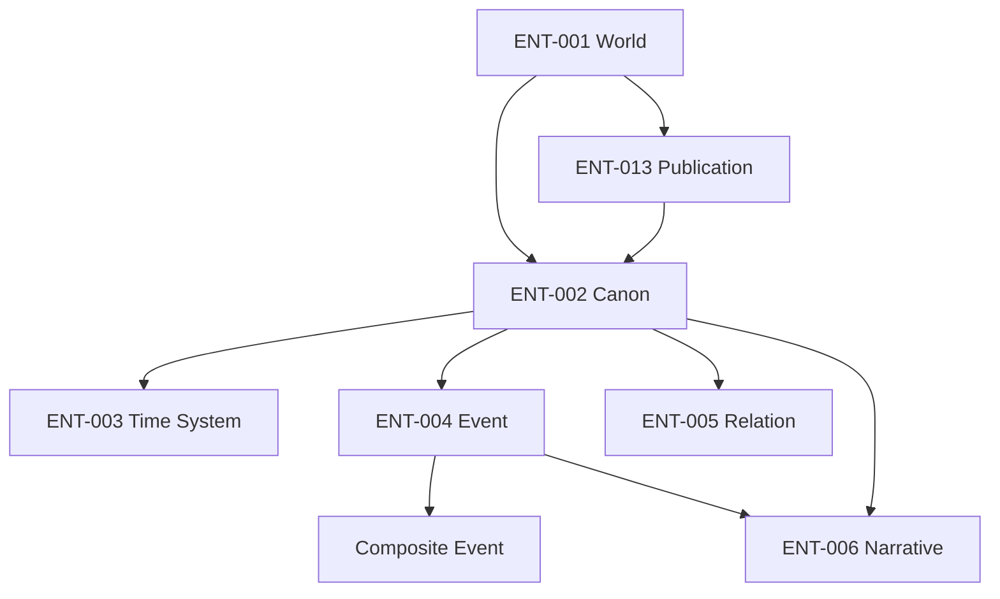

# 핵심 비즈니스 개념 관계와 책임

이 문서는 확정된 비즈니스 개념 사이의 의미와 책임 경계를 정의한다. 데이터 구조, API, 저장 방식과 구체적인 cardinality는 이후 기술 명세에서 결정한다.

## 개념 관계

## BCR-001 World와 Canon

ENT-001 World는 함께 작성·관리·탐색할 ENT-002 Canon을 묶는다. World 자체가 Canon 사이의 진위를 판정하지 않는다.

## BCR-002 Canon의 진실 범위

ENT-004 Event와 ENT-005 Relation은 특정 ENT-002 Canon 안에서 사실로 성립한다. 서로 다른 Canon의 사실은 모순될 수 있으며 한쪽이 다른 쪽을 덮어쓰지 않는다.

## BCR-003 Canon과 Time System

ENT-002 Canon은 ENT-003 Time System을 통해 Event의 시간을 읽을 수 있다. Time System은 Event의 의미를 시간축에 표현하기 위한 규칙이며 Canon의 우열을 만들지 않는다.

Time System의 공유 가능성과 한 Canon에서 사용할 수 있는 수는 이후 명세에서 결정한다.

## BCR-004 Event의 구성

ENT-004 Event는 단일 사건일 수도 있고 다른 Event를 포함하는 Composite Event일 수도 있다. Composite Event를 별도의 핵심 개념으로 만들지 않는다.

ENT-017 Process는 여러 Event 또는 Composite Event를 과정으로 읽은 파생 결과다. Process를 Composite Event로 표현하는 구현 가설은 이후 기술 명세에서 검증한다.

## BCR-005 Canon 내부 Relation

ENT-005 Relation은 같은 Canon 안의 Event 사이에서 성립하는 사실 관계다. 포함, 순서, 인과, 조건, 영향, 방해와 정체성 연속 등을 표현할 수 있다.

Canon 내부 Relation과 작성·관리·비교를 위한 Canon 간 연결은 같은 의미로 취급하지 않는다.

## BCR-006 Narrative의 범위

ENT-006 Narrative는 다음 범위를 서술할 수 있다.

- ENT-002 Canon
- ENT-017 Process
- Composite Event
- 단일 ENT-004 Event

범위가 다른 Narrative는 같은 개념이다. 상위 범위의 Narrative는 하위 Event, Relation과 Narrative를 대체하지 않는다.

## BCR-007 파생 개념

ENT-016 Subject, ENT-017 Process, ENT-018 State, ENT-019 Duration과 ENT-020 Timeline은 Event, Relation, Canon과 Time System에서 읽거나 계산한다.

파생 결과를 제공하기 위해 새로운 Canon의 사실을 만들거나 원본 의미를 변경하지 않는다.

## BCR-008 Canon 간 대응

서로 다른 Canon의 Event 또는 파생 Subject가 서로 대응함을 작성자가 명시할 수 있다.

Canon 간 대응은 다음 성격을 가진다.

- 어느 Canon의 사실도 아니다.
- Canon 내부 Relation과 구분되는 관리·비교 관계다.
- 연결된 Event나 Subject를 하나의 정체성 또는 사건 이력으로 병합하지 않는다.
- 일대일 관계로 제한하지 않는다.
- 공개된 범위 안에서 Atropos의 Canon 비교에 사용될 수 있다.

## BCR-009 Publication

ENT-013 Publication은 한 World에서 어떤 Canon과 내용을 독자에게 공개할지 정한다. 하나의 Publication은 공개 목적에 따라 여러 Canon을 포함하고 비교 경험을 제공할 수 있다.

저장, 작성 승인과 출판은 서로 다른 행위다. 출판되었다는 사실은 Canon의 진실 지위를 바꾸지 않는다.

## BCR-010 시스템 책임

| 시스템 | 비즈니스 책임 |
|---|---|
| Clotho | LLM이 World와 Canon의 기존 맥락을 읽고 Event, Relation과 Narrative를 작성·수정할 수 있게 한다. 출판 권한과 공개 독자 서비스를 소유하지 않는다. |
| Lachesis | World, Canon, Time System, Event, Relation, Narrative, 작성 유래와 운영 이력을 비공개로 보존·검증·관리한다. |
| Atropos | 인간이 결정한 Publication을 공개하고 독자가 Narrative와 세계 구조를 탐색·비교할 수 있게 한다. 유일한 공개 사용자 서비스다. |

## BCR-011 인간의 권한

인간은 LLM이 제안한 세계 내용과 Canon 간 대응을 승인·거부·정정한다. 무엇을 출판·갱신·철회할지도 인간이 결정한다.
