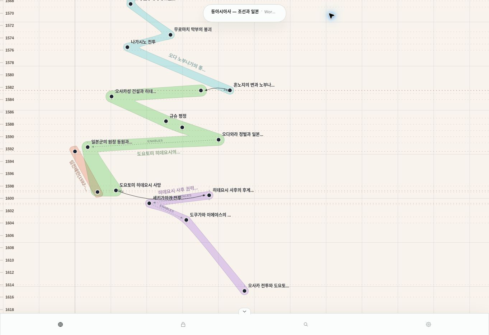

# IP-010 — 일본사 chronology 복구 검증

**World current/target/served = 30 / 30 / 30, ready.**

기능 PR [#127](https://github.com/neocjmix/moirai/pull/127), 병합 commit `bf96316152d99821fb103b29e1addfca019ea8f7`.

## 원인과 수정

일본사 Canon의 날짜는 `attributes`에만 존재했다. Time Event 관계는 0개였고, 공유 임진왜란 Event의 temporal Relation membership도 누락됐다. semantic projection은 이 상태를 relative-only/unresolved로 전달했다. 이후 `semantic-layout.ts`가 precedes의 component별 rank를 `{minYear:rank,maxYear:rank}`에 넣었다. chart-plane은 이를 140 pixels/year로 바꾸고 frontend Gregorian formatter는 그대로 연도로 표시했다. 사망1598이 rank2, 막부 붕괴1573이 rank4가 된 직접적인 이유다.

데이터·모델링·presentation layout 결함이 함께 있었다. semantic temporal projection이 이미 있던 Gregorian coordinate를 유실한 증거는 없다. 처음부터 canonical 시간 제약이 작성되지 않았다. layout /4는 명시적 `structural-order-display/1`에서만 rank를 허용한다. Gregorian/custom 시간축에서는 미앵커 사건을 진단과 함께 unplaced로 남긴다.

## Canonical 시간 모델

TS-010의 시간 사실은 **Event ↔ virtual Time Event Relation**이다. 연도만 알려진 사건은 `T(Y-01-01) not_after Event`, `Event precedes T(Y+1-01-01)`로 표현한다. January 1은 범위 경계이며 발생일 주장이 아니다. 설명 metadata는 precision·구력 원문·검증 상태·출처를 보존한다.

세 Composite의 contains17개를 유지했다. 별도 Duration이나 starts/ends를 꾸며 넣지 않았으며 descendant span으로 범위를 계산한다. 임진왜란 overview는 기존 부산진·최종 철군 사건을 재사용해 경계를 복원했다.

## 실제 데이터 교정

- 신규 atomic16개: 연도10 / 연도 범위3 / 검증된 Gregorian 일자3. 기존 가짜 GR 범위 metadata를 제거하고 원 일본 달력, precision, 출처, 변환 상태를 기록했다.
- 혼노지: 1582-07-01, 야마자키: 1582-07-12. 대야마자키정 자료가 명시한 신력 날짜를 채택했다. 한국 음양력 변환기를 사용하지 않았다.
- 신규 Composite3개의 출처와 descendant-span 설명 정정.
- 전체35 Relation 감사: 단순 연표용 precedes13개 membership 제거 및 historical withdrawal. contains17, causes2, enables2, influences1 유지.
- Time Event bounds32개 추가. 기존 공유 atomic4개의 시간관계8개를 일본사 Canon에도 채택.
- 부산진·최종 철군 Event membership2개와 overview contains2개 추가. Event 새 생성·삭제 **0개**.
- World ID/slug 유지, title을 `동아시아사 — 조선과 일본`으로 변경. description 범위를1380~1615로 맞췄다.

Change Set `01a10010-0000-7000-8000-000000000001`: r28→29,94 operations. `...000002`: r29→30,30 operations. 두 Live validate 모두 오류0/경고0. SQL schema migration 없이 Lachesis의 감사·revision·publication 경로로만 수정했다.

전수 목록: [Event 감사](event-audit.json), [Relation35개 판정](relation-audit.json), [계획1](plan-01.json), [계획2](plan-02.json).

## 보존 및 E2E 결과

- 전체 Event127개 identity 유지. 기존 일본사 외108 Event와359 Relation의 사실 내용 불변. Narrative160개, Canon, Time System 내용 불변.
- r28을 다시 Live export해 World/Canon/Event/Relation/membership/Narrative/Time System 전부 수정 전 snapshot과 일치함을 확인했다.
- 기존 임진왜란 Canon의 temporal positions와 Composite projections가 r28/r30 완전히 동일하다.
- 공유 사망·동원·부산진·철군 네 Event의 일본사/임진왜란 canonical temporal projection이 완전히 동일하다.
- 최종 일본사24 Event/64 Relation, spatial unplaced0, truncation 없음.
- 생산 graph query/spatial 좌표가 사전 export rehearsal과 일치한다. 실제 SVG의 Y 순서도 확인했다.

검증 파일: [데이터 보존](live-preservation.json), [production query/layout](production-after.json), [실제 SVG 좌표](rendered-chronology.json), [배포·commit·publication](deployment-and-publication.json).

## 테스트와 배포

[최종 기능 CI](https://github.com/neocjmix/moirai/actions/runs/35728933945): unit282 pass/2 기존 skip, PostgreSQL integration28 pass, mobile25 pass/1 기존 skip. format/lint/strict typecheck/서비스 경계/production build/secret scan/audit 모두 통과했다.

1573/1575/1582/1588/1598/1600 fixture는 publication→query→layout을 통과하며 topology 변경, contains, 다중 Canon shared identity/좌표를 검증한다. metadata update는 ID·membership·이전 revision·idempotent replay 보존을 DB에서 검증한다. 1k frozen spatial fixture의 기존 좌표도 보존했다.

Railway의 Atropos `9394b9fe-3410-4fdf-bef4-b054a3c69d57`, Clotho `9b37c4aa-52aa-4136-ba39-10143cff3c51`, worker `749cbd2f-53a8-4950-b4d1-a4574cb65983`가 모두 기능 commit으로 SUCCESS다. 공개 health/status에서 SHA를 read-back했다. [배포 후 공개·인증 smoke](https://github.com/neocjmix/moirai/actions/runs/35729563675)도 성공했다.

추가 실데이터 iPhone/desktop acceptance는 evidence PR의 `Japan published chronology on mobile and desktop` 단계에서 `tests/live/japan.spec.ts`로 실행한다. 실제 published spatial order와9개 핵심 Event의 drawer→Graph focus 및 연대 camera를 검증하고 화면을 artifact로 남긴다.

## 코드 변경 파일

| 영역 | 파일 |
|---|---|
| rank/calendar 분리 | `packages/graph-presentation/src/semantic-layout.ts` |
| canonical chronology 회귀 | `packages/graph-presentation/src/chronology-regression.test.ts`, `artifacts.test.ts` |
| attributes-only write contract | `packages/contracts/src/index.ts`, `clotho.ts` |
| authoring 검증 | `packages/domain/src/index.ts`, `index.test.ts`, `apps/clotho-api/src/mcp.ts` |
| 감사/history persistence | `packages/persistence/src/index.ts`, `change-set.integration.test.ts` |
| 교정 재현 및 사전 검증 | `scripts/history/japan-correction.py`, `verify-japan-correction.ts` |
| E2E/기존 spatial gate | `tests/live/japan.spec.ts`, `playwright.japan-live.config.ts`, `tests/e2e/moirai-scale.spec.ts`, `scripts/ip004-spatial-compatibility.test.ts`, `.github/workflows/ci.yml` |

## 남은 한계

일자 변환을 독립 검증하지 않은10개 사건은 연도 정밀도를 유지한다.3개 장기 과정은 연도 범위다. 넓은 zoom에서는 같은 해 사건의 label이 생략되거나 가까워질 수 있지만 canonical chronology는 역전되지 않는다. 과거 revision28 publication은 당시 snapshot으로 보존되므로 최신 revision30으로 열어야 한다.

의존성 audit의 기존 moderate2건은 Vitest/mocker 개발 도구 항목이다. high/critical0이며 이번 chronology 작업에서 의존성을 불필요하게 변경하지 않았다.

## 실제 수정 후 화면

