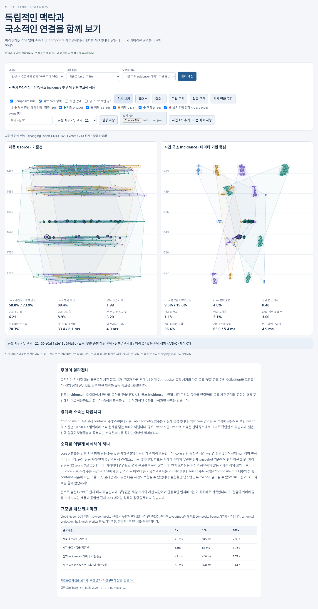
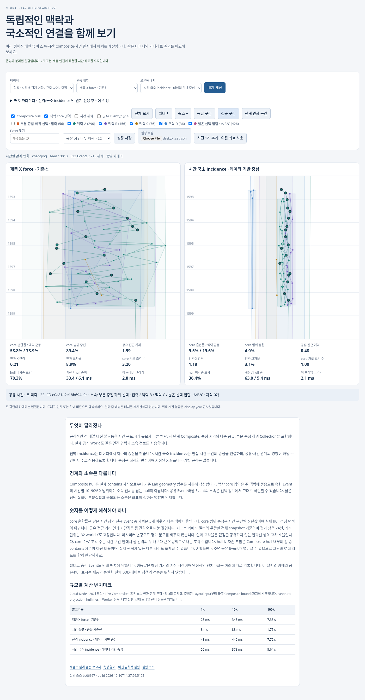
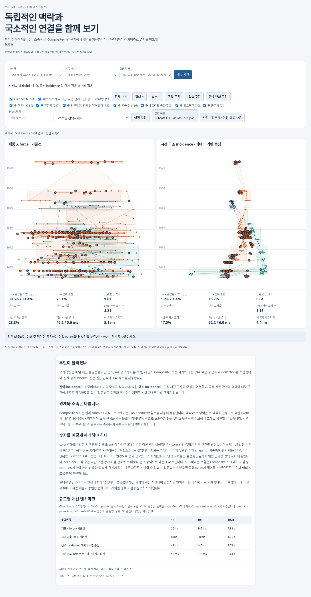

# Moirai Collection 레이아웃 실험 재검토와 v2

2026-10-10. 독립 연구 범위. [공개 비교](https://neocjmix.github.io/moirai/), [실험 소스](../../../scripts/layout-research/README.md), [원시 측정](../../../scripts/layout-research/measurements.json). 제품 코드 기준은 `da75b82dbad83b830aac7d6363756baa4a702a44`다. 운영 알고리즘 등록·canonical config·World 쓰기·backfill·served pointer 변경은 없다. 소스는 `research/collection-layout-v2`, 정적 배포는 별도 `gh-pages`다.

## 기존 실험의 근본적인 문제

기존 120-point 실험은 세 맥락이 동일한 시점마다 하나씩 나타나며, 임의 ID와 소속 이외의 구조를 거의 제공하지 않았다. Composite·인과 관계·불균등 밀도·다수 공유가 빠졌다. 고정 중심 비교군의 분리는 중심을 사람이 먼저 배정한 결과다. 따라서 문제 해결의 증거가 아니라 제한된 sanity control이었다. X 축을 각 패널에서 별도로 맞춘 초기 그림은 압축과 분리의 차이도 오해하게 할 수 있었다.

| 기존 비교군 | 실제 검증한 것 | 검증하지 못한 것 | 처분 |
| --- | --- | --- | --- |
| 제품 legacy-force | 실제 pure engine의 주어진 입력에서의 X 배치 | 소속을 모르는 엔진의 맥락 분리, 시간별 관계 | 동일 코드 기준선으로 유지 |
| 결정적 시간 슬롯 | Y를 유지하는 greedy 충돌 슬롯, 규칙적 X 압축 | community 발견, Composite 응집, 국소적 연결 | 보조 기준선으로 유지 |
| 고정 중심 + 한 공유점 | 미리 분리한 중심과 하나의 identity를 함께 표시할 수 있음 | 중심 발견, 중첩 DAG, 다수 공유, 증분 안정성 | [이전 페이지](https://neocjmix.github.io/moirai/legacy/)에 보존; 추천 후보에서 제외 |

슬롯은 쓸모없는 알고리즘이 아니다. 예측 가능한 충돌 처리·시간 보존의 대조군이다. 그러나 X 열이 여러 개 생긴다는 사실은 Collection이 구분된다는 뜻이 아니다. 고정 중심 역시 ownership과 geometry를 분리한 실험 통제이지만, 요구한 emergent separation을 입증하지 않는다.

## 실제 구현에서 확인한 경계

다음 링크의 행 번호는 제품 기준 커밋에 고정했다.

1. [v5-world-layout.ts:89](https://github.com/neocjmix/moirai/blob/da75b82dbad83b830aac7d6363756baa4a702a44/packages/graph-presentation/src/v5-world-layout.ts#L89)의 `prepareV5LayoutInput`은 temporal projection의 anchor·contains·causes·순서 제약을 World 단위 입력으로 만든다. [동일 파일:191](https://github.com/neocjmix/moirai/blob/da75b82dbad83b830aac7d6363756baa4a702a44/packages/graph-presentation/src/v5-world-layout.ts#L191)은 v5 axis를 `startYear=0,endYear=0`으로 고정한다. 날짜 없는 Event에 fallback Gregorian 사실을 만들지 않는다.
2. [layout-engine.ts:55](https://github.com/neocjmix/moirai/blob/da75b82dbad83b830aac7d6363756baa4a702a44/packages/graph-presentation/src/layout-engine.ts#L55)의 `LayoutInput`에 Collection membership이 없다. [379행](https://github.com/neocjmix/moirai/blob/da75b82dbad83b830aac7d6363756baa4a702a44/packages/graph-presentation/src/layout-engine.ts#L379)의 `CANONICAL_LAYOUT_SELECTION`은 legacy-force다. [421행](https://github.com/neocjmix/moirai/blob/da75b82dbad83b830aac7d6363756baa4a702a44/packages/graph-presentation/src/layout-engine.ts#L421)의 `computeLayout`을 실험 기준선도 직접 호출한다. 모조 force가 아니다.
3. [urdr-chart-plane.ts:312](https://github.com/neocjmix/moirai/blob/da75b82dbad83b830aac7d6363756baa4a702a44/packages/graph-presentation/src/urdr-chart-plane.ts#L312)의 `chronologyYearToWorldY`는 display-year당 140 world units다. X force는 temporal 배치 이후 적용되며, [1295행](https://github.com/neocjmix/moirai/blob/da75b82dbad83b830aac7d6363756baa4a702a44/packages/graph-presentation/src/urdr-chart-plane.ts#L1295)의 bounded repulsion을 사용할 수 있다. World Event 수가 500을 넘으면 auto가 bounded로 바뀐다. Composite·미배치도 그 수에 들어간다.
4. [urdr-chart-plane.ts:1742](https://github.com/neocjmix/moirai/blob/da75b82dbad83b830aac7d6363756baa4a702a44/packages/graph-presentation/src/urdr-chart-plane.ts#L1742)의 `deriveCompositeRegions`는 authored contains 자식으로 경계를 bottom-up 생성한다. 이것은 Collection containment가 아니다.
5. [Lab geometry.ts:28](https://github.com/neocjmix/moirai/blob/da75b82dbad83b830aac7d6363756baa4a702a44/apps/atropos-web/src/labs/layout/geometry.ts#L28)의 `layoutGeometry`와 [v5-render-hull.ts:61](https://github.com/neocjmix/moirai/blob/da75b82dbad83b830aac7d6363756baa4a702a44/packages/graph-presentation/src/v5-render-hull.ts#L61)의 `buildRenderConcaveHull`을 v2에서도 그대로 사용한다. 중첩 child polygon과 shared support를 임의로 삭제하지 않는다.
6. [Lab layout-lab.tsx:59](https://github.com/neocjmix/moirai/blob/da75b82dbad83b830aac7d6363756baa4a702a44/apps/atropos-web/src/labs/layout/layout-lab.tsx#L59)는 선택을 debounce하고 React memo에서 후보를 계산한다. v2는 별도의 작은 정적 호스트에서 Worker로 후보를 계산한다. [gestures.ts](https://github.com/neocjmix/moirai/blob/da75b82dbad83b830aac7d6363756baa4a702a44/apps/atropos-web/src/labs/layout/gestures.ts)은 동일 pure pan/pinch·축별 camera 수학을 재사용한다. production GraphShell·renderer는 수정하지 않았다.
7. [v5-render-grid.ts:26](https://github.com/neocjmix/moirai/blob/da75b82dbad83b830aac7d6363756baa4a702a44/packages/graph-presentation/src/v5-render-grid.ts#L26)은 고정 spatial frame을 정의한다. [compileV5RenderPublication:223](https://github.com/neocjmix/moirai/blob/da75b82dbad83b830aac7d6363756baa4a702a44/packages/graph-presentation/src/v5-render-publication.ts#L223)과 [buildV5RenderGeneration:40](https://github.com/neocjmix/moirai/blob/da75b82dbad83b830aac7d6363756baa4a702a44/packages/publication/src/v5-render-generation.ts#L40)은 계산된 World geometry를 불변 발행 자료로 만든다. 확대·타일 로딩마다 force를 실행하는 구조가 아니다.

실험에서 동일한 것은 시간 해결, 기준선 계산, snapshot 검사, hull 지원 기하, camera 수학이다. 다른 것은 새 X solver, 연구용 Canvas 표시, core 영역과 전체 snapshot 진단이다. 제품의 WebGL2·native label·LOD·publication cache·타일 viewport loading을 이 페이지가 재현하거나 성능 검증했다고 주장하지 않는다.

## 개선 fixture와 실제 자료

`fixtures.ts`는 기존 `createSyntheticLabState`의 Time System 계약을 재사용하고 실제 `projectV5WorldTemporal` → `prepareV5LayoutInput`을 통과한다. seed는 13013이며 ID도 hash로 만들었다. Event ID 순서가 Collection 순서 대신 분리를 해주지 않도록 했다.

- 기본 전용 사건 수는 A 240, B 110, C 48, D 24로 서로 다르다. 난수는 seed에 고정된 hash다.
- 1380·1460·1592·1650·1790 부근에 비균등 군집을 만들고 월·일과 군집 폭도 다르게 한다. 공유 관계가 없는 먼 시기를 포함한다.
- 28개의 공유 사건은 두 맥락 또는 세 맥락에 속하며 1592–1598과 1650–1658에 집중된다. 후반에는 연결되는 맥락 쌍이 달라진다. 인과 관계도 있다.
- root → phase → episode → Event의 세 단계 contains 계층, 공유 Composite, 부분 중첩 하위 선택, A/B/C를 덮는 넓은 Collection을 포함한다. Collection의 부분집합 관계를 contains로 꾸미지 않는다.
- 전체 522 Events, 713 Event 관계다. 450 primitive와 71 Composite가 배치되고 날짜 없는 1개는 미배치로 남는다.
- 독립 fixture는 공유 추가가 없다. dense-shared fixture는 100개 공유 사건을 사용한다. 추가 fixture는 기존 ID를 유지한 채 1594년 사건 하나와 실제 관계를 추가한다.
- 공개 역사 r56은 539 Events, 7 Collections, 651 Event 관계의 immutable Lab snapshot이다. 한국사 389, 일본사 237, 중국사 211이지만 상당한 중첩이 있어 “대체로 독립”인 합성 fixture의 대체물이 아니다. r56을 최신 revision으로 몰래 교체하지 않는다. 관계 종류는 contains 614, precedes 26, enables 7, influences 4이며 causes는 없다. 현재 후보는 contains·causes·precedes에 힘을 적용하고 enables/influences는 표시만 한다. 실제 자료의 인과 해석을 이 지표로 검증했다고 주장하지 않는다.

크기 stress fixture는 1k/10k/100k 전체 Events, 20개 맥락, 약 10% Composite, 군집 시간 분포·희박한 공유·인과선·두 단계 Composite를 포함한다. 이는 준비된 LayoutInput의 계산 stress이며 canonical projection 비용이나 실제 역사 가독성의 증거가 아니다. 실제 국가 이름은 UI의 평가 대상 선택에만 쓰이고 solver에는 없다.

## 대안과 선정 이유

| 대안 | 강점 | 주요 실패·비용 | 이번 판단 |
| --- | --- | --- | --- |
| 기존 force 계수·제약 수정 | pure engine·publication 재사용이 쉽다 | 입력에 소속이 없어 관계가 없는 맥락을 알 수 없다; saturating clipping과 500-event 전환 | 실제 기준선 유지 |
| 관계·Composite 전용 constrained graph | authored 연결을 모으고 Y를 보존 | 소속만으로 성립하는 맥락을 놓쳐 전체가 중앙에 섞임 | 구현·비교 |
| 전역 membership-aware force / hypergraph | 고정 좌표 없이 분리; 데이터 기반 자유 중심 | 짧은 공유 시기가 전체 역사 중심에 영향을 줌 | 구현·비교; 국소성 반증 대조군 |
| 엄격한 Collection→Composite→Event 트리 배치 | 큰 스케일 coarsening·부분 refinement 가능 | Collection은 겹치는 집합이고 Composite는 multi-parent일 수 있음; partition/복제/고정 레인 강요 위험 | 그대로 채택하지 않음 |
| 시간 국소 bipartite incidence + authored graph | 국소 연결과 독립 구간을 구분; 중복 identity 없음 | 창·연속성 민감도, 중심 순서 뒤집힘, 비볼록 해, broad hull 잔존 | 구현·후속 검증 대상으로 추천 |
| 범용 제약/에너지 solver | hard 시간, prior, 충돌, hull 등을 명시 가능 | crossing·hull 최적화가 비매끄럽고 대규모 전역 해가 비싸다 | 목적 정의와 후속 수렴 검증에 사용 |
| 별도 community detection + multilevel refinement | 연결 성분을 줄여 100k 비용 개선 가능 | 해상도에 따른 community merge/split이 인지 안정성을 깨뜨릴 수 있음 | 중첩 Composite를 활용한 다음 후보; 미구현 |

incidence는 force와 반대되는 선택이 아니다. Collection을 hyperedge 또는 가상 hub로 표현하고, constrained X relaxation으로 배치할 수 있다. 이번 결과로 범용 force가 근본적으로 부적합하다고 결론 내릴 수 없다. 현재 입력과 목적이 불충분한 것이 확인됐다. Collection과 Event 계산의 책임은 분리해야 하지만, Collection에 고정 좌표를 먼저 주는 트리 배치는 요구사항이 아니다.

## 구현한 후보와 목적

`engine.ts`의 `solve`는 기존 엔진에서 temporal geometry를 먼저 얻는다. 각 배치된 primitive는 단일 Event 변수를 갖는다. segment의 Y 끝점과 길이, Composite의 temporal Y 범위, 미배치 ID를 유지한다. `replaceX`는 수정된 자식의 전체 X support로 Composite bounds를 bottom-up 재생성한다. Composite에는 계층 응집을 위한 보조 X 변수가 있다. 이것과 최종 자식 support로 만든 Composite bounds 중심이 동일하다고 가정하지 않는다.

전역 후보는 Collection당 한 자유 hub를 둔다. 국소 후보는 epoch가 고정된 display-year 시간 격자에 자유 hub를 둔다. Event는 양쪽 구간에 선형 가중 incidence를 갖는다. 분할 위치가 새 최소/최대 날짜에 따라 바뀌지 않으며 국가는 입력에 없다. 초기 X는 Collection 좌표가 아니라 Event ID의 중립 hash다. hub는 해당 Event X의 평균에서 시작한다. X 중심은 relaxation 결과다. 중심이 시간에 따라 이동하도록 반드시 강제하지 않고, 시간 창과 연속성 비용으로 그 정도를 조절한다.

각 반복은 다음을 함께 계산한다.

1. Event↔local membership hub 응집. 다중 소속 Event의 총 영향은 소속 수로 정규화한다.
2. 같은 시간 구간의 hub 간 거리 부족 penalty. 목표 간격은 `spacing × (sqrt(localMassA)+sqrt(localMassB)) × localDistinctness`다. distinctness는 겹침/작은 집합 질량으로 계산한다. 완전히 포함된 선택 집합을 억지로 멀리 보내지 않는다.
3. contains·causes·precedes를 이용한 sparse 관계 응집. 시간 차이가 큰 연결의 X 영향은 감소하고, 큰 X 차이는 clipped robust gradient로 제한한다. authored 관계를 삭제하는 것은 아니다.
4. 인접한 동일 Collection hub의 시간 연속성. 관측이 없는 긴 구간을 보이지 않는 레인으로 이어 붙이지 않는다.
5. 시간 근접 primitive의 bounded repulsion. 시간 순서 가까운 후보 최대 16개를 사용한다. 완전한 2D 충돌 보장은 아니다.
6. 이전 published X에 대한 soft prior. 기존 Event 좌표를 인지 기준으로 삼고 새 Event는 자유롭게 정착시킨다.

널리 중복되는 선택 집합은 엄밀한 primitive 부분집합 비교로 layout 영향만 줄인다. 소속·Event ID·contains는 그대로다. 부분집합 추론 비용은 캐시하지만 많은 겹친 Collection에서는 병목이 될 수 있다. local hub repulsion 후보도 최대 24개로 제한하여 무제한 Event all-pairs를 피했다. 크기 stress의 20개 맥락에서 잘 작동한다는 사실을 수천 Collection의 검증으로 확대하지 않는다.

개념적으로는 `Y_i = temporalY_i`, 단일 ID, authored contains를 hard 조건으로 둔 뒤, membership 응집 + sparse 관계 X 거리 + local hub 겹침 + 시간 연속성 + 이전 좌표 이동을 최소화하는 문제다. hull 침입·경계 복잡도·선 교차는 별도 평가다. 현재 구현은 bounded, normalized, clipped relaxation prototype이며 명시적 에너지의 단조 감소나 전역 최적해를 증명하지 않았다. 따라서 “정확한 에너지 최소화 solver”라고 부르지 않는다.

우선순위는 identity·시간 의미 보존을 hard 조건으로, 그다음 안정성과 맥락/관계 가독성을 Pareto 평가로 둔다. 선 교차를 줄이려고 전체 역사를 구부리거나, 중첩 0을 위해 공유 Event를 멀리 보내는 해를 정답으로 삼지 않는다. 큰 Collection의 점 수가 평균을 지배하지 않도록 event-weighted와 Collection-equal 혼합률을 함께 기록한다.

### 파라미터와 보정

기본값은 90회, 시간 창 24 display-years, spacing 32 world X, 응집 0.7, 관계 0.35, 시간 연속성 0.12, prior 20이다. 32는 country spacing이 아니라 primitive의 world X 해상도 기준이다. 나머지는 같은 정규화 X 거리에서 경쟁하는 상대 강성이다. 과학적으로 추정된 고유 상수라고 주장하지 않는다.

시간 창 12/24/48 × 연속성 0/0.12/0.5, 응집 0.35/0.7/1.4 × 관계 0/0.35/0.7의 grid와 독립 seed 두 개를 추가로 측정했다. 예를 들어 관계 강성을 0에서 0.7로 높이면 인과선 교차가 줄어드는 반면 공유 접근 거리가 나빠지는 조합이 있었다. 24/0.12/0.7/0.35는 기본 합성 사례의 분리와 접근성을 함께 보여주는 설명 가능한 비교 설정이며 최종 채택값은 아니다. 창을 고를 때는 actual date density·Composite span과 무관한 전국 평균을 쓰지 말고, 실제 사건의 관계 지속 시간과 구간별 가독성 검토를 사용해야 한다. 이후에는 한 사례의 점수로 선택하지 말고 withheld World·seed·규모 계층에서 Pareto frontier와 사용자 판단으로 보정한다.

prior 2는 추가 한 사건 실험에서 cold recompute보다 p95 이동이 커졌다. prior를 준 해가 기존 비수렴 상태를 추가 relaxation하는 효과도 있어, prior가 있다는 사실만으로 안정성을 보장할 수 없다. 20은 같은 실험에서 이전 좌표 이동을 억제했기 때문에 증분 비교 기본값으로 선택했다. 여러 추가·삭제·관계 수정에도 검증해야 한다.

## 정량 결과

아래 quality는 동일 입력, 같은 시간 창 24와 spacing 32에서 측정했다. 전체 snapshot 지표이며 카메라 확대에 맞춰 지표의 분모를 바꾸지 않는다.

| 기본 합성 후보 | core 혼합률 | 맥락 균등 혼합률 | core 범위 중첩 | 공유 접근 거리 | 인과 X 간격 |
| --- | ---: | ---: | ---: | ---: | ---: |
| 제품 force | 58.8% | 73.9% | 89.4% | 1.985 | 6.205 |
| 시간 슬롯 | 57.3% | 73.8% | 100.0% | 0.109 | 1.675 |
| 관계 전용 | 54.8% | 71.2% | 93.2% | 0.359 | 0.598 |
| 전역 incidence | 4.6% | 14.4% | 0.0% | 4.362 | 2.003 |
| 시간 국소 incidence | 9.5% | 19.6% | 4.0% | 0.478 | 1.178 |

슬롯의 공유 거리가 아주 작아도 전체가 혼합되어 있으므로 성공이 아니다. 전역 후보는 중첩 0을 얻지만 공유 접근성이 가장 나쁘다. 국소 후보는 이 사이의 유용한 trade-off다.

- 기본 합성의 인과선 교차는 제품 1,706→국소 601. 끝점 공유를 제외한 교차율은 8.9%→3.1%다. 드로잉 edge crossing은 인과 해석 정확성 전체를 대표하지 않는다.
- 시간 구간별 core X 조각 수는 제품 평균 3.2→국소 1.0. 큰 X 공백 기준의 진단이며, 진짜 별도 과정의 분할이 항상 나쁜 것은 아니다.
- Composite hull 안에서 contains 자손이 아닌 점의 비율은 제품 70.3%→국소 36.4%. 전역은 1.9%로 더 낮았다. 국소 후보의 긴 Composite 경계 문제가 해결 완료된 것은 아니다. hull 내부의 다른 사건이 실제 연결된 사건일 수도 있어 이 수치를 misleading-area의 완전한 정의로 쓰지 않는다.
- 공유 100개에서는 국소 혼합 9.6%, 공유 거리 0.680. 1개 공유에만 맞춘 동작은 아니다.
- 실제 r56에서는 제품 혼합 30.5%→국소 1.2%, core 중첩 75.1%→15.7%, 공유 거리 1.066→0.642였다. 실제 자료에서 broad histories의 상당한 공유를 유지한 결과다. 이 snapshot은 인과 X 평가의 유효 표본이 없어 그 값은 UI에서 `—`로 표시한다.
- seed 23013/33013의 국소 혼합률은 18.2%/14.0%였다. 기본 seed의 9.5%만으로 일반화하지 않는다.

### 국소성의 직접 검증

동일 Events·시간 입력·authored 관계에서 공유 Event의 추가 주 맥락 소속과 접촉 하위 소속만 제거한 counterfactual과 비교했다. 원본 ID나 점 수가 바뀌지 않아 500-event 알고리즘 전환이 섞이지 않는다.

| 후보 | 연결 구간 평균 X 변화 (1580–1680) | 먼 구간 평균 X 변화 (<1530 또는 >1740) |
| --- | ---: | ---: |
| 제품 force / 슬롯 / 관계 전용 | 0 | 0 |
| 전역 incidence | 112.45 | 157.85 |
| 시간 국소 incidence | 50.20 | 0.21 |

앞 세 방식의 0은 안정성의 승리가 아니라 membership 변화를 입력으로 읽지 않기 때문이다. 국소 후보는 실제 관계 변화에 반응하면서 먼 시기의 영향이 작았다. 특정 fixture에 대한 반증 가능한 근거이며 모든 World의 영향 반경 보장은 아니다.

### 한 사건 추가의 기존 좌표 이동

450개 기존 primitive를 동일 world 좌표로 비교했다. rigid 정렬이나 중앙 이동 제거를 하지 않았다.

| 방식 | 평균 X 이동 | p95 X 이동 | 최대 X 이동 | 최대 Y 이동 |
| --- | ---: | ---: | ---: | ---: |
| cold recompute | 0.71 | 5.01 | 22.03 | 0 |
| previous X, prior 2 | 2.74 | 5.66 | 8.87 | 0 |
| previous X, prior 20 | 0.30 | 0.65 | 1.14 | 0 |

기본 UI의 추가 실험은 prior 20이다. 줌·패닝·Collection 필터는 geometry를 다시 풀지 않는다. 자동 smoke에서 출력 배열과 generation 불변을 확인했다. 새 Collection·1% batch·날짜 수정·삭제의 영향은 아직 측정하지 않았다.

### 규모·비용

Cloud Linux, Node v24.19.0, AMD EPYC 9V74. 준비된 입력부터 기존 temporal geometry와 후보 X 및 Composite bounds까지 각 3회 중앙값이다. canonical temporal projection, Worker structured clone, hull mesh, labels, renderer, 타일 발행은 제외했다. raw repetitions를 남겼고 100k 제품 force의 한 반복은 약 16.4초였다. GC·Cloud 실행 변동 때문에 중앙값만을 latency 상한으로 해석하면 안 된다.

| 후보 | 1k | 10k | 100k |
| --- | ---: | ---: | ---: |
| 제품 force | 24.9 ms | 344.7 ms | 7.38 s |
| 시간 슬롯 | 8.3 ms | 88.1 ms | 1.75 s |
| 전역 incidence | 43.0 ms | 440.0 ms | 7.72 s |
| 시간 국소 incidence | 54.8 ms | 377.8 ms | 8.64 s |

국소 prototype은 100k를 계산할 수 있으나 gesture 중 재계산에는 부적합하다. 전체 비용이 선형이라고 증명하지 않았다. 순서 정렬, incidence 생성, bounded sparse 반복 뒤에 기존 temporal engine과 Composite 처리가 붙는다. 부분집합 전처리와 대량 Collection도 별도 비용이다. 지표 계산에는 작은 fixture용 O(N²)/O(E²) 참조 계산이 있으므로 대규모 publication·interactive path에 넣어서는 안 된다. 메모리 peak, 실제 모바일 100k 렌더, end-to-end publication SLA는 미측정이다.

## 시각 비교와 UI

두 패널은 동일 `LabCamera`와 world 좌표 변환을 사용한다. 개별 auto-fit을 하지 않으며 후보 변경도 camera를 유지한다. 전체 보기만 두 결과의 합집합에 fit한다. 모바일에서는 비교 패널이 위아래로 배치된다. 드래그·다중 터치 pinch, 시간 구간 버튼, Event 검색·선택, Collection union 필터, 공유 강조, hull/관계/core 영역 toggle을 제공한다.

설정 JSON은 snapshot digest·알고리즘·파라미터·camera·필터·표현 선택을 저장한다. 복원 때 임의의 imported 좌표를 신뢰하지 않고 immutable source에서 다시 계산한다. 증분 설정은 초기 predecessor까지 재현한다. fingerprint가 다른 자료로 묵시적으로 바꾸지 않는다.

위 비교에서 국소 후보는 기존의 큰 분산을 줄이면서 시간별 중심 위치가 다르게 나타난다. 중심 선 자체를 고정 레인으로 그리지 않는다. 공유점의 검은 테두리와 정확한 소속 선택 정보로 연결을 확인한다. 넓은 Composite hull과 작은 점의 구분·밀도·선 선택은 여전히 사람이 평가해야 한다. 숫자만으로 가독성 수용을 선언하지 않는다. 색각 다양성과 실제 iPhone Safari/PWA 가독성도 별도 평가가 필요하다.

## 검증과 후속 기준

실험 engine 7개, 재사용 layout-engine 6개, Lab geometry 1개, gestures 9개 focused test를 실행했다. 단일 identity, 모든 temporal Y·미배치 보존, nested/shared child support, 순서 독립 결정성, prior 증분 이동, invalid parameter rejection을 확인했다. strict root typecheck, 실험 lint·format, 정적 build, secret scan을 수행한다. browser smoke는 데스크톱과 iPhone 14 크기의 Chromium touch emulation에서 pan·실제 CDP 다중 터치·카메라 공유·필터 무재계산·설정 복원·증분 복원·r56 전환·가로 overflow·script 오류를 검사한다. Chromium emulation은 실제 iPhone 17 Safari/PWA 증거가 아니다. WebKit 실행은 Cloud 시스템 라이브러리가 없어 수행하지 못했다.

운영 적용의 권장 다음 단계는 전체 트리 배치 채택이 아니라 이 국소 incidence 가설을 기존 Layout Lab의 실험 adapter에 좁게 옮기는 것이다. 다음 단계별로 acceptance와 rollback을 둔다.

1. **반증 fixture 확대**: seed·시간 창·밀도 1:100, shared 0/소수/다수, 다중 부모, 새 Collection, batch 1%·삭제·날짜 수정. ID·Y·unplaced는 exact invariant. 맥락 균등 혼합률과 공유 접근성이 기준선보다 함께 나아져야 한다. batch p95 기존 X 이동은 초기 목표 spacing의 0.1배 이내로 두되 의미 있는 큰 관계 수정에는 명시적 예외가 필요하다. 실패하면 후보를 연구용으로 유지한다.
2. **현재 Lab adapter**: 후보 registry를 연구 경계에만 추가하고 현재 renderer·representation preset·real World fixtures로 비교한다. 동일 카메라에서 자동 캡처와 모바일 사용자 검토를 수행한다. core 혼합률 감소 때문에 shared Composite 설명이 나빠지거나 시간이 다른 맥락이 새로 섞이면 수용하지 않는다. 철회는 Lab 후보 제거다.
3. **multi-level / convergence 실험**: authored Composite DAG를 coarsen한 뒤 local refinement, residual·iteration budget·메모리 peak를 비교한다. Collection을 disjoint tree로 강제하지 않는다. 100k 처리시간·수천 Collections·mesh와 전체 publication 비용을 측정한다. 최적화로 identity·hull support가 변하면 폐기한다.
4. **발행 통합 전 검증**: membership을 명시적으로 versioned input과 digest에 포함하고 World-wide geometry authority를 유지한다. 이전 Publication의 좌표·고정 spatial grid를 prior로 사용한다. 완전한 snapshot에서 offline 계산·hull 준비·타일 compile·immutable generation 검사를 끝낸 뒤 별도 승인을 거쳐 canonical 후보를 채택한다. viewport나 부분 타일 로딩으로 solver를 실행하지 않는다. rollback은 이전 immutable generation pointer이며 canonical 사실을 되돌리지 않는다.

가장 작은 반증 실험은 **원본 World에 특정 시기의 shared membership만 추가/제거하고 같은 두 후보의 먼 시기 geometry 이동을 비교하는 것**이다. 이번 구현은 이미 그 실험을 포함하며 전역 방식의 국소성 실패를 관측했다. 이어서 동일 구간에 소수의 새 Collection과 multi-parent Composite를 추가했을 때 국소 후보의 중심 순서가 뒤집히거나 prior가 관계 가독성을 망가뜨리면 추천을 철회해야 한다. 이것이 점 사이 평균 거리보다 의미 있는 falsification이다.

## 공개 배포 확인

GitHub Pages `gh-pages` 배포 커밋 `4c3723c8dd19509c880eda98e9ac50e5e73293ed`의 build 완료를 확인했다. 배포된 구현 소스는 `bc06167ae26fd53050f70355981b105a3079d191`이며, 이후 증거 문서 변경은 운영 알고리즘이나 정적 실행 파일을 바꾸지 않는다. [Draft PR #344](https://github.com/neocjmix/moirai/pull/344)에 연구 소스와 검증을 함께 제출했다.

[공개 URL smoke](collection-layout-v2/public-smoke.json)는 데스크톱·모바일 Chromium 모두 HTTP 200, 시간 좌표 보존, navigation 무재계산, pan·다중 터치 pinch·일반/증분 설정 복원, 실제 자료 전환, script 오류 0을 확인했다. [배포 증거](collection-layout-v2/deployment.json)에 공개 주요 자산 9개의 HTTP 200과 로컬 release 대비 SHA-256 일치 결과를 남겼다. 위 세 시각 비교도 공개 배포에서 다시 캡처했다. [모바일 실제 자료 캡처](collection-layout-v2/mobile-history.png)를 함께 보존한다. GitHub의 전체 제품 CI 결과와 이 독립 정적 실험의 검증은 별개다.
