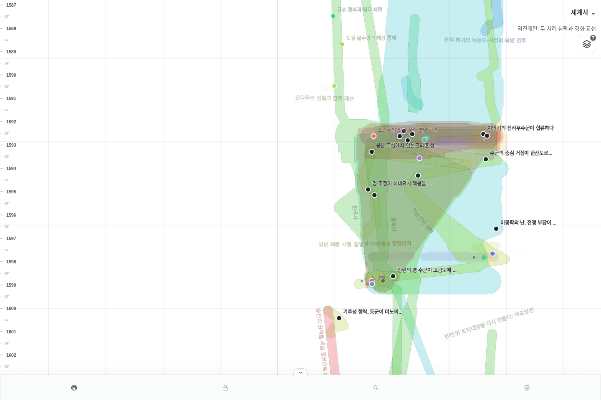
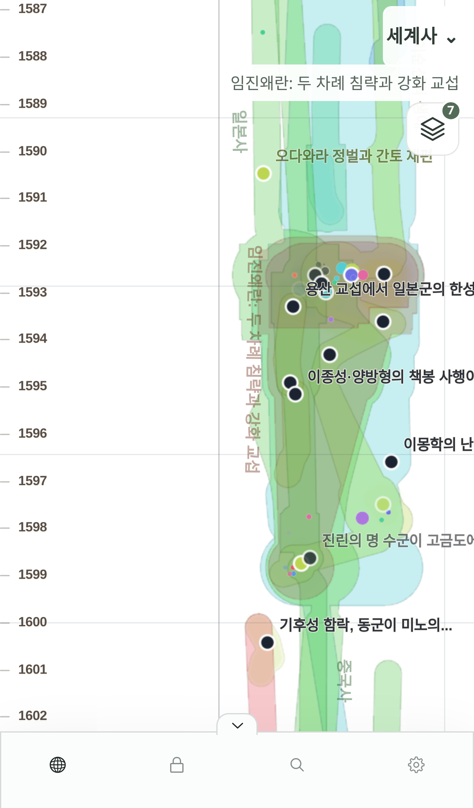
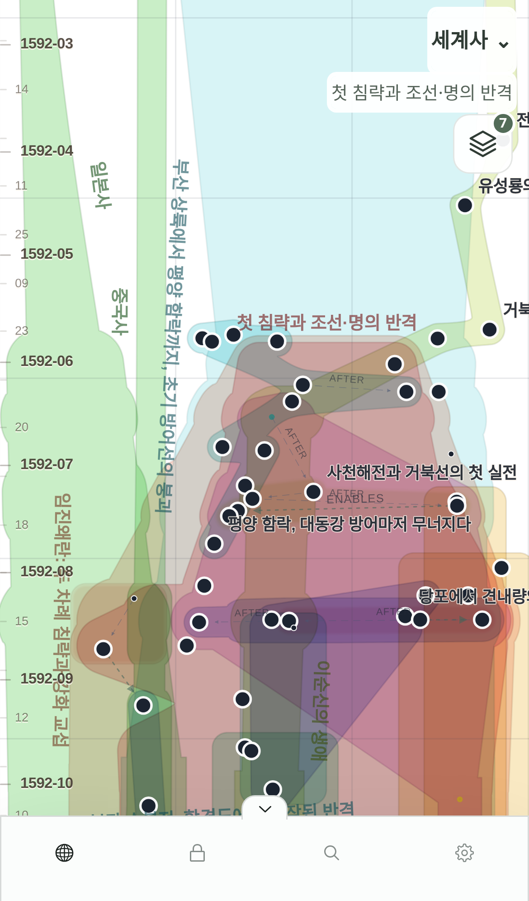

# 전역 incidence 운영 승격과 전체 Render 발행

2026-10-10. 사용자 지시: GitHub Pages의 “전역 incidence · 데이터 기반 중심”을 먼저 프로덕션에 배포하고 전체 퍼블리싱한다. 이전 Lab-only 범위는 이 후보와 이 발행 작업에 한해 대체됐다. CON-003·TS-005·TS-006·TS-010·IP-012의 identity/시간/발행 불변식은 유지한다.

## 승격할 결과

`global-incidence/1`, iterations 90, 관계 시간 척도 24 display-years, spacing 32 world X, membership cohesion 0.7, authored relation cohesion 0.35. 국가명·고정 레인·Event 복제가 없다. 이전 좌표 prior를 사용하지 않는 검토한 cold solve와 동일하다. 시간 국소 후보는 이번 운영 선택이 아니다.

공유 pure incidence 구현을 graph-presentation으로 옮겼으며 실험 adapter도 그 구현을 사용한다. Lab 파일을 제품 엔진에서 import하지 않는다. 입력의 `incidence: collection-incidence/1`은 World-wide membership·contains·Event 관계를 명시하며 snapshot digest에 포함된다. 기존 immutable Lab preset은 legacy 후보로 재생할 수 있다. membership 변경이 X를 바꿀 수 있지만 viewer Collection toggle은 발행 좌표를 다시 계산하지 않는다. 정확한 authored contains support와 모든 temporal Y·미배치 identity를 유지한다.

실제 공개 역사 r56의 539개 배치 결과는 검토 당시 Pages release `4c3723c`에서 전역 후보를 실행해 독립 캡처했다. shapes JSON SHA-256은 `6032f46d8b340c9e5d610e4388e12e35940f92d57432e77dfb992f7bca33d545`이며 승격 구현과 exact 일치한다. 과거 legacy /1·/2 golden JSON bytes 회귀도 명시적 legacy selection으로 유지한다.

## 전체 발행 경계

worker의 명시적 one-shot `IP013_RENDER_BACKFILL_ALL=1`, `IP013_RENDER_BACKFILL_RUN_ID=<고유 실행 ID>`는 active 공개 v5 World를 각각 현재 served Revision에 pin하고 모든 Time System·전체 World를 컴파일한다. 기존 advisory lock 12012로 deferred renderer와 병렬 실행을 막는다. 완전한 coverage proof와 immutable upload/readback 이후 source-pinned CAS로 render-current만 교체한다. World별 이전 pointer는 `worlds/<id>/render-rollbacks/<run-id>.json`에 immutable backup한다. 한 World 실패는 다른 World와 ordinary worker를 멈추지 않으며 partial 결과를 로그로 남긴다. 실행 완료 후 one-shot 변수는 비운다.

canonical `current.json`·Revision·정본 데이터·기존 immutable spatial tree는 바꾸지 않는다. 모든 새 글의 future publication은 선택한 shared engine을 사용한다. 이 rollout은 전체 Render 재발행이며 과거 canonical root를 덮어쓰는 작업이 아니다. 명시적 `tileData=0` semantic rollback은 기존 좌표를 사용한다. 기본 Render 화면의 camera navigation bounds는 현재 generation의 summary bounds를 사용하여 old spatial tree와 새 X 범위가 충돌하지 않게 한다. compiler는 좌표 계산 알고리즘과 별개이므로 v4를 유지하며 manifest와 bounded summary에 `layoutAlgorithmVersion`을 기록한다.

## 검증과 알려진 위험

전역 후보는 이전 실험에서 국소 후보보다 분리는 강하지만 공유 Event 접근성과 시간 국소성이 나빴다. 이번 요청은 운영 관찰을 위한 후보 선택이며 국소성 해결 완료가 아니다. 새 사건/소속의 cold recompute는 기존 X를 움직일 수 있다. 100k 계산 측정은 연구 보고서 참조이며 actual 모바일 FPS 또는 publication SLA가 아니다.

고정 카메라 렌더러/gesture 회귀 fixture는 명시적 legacy 배치를 유지한다. 처음 전체 fixture를 전역으로 바꿨을 때 위치·클릭 대상·camera 범위의 전제가 달라져 11개 중 3개가 실패했다. 이를 전역 후보의 성공으로 기록하지 않는다. 공유 ID·시간·reviewed geometry·실제 whole-publication proof는 별도 검증하고 공개 배포를 다시 관찰한다. Chromium mobile emulation은 실제 iPhone 17 Safari/PWA가 아니다.

최종 자동 검증·배포 SHA·전체 재발행 count·공개 smoke 결과는 아래 실행 결과에서 기록한다. 의존성 manifest/lockfile 변경 없음. 기존 Next Image Optimization high advisory와 관련 moderate/low advisory 때문에 dependency audit는 실패한다; 이번 범위에서 업그레이드하거나 gate를 약화하지 않는다.

## 복구

일반 실패는 기존 generation pointer를 유지한다. 관찰 결과 전역 후보를 철회할 경우 canonical selection을 legacy-force로 되돌리는 별도 attributable commit을 배포하고, `IP013_RENDER_BACKFILL_LAYOUT=legacy-force`, 새 run ID, ALL=1로 전체 재발행한다. 이 경로는 in-memory publication test에서 실제 실행해 canonical root 유지·이전 pointer immutable 보관·반복 실행·backup conflict rejection을 검증한다. 저장된 이전 generation/backup과 immutable assets는 삭제하지 않는다. pointer를 직접 복원한다면 World/revision/source digest와 현재 generation의 일치를 검사하고 CAS 해야 하며, 새 canonical Revision을 예전 것으로 되돌려서는 안 된다.

## 실행 결과

PR [#345](https://github.com/neocjmix/moirai/pull/345)는 `45c637bce8e7730f562d0a7842ff9d9e1dbac03c`로 병합·운영 배포됐다. Railway Atropos `25173105-ef89-420b-a2d5-3ae8f4eefabf`, worker `71470f87-5463-4e69-8f8d-4be2391b3e45`, Clotho `8df5a157-b37f-465a-8b17-91df008b1331`는 해당 소스 배포다. 적용 후 public readiness smoke가 정확한 SHA로 통과했다.

`global-incidence-20261010` 전체 재발행은 15:16:42 UTC 완료: **served 2 / failed 0 / skipped 0**, 모든 World의 모든 Time System이다. synthetic World는 r62 / generation `765e6538e6a0bca9c4efe43223c8e6f17b7e4aa28849b33f5329cb26746c2c00`, 역사 World는 r56 / generation `25ebaa2fffb390c1394a50139d708a9129e6b76255f0615a95690fb2ac04b1af`다. 총 11,278 documents / 114,618,279 bytes이며 worker 시작부터 약 140초다. 각 World의 immutable 이전 pointer backup을 보존했고 완료 후 ALL/RUN_ID/LAYOUT one-shot 변수를 비웠다. 이전 Railway staged inspector 변경 2개는 적용하지 않았다. [operator 기록](global-incidence/rollout.json), [모든 Time System의 공개 manifest 확인](global-incidence/all-time-systems.json).

역사 snapshot의 source root digest·539 Event·7 Collection·관계 metadata는 전후 exact 일치한다. 새 input digest는 incidence membership 필드 추가로 달라진다. 공개 finest tile 493개에서 replicas consistency를 검사했고 **430 일반 Event의 XY와 109 Composite의 worldBounds가 reviewed Pages 결과와 exact 일치**한다. Render bounds는 hull support/paint bounds이므로 layout region envelope와 숫자가 같을 필요는 없다. [공개 좌표 확인](global-incidence/public-coordinates.json).

Chromium desktop와 iPhone14 mobile emulation에서 실제 새 generation을 확인했다. 공유 Event drawer·확대 후 단일 point identity·Composite/Hull·Collection 해제/복원 시 camera 유지·pan·zoom·overflow·page/request error를 확인했다. 두 화면에서 초기 넓은 화면 WebGL painter와 단일 generation을 관측했으며 errors 0이다. 좁은 화면에서 Cloud GPU의 SVG fallback도 관측했다. 실제 Safari/PWA 결과나 FPS 수용으로 해석하지 않는다. 넓은 화면에서 특정 child point가 안 보이는 것을 identity 소실로 판단하지 않고 확대하여 같은 canonical Event를 확인했다. [공개 화면 검사](global-incidence/public-check.json).

자동 검증은 unit 805 passed / 2 skipped, PostgreSQL18 integration 49 passed, 명시적 legacy renderer Chromium regression 11 passed, strict typecheck·format·lint·boundaries·production build·commit-range gitleaks 통과다. disposable integration DB는 종료했다. main CI의 typecheck/test/build는 통과했지만 기존 dependency audit에서 실패했다. A5 public mobile checkpoint는 통과했고 post-deploy의 public readiness / mobile WebKit 단계도 통과했다. authenticated Clotho authoring smoke의 기존 실패는 남아 있다.

main 모바일 CI에서는 새 registry 후보에 대한 Lab 한글 copy 누락으로 demo SSR이 실패했다(8 tests). 운영 Graph와 별개지만 승격에 따른 회귀이므로 PR #346에서 전역 후보의 모든 control copy와 registry completeness 회귀를 추가했다. reviewed geometry regression과 함께 focused unit 3개가 통과했고 strict typecheck·lint·format·재빌드·기존 Lab 화면 검사 8개와 새 전역 후보 선택/조절/preset replay 검사 1개가 Chromium mobile emulation에서 통과했다. solver와 generation은 변경하지 않는다. 연구 PR #344의 내용은 #345에 포함됐으며 중복 배포를 피하도록 닫았다.

다음 최소 단계는 [운영 역사 Graph](https://moirai-production-8ed1.up.railway.app/graph/v5?world=01a107fb-4018-7fcb-8390-836a40fa91cc)를 실제 iPhone17 Safari와 PWA에서 관찰하는 것이다. 전역 중심의 과도한 공유 구간 결집·큰 Composite hull 중첩·작은 정본 추가 후 X displacement는 알려진 후보 한계로 유지한다. 사용자 관찰 없이 국소 후보로 자동 전환하지 않는다.
