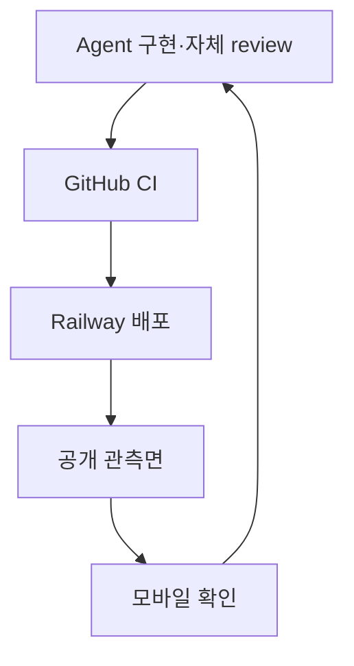

# IP-001 — 첫 제품 구현 계획

## IP-001.1 효력과 시작 조건

이 계획은 승인된 첫 제품을 구현하는 순서, 관측 방법과 milestone 종료조건을 정의한다. 제품 의미는 헌법, 비즈니스 요구사항과 기술 명세를 따른다. 실행 방식은 [IS-001](IS-001-agent-mobile-strategy.md)과 저장소 루트의 [`AGENTS.md`](../../AGENTS.md)를 따른다.

`accepted`는 계획의 내용이 기준선이라는 뜻이며 구현이 이미 시작됐다는 뜻이 아니다. 다음 milestone은 사용자가 구현 시작을 지시하고 [CURRENT.md](CURRENT.md)에 active로 표시된 뒤에만 실행한다.

이 계획은 다음을 승인하지 않는다.

- [RM-001](../roadmap/RM-001-personalization-multitenancy.md)의 개인화·다중 Tenant 기능
- 실제 개인·회사·비공개 데이터 사용
- 사전 합의 없는 유료 provider 추가
- URDR 외의 공유 infrastructure 삭제
- 승인된 기술 명세의 의미 변경

## IP-001.2 구현 방법

전체 제품을 layer별로 완성한 뒤 마지막에 연결하지 않는다. 먼저 배포와 관측이 가능한 최소 end-to-end 경로를 만들고, 이후 사용자 동작 하나씩 vertical slice로 확장한다.



각 slice는 다음 성질을 가진다.

- 하나의 외부에서 설명 가능한 동작을 만든다.
- 필요한 contract, domain, persistence, projection과 UI 경계를 함께 통과한다.
- synthetic fixture와 자동 test로 반복할 수 있다.
- public integration environment에 독립적으로 배포할 수 있다.
- 이전 정상 deployment로 되돌릴 수 있다.
- 사용자 확인을 기다리지 않아도 다음 안전한 내부 작업을 계속할 수 있지만, milestone 변경과 제품 판단은 사용자에게 보고한다.

## IP-001.3 지속적인 전달 구조

### 기본 환경

- `main`은 public integration environment의 배포 기준 branch다.
- CI가 실패한 commit은 배포하지 않는다.
- Railway는 Wait for CI와 readiness healthcheck를 사용한다.
- 배포된 결과는 고정 public URL에서 모바일로 확인한다.
- PR environment는 큰 UI 대안, migration과 infrastructure 격리가 필요할 때만 사용한다.
- local full-stack은 에이전트의 진단 도구이며 사용자 검수 경로가 아니다.

### 영구 관측면

구현 초기부터 다음을 유지한다.

| 표면 | 검증 내용 |
|---|---|
| Atropos public URL | 실제 독자 경험 |
| 고정 synthetic World | 동일한 데이터에서 기능 변화 비교 |
| `/health` | 새 deployment의 readiness |
| `/__status` | build SHA, format version, synthetic Revision과 smoke 결과 |
| GitHub Actions | typecheck, test, build, secret scan |

공개 관측면은 현재 상태를 보여주는 검증 표면이지 개발 일지나 내부 dashboard가 아니다. raw log, stack trace, 환경 변수, private hostname과 credential은 노출하지 않는다.

### 작업 결과 보고

runtime 변경을 완료한 에이전트는 다음을 한 화면 분량으로 보고한다.

- Outcome
- Public mobile URL
- commit SHA와 deployed build SHA
- 통과한 test와 post-deploy smoke scenario
- 사용한 synthetic fixture
- 알려진 위험과 검증하지 못한 부분
- 다음 최소 구현 단위

사용자가 모든 commit을 line-by-line review하거나 모든 checkpoint에 응답하는 것을 전제로 하지 않는다.

## IP-001.4 Milestone 0 — 전달·관측·보안 기반

### 목표

기능 구현보다 먼저 이후의 모든 결과를 안전하게 배포하고 모바일에서 확인할 수 있는 경로를 만든다.

### 범위

- TS-001의 pnpm monorepo와 module directory 골격
- TypeScript strict, format, lint, Vitest와 Playwright 기본 설정
- GitHub Actions의 typecheck, test, build, dependency audit와 secret scan
- URDR Railway resource의 이름·연결 관계 inventory
- 전용 resource 확인 후 URDR runtime을 Moirai service로 재구성
- URDR-era credential 회수와 Moirai용 최소 권한 credential 발급
- `lachesis-api`, `lachesis-worker`, `atropos-web` process의 deployable skeleton
- Railway PostgreSQL 연결과 migration runner 골격
- public `/health`, `/__status`와 배포 SHA 표시
- 고정 synthetic World fixture의 최소 형식
- post-deploy smoke workflow
- public integration URL과 rollback 경로

Publication Store는 Railway Bucket과 CDN을 우선 spike한다. TS-006의 원자적 pointer, immutable JSON cache, `ETag`, revision-pinned URL과 rebuild 조건을 만족하지 못하면 그때 별도 provider 결정을 요청한다.

### 제외 범위

- 실제 World 작성 기능
- 완성된 canonical schema
- Clotho skill
- JointJS graph
- 실제 사용자 데이터
- 개인화와 다중 Tenant

### 종료조건

1. `main`의 CI 성공 commit만 public integration environment에 배포된다.
2. 모바일에서 Atropos placeholder, `/health`와 `/__status`를 열 수 있다.
3. `/__status`의 build SHA가 GitHub commit과 일치한다.
4. post-deploy smoke 결과가 공개 status에 반영된다.
5. CI와 공개 artifact에서 secret pattern이 발견되지 않는다.
6. API, worker, web과 PostgreSQL의 public/private exposure가 IS-001의 목표 배치와 일치한다.
7. URDR repository는 유지되며, 재사용·삭제한 runtime resource의 정확한 mapping이 secret 없이 기록된다.
8. 이전 정상 deployment로 rollback하는 절차가 확인된다.

## IP-001.5 Milestone 1 — 최초 walking skeleton

### 목표

하나의 최소 Change Set이 정본 commit에서 공개 Event route까지 전체 시스템을 관통하게 한다.

```text
World + Canon + Event
→ Change Set 검증·commit
→ World Revision 증가와 outbox 기록
→ worker의 Publication Snapshot 생성
→ served Revision 교체
→ Atropos Event 페이지 표시
```

### 범위

- 최소 World, Canon과 Event schema
- typed Change Set의 create operation
- `expected_revision`, idempotency key와 원자적 PostgreSQL transaction
- Change Set, Operation, Revision과 outbox 기록
- target Revision을 읽는 worker
- 최소 immutable Snapshot과 atomic served pointer
- World, Canon과 Event의 stable public route
- synthetic fixture를 일반 Change Set 경로로 생성하는 bootstrap 도구
- commit부터 public route까지의 post-deploy scenario

### 제외 범위

- 전체 Relation·Narrative·Time System 계약
- Subject·Timeline projection
- JointJS graph
- Clotho의 전체 도구
- import/export와 복구

### 종료조건

1. synthetic World, Canon과 Event가 하나의 Change Set으로 전부 성공하거나 전부 실패한다.
2. 성공 시 World Revision이 한 번 증가하고 outbox가 같은 transaction에 기록된다.
3. worker 재시도는 중복 Revision이나 잘못된 pointer 교체를 만들지 않는다.
4. Atropos가 canonical DB에 접근하지 않고 Snapshot만으로 Event를 표시한다.
5. 모바일 public URL에서 World, Canon, Event와 served Revision을 확인할 수 있다.
6. `/__status`가 current/target/served Revision과 smoke 결과를 보여준다.
7. 전체 경로의 integration·E2E test가 CI와 배포 환경에서 통과한다.

## IP-001.6 Milestone 2 — 세계 확장

### 목표

여러 사건과 관계로 이루어진 의미 있는 작은 World를 작성하고 읽을 수 있게 한다.

### 범위

- Time System과 Event 시간 배치
- Relation registry와 Canon 경계 invariant
- World·Canon·Event Narrative
- 여러 operation을 가진 Change Set
- client reference 해석
- revision conflict와 idempotent retry
- validation error와 warning contract
- 검색 가능한 최소 공개 document

### 대표 공개 scenario

하나의 synthetic Canon에 시간 배치된 여러 Event, 인과·구조 Relation과 Narrative를 작성하고 Event detail에서 주변 맥락까지 탐색한다.

### 종료조건

1. 여러 Event와 Relation을 만드는 Change Set이 원자적으로 처리된다.
2. 잘못된 Canon 교차와 dangling reference가 안정적인 오류로 거부된다.
3. 같은 base Revision의 충돌과 timeout retry가 TS-003의 의미를 보존한다.
4. Narrative와 Relation이 공개 Snapshot의 allowlist를 통과해 모바일 route에 표시된다.
5. private origin, actor와 validation detail이 public artifact에 포함되지 않는다.

## IP-001.7 Milestone 3 — Clotho 최소 작성

### 목표

새 LLM 세션이 작은 읽기 기능으로 맥락을 찾고 Change Plan을 안전하게 commit해 Atropos 결과까지 만들 수 있게 한다.

### 범위

- `world.list/get`
- `canon.list/get`
- `event.search/get/neighbors`
- `context.slice`
- `change.validate`
- `change.commit`
- revision conflict와 idempotent retry recovery
- token을 prompt·stdout·history에 남기지 않는 CLI transport
- origin 요약과 field-level 연결의 최소 경로

### 대표 공개 scenario

Clotho가 synthetic World의 기존 맥락을 읽고 Event와 Narrative를 추가한다. 성공 응답의 Revision이 worker를 거쳐 동일한 Atropos public route에 나타난다.

### 종료조건

1. World ID만 가진 새 세션이 필요한 Canon과 Event 맥락을 다시 찾는다.
2. validate 결과가 commit 권한으로 오용되지 않고 commit 시 전체를 재검증한다.
3. conflict 후 최신 범위를 다시 읽어 안전하게 재계획할 수 있다.
4. credential과 숨은 LLM 작업 과정이 log, prompt artifact, Change history와 public Snapshot에 남지 않는다.
5. Clotho commit부터 모바일 Atropos 확인까지 synthetic E2E가 통과한다.

## IP-001.8 Milestone 4 — 파생 모델·비교·그래프

### 목표

독자가 World의 구조를 Subject, 시간, 과정과 Canon 비교 관점에서 모바일 그래프로 탐색할 수 있게 한다.

### 범위

- identity equivalence와 lineage registry
- Subject handle reconciliation
- Process, State, Duration과 Timeline projection
- explicit correspondence 기반 Canon 비교
- JointJS graph와 scope artifact
- vertical chronology, subject lane과 metro routing
- y-sweep envelope 기반 composite region
- semantic zoom, LOD와 graph budget
- pointer·pinch centroid 기준 zoom
- Event bottom sheet와 stable share URL
- mobile accessibility와 reduced motion

### 종료조건

1. 같은 Revision과 algorithm version은 같은 semantic projection과 digest를 만든다.
2. equivalence와 lineage가 Subject를 잘못 병합하지 않는다.
3. graph가 정본에 layout 사실을 쓰지 않는다.
4. 100k Event 기준 fixture에서 전체를 browser에 적재하지 않고 scope·LOD로 탐색한다.
5. 실제 mobile viewport에서 pan, pinch zoom, selection, bottom sheet와 URL 복원이 통과한다.
6. Canon 비교가 명시적 correspondence 밖의 동일성을 추론하지 않는다.

Milestone 4가 너무 커져 하나의 안전한 배포 단위가 되지 않으면 파생 모델, graph 기본 탐색과 Canon 비교의 세 하위 slice로 나눈다. milestone의 종료조건은 유지한다.

## IP-001.9 Milestone 5 — 생명주기·이동성·출시 품질

### 목표

정정, 철회, 복구, 반출과 운영 실패를 포함해 첫 제품을 지속적으로 운용할 수 있게 한다.

### 범위

- update·withdraw Change Operation
- public tombstone과 redirect
- Revision diff와 compensating restore
- `.moirai` owner-full, content, public과 scoped export
- preserve-ID restore와 clone remap
- schema migration과 semantic fingerprint
- backup, restore drill과 Publication rebuild
- SLO, alert, structured log와 runbook
- security, leakage, resource exhaustion과 migration gate
- post-deploy full-story verification

### 종료조건

1. 정정·철회·복구가 Revision을 되돌리지 않고 새 Change Set을 만든다.
2. 안정적 URL이 철회 후에도 안전한 tombstone을 제공한다.
3. export→import→export semantic fingerprint가 허용된 변환 밖에서 동일하다.
4. 정본 backup 복구와 Publication 전체 rebuild가 검증된다.
5. TS-008의 SLO, graph budget과 보안 acceptance test가 통과한다.
6. 첫 제품의 주요 사용자 여정 JRN-001~007이 public synthetic environment에서 검증된다.

Milestone 5도 portability, lifecycle과 operational hardening 하위 slice로 나눌 수 있다. 하위 slice 완료를 전체 milestone 완료로 잘못 보고하지 않는다.

## IP-001.10 작업별 공통 실행 루프

모든 milestone의 각 slice는 다음 순서를 따른다.

1. 관련 CON·BR·JRN·TS와 현재 상태를 읽는다.
2. observable outcome, 제외 범위, test와 public route를 선언한다.
3. contract 또는 scenario를 실패하는 test로 고정한다.
4. 최소 구현과 critical structured log를 추가한다.
5. 전체 diff를 self-review하고 scope creep와 secret을 검사한다.
6. 관련 static, unit, integration, migration, projection과 E2E gate를 실행한다.
7. 작은 의미 단위로 commit하고 public GitHub에 push한다.
8. CI 성공 후 public integration environment에 배포한다.
9. `/health`, `/__status`와 synthetic smoke scenario를 실행한다.
10. evidence packet을 전달하고 [CURRENT.md](CURRENT.md)를 갱신한다.

단순 문서 변경에는 runtime 배포를 강제하지 않는다. 문서 링크·ID·trace 검사, secret scan과 public commit으로 완료를 증명한다.

## IP-001.11 상태 기록

[CURRENT.md](CURRENT.md)는 세션과 에이전트가 바뀌어도 현재 위치를 복원하기 위한 유일한 짧은 상태판이다.

다음만 기록한다.

- active milestone과 slice
- 현재 상태와 다음 종료조건
- 최근 배포 commit과 public URL
- 마지막 smoke 결과
- blocker 또는 사용자 결정

다음을 기록하지 않는다.

- 매 command와 긴 실행 일지
- raw log와 stack trace
- secret 또는 infrastructure variable
- 이미 GitHub Actions와 commit history에 있는 중복 정보
- 장기적으로 의미 없는 시행착오

Milestone을 변경할 때는 이전 milestone의 종료조건을 증거와 함께 확인한다. 일부 기능이 동작한다는 이유로 종료조건을 축소하지 않는다.

## IP-001.12 전체 완료 정의

첫 제품 구현은 다음 조건을 모두 만족할 때 완료다.

1. 승인된 TS-001~008의 acceptance criteria가 구현과 test에 추적된다.
2. JRN-001~007의 주요 경로가 public synthetic environment에서 반복 가능하다.
3. 사용자는 local environment 없이 모바일에서 핵심 작성 결과와 독자 경험을 검증할 수 있다.
4. canonical write, Revision, Publication과 공개 격리가 실제 배포 환경에서 검증된다.
5. repository, CI artifact와 public observation surface에 secret과 private data가 없다.
6. export, backup, restore와 Publication rebuild가 검증된다.
7. 알려진 출시 위험과 후속 roadmap이 현재 제품 scope와 분리돼 있다.

이후 개인화·다중 Tenant 단계는 이 계획을 연장해 암묵적으로 시작하지 않는다. 별도의 요구사항과 구현 계획을 만든다.
