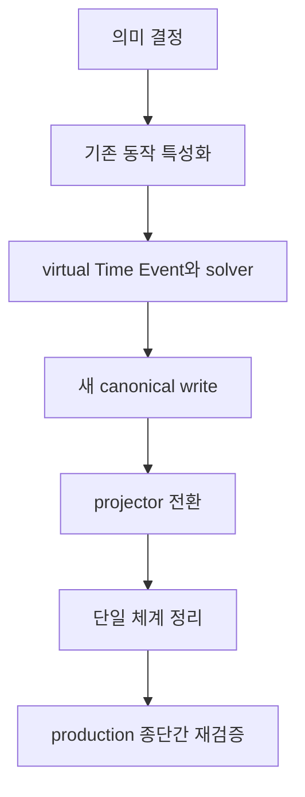

# IP-002 — 시간 모델 재정렬 구현 계획

이 계획은 2026-09-05 의미 결정과 함께 accepted됐다. 2026-09-07 사용자는 PR #4 병합, 기존 데이터 전체 삭제, production 단일 환경에서 Slice 7 활성화와 두 차례 종단간 재검증을 승인했다. 이 결정은 이전 호환·migration·별도 staging 전제를 대체한다.

## 목표와 금지선

목표는 Event/Relation 기반 시간을 도입하면서 현재 M4-D 기준선, revision 원자성, publication 불변성, 재현 가능한 파생 모델을 보존하는 것이다.

## 완료 후 IP-001 복귀 지점

> 후속 상태: IP-002 종료 뒤 실제로 M4-E와 M4-F까지 수행했다. 2026-09-09 KST 사용자
> 결정으로 M4는 그 검증 결과를 보존한 채 조기 종료됐고, 남은 graph 작업은
> [IP-001 M4.5](M4.5-ATROPOS-EXPLORATION-UI.md)로 이관됐다. 아래 문단은 IP-002 종료
> 당시의 복귀 계약을 기록한 역사적 기준이다.

IP-002는 IP-001을 대체하지 않는 시간 모델 교정 interrupt다. IP-002의 종단간 수용시험과 종료 checkpoint가 통과하면 [IP-001 Milestone 4](IP-001-first-product-plan.md#ip-0018-milestone-4--파생-모델비교그래프)의 **M4-D 다음 단계인 JointJS graph·scope artifact 기본 탐색**으로 복귀한다. 이어서 vertical chronology, subject lane, metro routing, composite region, semantic zoom·LOD와 Canon 비교를 진행하고 Milestone 4 종료조건을 모두 만족한 뒤에만 Milestone 5로 넘어간다.

IP-002 완료를 M4 또는 IP-001 전체 완료로 해석하지 않는다. `CURRENT.md`는 IP-002가 끝날 때 이 복귀 지점을 활성 slice로 명시해야 한다.

- 삭제 승인 전에 데이터를 변경하지 않는다. 2026-09-07 승인과 inventory 뒤 Canon DB와 Publication object를 전부 삭제했다.
- Branch·Run·시간여행 설계를 끌어들이지 않는다.
- JointJS 작업과 시간 정본 변경을 한 PR에 섞지 않는다.
- 별도 환경이나 임시 이중화를 만들지 않는다. 승인된 production primary 경로에서 corpus를 검증한다.

## 전환 흐름

각 화살표는 별도 승인 가능한 체크포인트다. 뒤 단계의 코드를 미리 배포하더라도 feature flag가 의미 전환을 일으키면 안 된다.

## Slice 0 — 문서 결정

산출물:

- TS-010 blocking 계약의 결정과 나머지 항목의 명시적 연기 기록
- TS-002/003/004/005/006/007 영향 diff
- Relation vocabulary와 strictness 결정
- Time System·calendar adapter·고정밀 좌표 계약
- migration 성공·중단 기준

종료 조건: TS-010과 영향받는 상위 문서가 일관된 accepted 상태이고, machine-readable 성공·거절 corpus와 expected Canon·projection·Atropos·round-trip 판정 파일이 존재한다.

2026-09-05 완료 결정:

- `precedes` strict, `not_after` non-strict, `coincides` equality
- `[start, nextBoundary)` 범위
- tagged virtual Time Event reference와 비영속성
- Time System별 lossless canonical string과 capability 기반 adapter
- 수용시험용 `proleptic-gregorian-utc@1`

## Slice 1 — 기존 동작 특성화

코드 의미를 바꾸지 않고 현재 Placement, Timeline, Process Duration, membership State의 동작을 golden test로 고정한다.

| ID  | 사례             | 반드시 보존할 관찰값             |
| --- | ---------------- | -------------------------------- |
| Y   | 연도만 알려짐    | 연 경계와 화면 범위              |
| M   | 월만 알려짐      | 월 경계와 정렬                   |
| D   | 날짜만 알려짐    | 날짜 경계와 timezone 정책        |
| MS  | 밀리초           | lossless API 왕복                |
| PS  | 피코초           | 새 구현에서 number coercion 없음 |
| DUR | 지속 Composite   | 명시적 start/end와 Duration      |
| IN  | 다른 Event 도중  | 비-membership 시간 제약          |
| REL | 상대 선후만 존재 | timestamp 없이 정렬·설명         |
| BAD | 모순 cycle       | commit 전 진단                   |

현재 synthetic World revision과 artifact digest는 비교 근거로 캡처하되 secret이나 bearer token은 저장하지 않는다.

이 표는 기존 구현의 회귀 기준일 뿐 최종 표현력 합격 기준이 아니다. 실제 신규 모델의 합격은 별도 시험 World에 [구체적 corpus](TEMPORAL-EXPRESSIVENESS-ACCEPTANCE.md#4-구체적-입력-corpus)를 입력하고 Canon·projection·Atropos 출력까지 확인해야 한다.

2026-09-05 완료: [M4-D 시간 동작 특성화 기준선](M4D-TEMPORAL-CHARACTERIZATION.md)에 current numeric Placement 계약, Timeline relative order·cycle 진단, Process descendant-span Duration, during 비-membership과 membership State 계산을 exact golden output·semantic digest로 고정했다. 이는 알려진 드리프트를 승인된 의미로 승격하지 않는다.

## Slice 2 — virtual Time Event와 solver

독립적인 domain module로 시작한다.

- canonical coordinate codec와 결정적 Time Event ID
- calendar/time-system boundary adapter
- lossless scalar 비교
- Event/Relation 제약 graph normalizer
- cycle·경계·cross-system validator
- 근거 경로와 모순 설명
- Gregorian과 무관한 custom·continuous scalar adapter conformance harness

이 단계는 DB write를 하지 않는다. property test로 좌표 정규화의 멱등성, 순서 보존, serialize/deserialize 왕복을 검증한다.

adapter conformance는 최소한 허구 세계 custom coordinate, 빅뱅 이후 임의정밀도 경과량, 지질 연대의 불확실 범위를 다룬다. 이 사례는 Gregorian 변환 성공을 요구하지 않는다. 대신 원문 좌표 보존, adapter 내부 비교, 지원하지 않는 conversion·difference의 설명 가능한 `unresolved`, authored cross-system 관계의 독립 보존을 판정한다.

2026-09-05 완료: `@moirai/domain`에 독립 adapter·resolver·solver와 graph validator를 추가했다. Gregorian 경계·피코초, 허구력 원문, 빅뱅 이후 임의정밀도 scalar와 지질 BP 범위, Composite 경계 순서, equality evidence, 입력 순서 독립성 및 원본 거절 corpus 5개를 검증했다. PR CI [33971023125](https://github.com/neocjmix/moirai/actions/runs/33971023125)가 성공했고 secret scan도 변경 이력에서 0건이다. production 경로에는 연결하지 않았다. 이 결과는 Slice 2 완료일 뿐 실제 제품 경로 표현력 수용시험 통과가 아니다.

## Slice 3 — 호환 adapter와 shadow 비교

legacy Placement를 새 제약 graph로 읽는 일방향 adapter를 추가한다. 결과를 다음으로 분류한다.

- `lossless`: 같은 의미로 변환 가능
- `ambiguous`: 두 가지 이상 해석 가능
- `unsupported`: 새 모델 결정이 더 필요함
- `conflicting`: 기존 Relation과 모순

기존 projector와 새 solver를 같은 revision에 실행해 차이를 기록한다. 사용자 응답과 publication은 계속 기존 경로가 소유한다. 차이를 자동으로 “새 구현이 맞음”으로 처리하지 않는다.

종료 조건: 기준 fixture 전체와 실제 synthetic World에서 차이 목록이 설명되고, 예상하지 못한 차이가 0이다.

2026-09-06 완료 checkpoint: `event_temporal_placement`를 변경하지 않는 일방향 reader를 추가했다. versioned ordinal integer의 exact point 9건만 virtual Time Event `coincides` 제약으로 lossless 전환하고, interval 3건은 명시적 start/end Event가 없으므로 `ambiguous`로 남긴다. [Revision 29 읽기 전용 shadow evidence](evidence/temporal-shadow-clotho-synthetic-r29.json)는 기존 `m4-timeline-v1`과 새 solver를 같은 입력에서 함께 실행한다. 기존 Timeline은 그 3건을 모두 start coordinate `0..0`으로 표시하지만 새 solver는 boundary·Duration을 발명하지 않는다. 이 차이는 예상된 차이이며 publication은 아직 기존 projector가 소유한다. 이 과정에서 corpus를 `Clotho Synthetic Observatory`에 쓰지 않았고 World revision도 바꾸지 않았다.

## Slice 4 — 추가형 canonical write

TS-010 승인 후에만 수행한다.

1. 기존 schema를 보존한 채 필요한 Relation/assertion reference를 추가한다.
2. 동일 Change Set·revision·audit·outbox 트랜잭션 경계를 유지한다.
3. Clotho validate가 virtual reference와 시간 모순을 commit 전에 보여준다.
4. 신규 시험 World에만 명시적으로 새 canonical write를 활성화한다.
5. 기존 데이터 migration은 별도 dry-run report와 사용자 승인 전에는 실행하지 않는다.

한 요청이 Placement와 Relation 양쪽을 독립 정본으로 쓰게 하지 않는다. 구형 client 입력은 adapter가 새 canonical write 한 경로로만 번역한다. 기존 M4-D World와 production data migration은 종단간 신규 World 검증의 선행 조건이 아니다.

2026-09-06 진행 checkpoint: numeric contract version `2`의 tagged Event/virtual Time Event endpoint, `not_after`·`coincides`, canonical coordinate adapter 검증, deterministic `time-event.resolve`, append-only Relation reference migration과 PostgreSQL integration fixture를 구현 중이다. 기존 `source_event_id`·`target_event_id`와 Placement는 보존하며 기존 row를 backfill하지 않는다. v2 write는 fixture의 `Temporal Expressiveness Observatory` World ID로만 gate한다. 실제 migration 실행, Railway 배포와 해당 World의 실제 commit은 사용자 승인 전 수행하지 않는다. validate는 읽기 전용 검증이며 별도 쓰기 승인이 필요하지 않다.

Slice 4 검증 완료: commit `203763a89ac96bfb15bfc56daa61c3875491a9da`, [CI 34014969062](https://github.com/neocjmix/moirai/actions/runs/34014969062) 전체 성공. PostgreSQL에서 실제 bootstrap·corpus transaction과 Canon read-back·resolve 비영속성·5개 거절 corpus를 확인했다. 이는 CI 전용 DB의 근거이며 승인된 cloud 시험 World 종단간 검증을 대체하지 않는다.

## Slice 5 — projector 전환

- Timeline bound와 정렬을 새 solver에서 계산한다.
- Process Duration은 명시적 boundary evidence만 사용한다.
- descendant extrema는 `descendant span`으로 이름과 근거를 분리한다.
- membership State의 시작·종료도 동일 boundary resolver를 사용한다.
- revision별 artifact와 semantic digest의 결정성을 유지한다.

전환은 World 단위 feature flag 또는 shadow gate로 제한한다. 새/구 projector 결과가 허용된 차이 목록에 없으면 publication target을 전진시키지 않는다.

2026-09-06 완료: source/import 시험 World에 한해 revision별 `temporal.json` artifact를 새 solver에서 생성한다. 기존 World는 기존 numeric Timeline·Process·State projector를 그대로 유지한다. 알려진 범위·exact·relative-only·명시적 Duration·descendant span·관계 증거 기반 during·membership boundary resolver를 분리한다. fixed corpus와 PostgreSQL read-back을 publication 생성까지 검증했다. commit `eff9d359cd917bb139a65bcfcc4ef97d19008ed1`의 PR CI [34015422657](https://github.com/neocjmix/moirai/actions/runs/34015422657)가 mobile 포함 전체 성공했다. 이는 승인된 cloud 시험 World 종단간 합격을 대체하지 않는다.

## Slice 6 — Clotho와 Atropos

Clotho는 사용자의 자연스러운 “220년”, “7월”, “B 도중”, “A가 B보다 전” 입력을 단위별 전용 도구가 아니라 경계와 관계 제안으로 보여준다. validate 결과에는 생성될 virtual Time Event와 모순 근거를 포함한다.

Atropos는 필요할 때 projection을 계산하고 다음을 구분해 표시한다.

- exact coordinate
- bounded interval
- relative-only
- unresolved
- Event duration과 knowledge range

100k/LOD 작업 전 viewport 기반 lazy evaluation 예산과 cache key를 측정한다.

2026-09-06 진행 checkpoint: Atropos Canon·Event 경로에 exact·bounded·relative-only, 명시적 Duration·descendant span, component와 during을 구분하는 접근 가능한 텍스트를 연결하고 같은 served Revision의 공개 `temporal.json`을 노출한다. millisecond·picosecond 원문 좌표는 접을 수 있는 세부 정보에서 lossless하게 확인한다. CI 전용 별도 publication fixture로 mobile Safari 경로를 검증하며 기존 Lantern·Clotho Synthetic Observatory를 재사용하지 않는다.

Clotho에는 revision-bounded complete snapshot인 `world.export`를 추가한다. Clotho CLI는 Time Event row나 legacy Placement가 없는 경우에만 digest가 붙은 ZIP64 `.moirai` content package를 만들고, 경로 순회·symlink·암호화·중복 entry·compression bomb·digest 변조를 거절한다. import preview는 모든 persisted ID를 빈 전용 import World로 재매핑한 단일 Change Plan을 실제 `change.validate`에 보낼 뿐 자동 commit하지 않는다. source→target mapping의 역함수를 적용한 `temporal-semantic-fingerprint-v1` 비교로 export/import 뒤 의미 동일성을 판정한다.

비교 UI의 참고 근거는 URDR commit `0267c8fd081ca9a3cd556f8f7319c600248c3760`의 `urdr/apps/web/src/components/graph-shell.tsx` Event drawer tab/table 구조다. 시각적 상호작용만 참고했으며 시간 의미·data model·runtime 의존성은 복사하지 않았다.

## Slice 7 — legacy 제거

2026-09-07 활성화됐다. 서비스가 아직 production user data 호환성을 요구하지 않는다는 사용자 결정에 따라 migration·dual-read 기간 대신 clean reset을 사용한다.

완료 조건:

- Change Plan contract version은 `2` 하나이며 모든 World에 동일하게 적용된다.
- Relation은 non-null tagged `source_ref`·`target_ref`만 저장하고 공개한다.
- `event_temporal_placements`, numeric coordinate, legacy adapter와 World allowlist가 코드·schema·artifact에 없다.
- Clotho pre-deploy는 migration만 실행하며 synthetic data를 자동 seed하지 않는다.
- 실제 production corpus validate→commit→Canon→resolve→projection→Atropos→export/import와 거절 corpus가 통과한다.
- 리팩터링 후 같은 전체 판정을 다시 통과한다.

2026-09-08 완료: PR #9 merge `e4265a627b121ef9d4274b693db094362146924c`에서 contract v2 단일 체계로 정리하고 Placement·numeric coordinate·legacy adapter·World allowlist·자동 seed를 제거했다. 전체 CI [34125253511](https://github.com/neocjmix/moirai/actions/runs/34125253511)이 성공했다. clean reset 뒤 리팩터링 전 [production E2E 34120376433](https://github.com/neocjmix/moirai/actions/runs/34120376433)과 리팩터링 후 [production E2E 34195243154](https://github.com/neocjmix/moirai/actions/runs/34195243154)가 모두 통과했다. 동적 application SHA·실행 시각·artifact 생성 시각을 제외한 두 실행의 의미 차이는 0건이다. 세 production 서비스는 검증 시 같은 merge SHA를 실행했다.

## 검증 게이트

각 구현 slice는 해당 package test 외에 저장소 표준 CI를 통과해야 한다. 구체 명령은 당시 `package.json`과 CI workflow를 source of truth로 재확인한다.

필수 검증:

- domain unit/property tests
- PostgreSQL integration과 migration dry-run
- API/MCP contract tests
- worker artifact determinism test
- Atropos SSR와 접근성 smoke
- `.moirai` export/import semantic fingerprint
- canonical Event/Relation regression
- `Temporal Expressiveness Observatory` corpus의 실제 validate→commit→read→publish→export/import 증거

2026-09-06 실제 종단간 검증을 완료했다. 승인된 application SHA
`8ee04b47843b8d080014325e39be3dda4aac88c6`와 승인 패킷 SHA-256
`bc3e8e3b60925bfde279cc72945e147198183b3321ac50dfc6f565abbc2af99b`를 사용했다.
별도 source World revision 2와 import World revision 1에서 Canon read-back, 결정적
virtual Time Event resolve와 비영속성, solver projection, 같은 served Revision의
Atropos 텍스트·JSON, `.moirai` export/import 역매핑 fingerprint, 거절 corpus 5개를
모두 확인했다. [machine-readable live evidence](evidence/ip-002-live-acceptance-2026-09-06.json)에
실제 Change Set ID, revision, import ID mapping, digest와 사례별 판정을 고정했다.

rollback rehearsal에서는 migration 006 실행 뒤 exact M4-D SHA가 migration 파일을
모르기 때문에 pre-deploy에서 fail-safe로 중단되는 운영 계획 결함을 발견했다. DB를
downgrade하거나 trial Relation을 삭제하지 않았다. M4-D runtime 위에 실행된
`006_event_relation_time` 파일만 보존한 compatibility bridge
`3ac0b0deafbe00b5aaa4aa474b7ad4a8e9cc6bb8`로 Clotho readiness를 복구했다.
따라서 migration 006 이후 rollback은 pre-migration SHA 단독이 아니라 그 SHA의
runtime과 migration 006 ledger 파일을 함께 사용해야 한다.

이 증거로 IP-002 Slice 0–6과 첫 관계 기반 시간 표현력 수용시험을 완료했다. 이후
2026-09-07 clean-slate 결정으로 Slice 7을 활성화했고, 2026-09-08 두 번째 종단간
검증까지 완료했다. Canon 11 Event·23 Relation, lossless 좌표, 결정적 virtual Time
Event resolve와 비영속성, solver projection, 같은 served Revision의 Atropos 출력,
`.moirai` 왕복 fingerprint, 설명 가능한 거절 corpus 5건이 모두 통과했다. 상세 실행
ID·artifact digest와 리팩터링 전후 비교는 [Slice 7 machine-readable evidence](evidence/ip-002-slice7-production-revalidation-2026-09-08.json)에 고정했다.

따라서 IP-002는 완료다. 당시 실행 포인터는 IP-001 M4-D 다음 JointJS graph·scope
artifact 기본 탐색으로 복귀했고, 실제 M4-E·F까지 완료했다. 2026-09-09 이후 실행
포인터는 M4.5이며 M4.5 종료 전에는 M5를 활성화하지 않는다.

현재 로컬 환경에서 `pnpm`은 ignored build scripts 정책으로 실행이 막힐 수 있다. 이를 우회하려고 dependency 정책을 조용히 바꾸지 말고 CI 또는 승인된 설치 절차를 사용한다.

## 관측과 rollback

관측값:

- adapter 분류별 개수
- solver contradiction·unresolved 비율
- legacy/new projection diff 수
- 계산 latency와 cache hit
- publication 보류 사유

Slice 0–6에서 사용한 단계별 rollback 전제는 clean-slate 전환의 이력으로 보존한다.

- Slice 2–3: 코드를 끄면 저장 데이터 변화 없음
- Slice 4: 원본 Placement와 migration map으로 역추적
- Slice 5–6: projector flag를 legacy로 복귀, immutable 이전 artifact 유지
- schema 제거: export/import와 restore rehearsal 전에는 실행 금지

Slice 7 이후 production rollback은 호환 계층 재활성화나 데이터 downgrade가 아니다. merge commit을 revert하고 빈 clean schema에 승인된 package를 다시 import하는 방식이다. 이미 제거한 legacy data를 복원하거나 Placement를 재생성하지 않는다.

## 완료 후 실행 포인터

1. `docs/implementation/CURRENT.md`의 활성 slice를 따른다.
2. M4-E JointJS graph·scope와 M4-F vertical chronology 완료 이력을 보존한다.
3. 남은 subject lane, metro routing, composite region, semantic zoom·LOD와 Canon 비교는 [M4.5 계획](M4.5-ATROPOS-EXPLORATION-UI.md)을 따른다.
4. IP-002의 Event/Relation 시간 정본과 production acceptance corpus는 M4.5 graph의 회귀 기준으로 유지한다.
5. M4.5 종료조건을 모두 통과하기 전에는 M5를 활성화하지 않는다.
