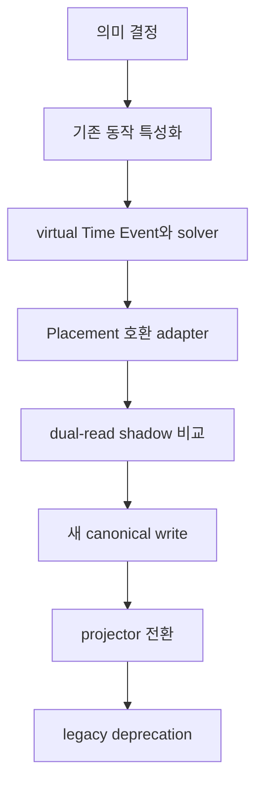

# IP-002 — 시간 모델 재정렬 구현 계획

이 계획은 다음 milestone을 **활성화하지 않는다**. [TS-010](../technical-specifications/TS-010-event-relational-time.md)이 draft인 동안 runtime 의미, Canon schema와 production data를 바꾸지 않는다. 먼저 [드리프트 분석](TEMPORAL-MODEL-DRIFT.md)의 판단을 검토한다.

## 목표와 금지선

목표는 Event/Relation 기반 시간을 도입하면서 현재 M4-D 기준선, revision 원자성, publication 불변성, 재현 가능한 파생 모델을 보존하는 것이다.

- 기존 Placement 행을 삭제하거나 덮어쓰지 않는다.
- 승인 전 schema migration과 canonical write 변경을 하지 않는다.
- Branch·Run·시간여행 설계를 끌어들이지 않는다.
- JointJS 작업과 시간 정본 변경을 한 PR에 섞지 않는다.
- production에서 최초 검증하지 않는다. synthetic fixture와 shadow 비교가 먼저다.
- rollback 불가능한 전환은 하지 않는다.

## 전환 흐름

각 화살표는 별도 승인 가능한 체크포인트다. 뒤 단계의 코드를 미리 배포하더라도 feature flag가 의미 전환을 일으키면 안 된다.

## Slice 0 — 문서 결정

산출물:

- TS-010 미결정 7개에 대한 결정 기록
- TS-002/003/004/005/007 영향 diff
- Relation vocabulary와 strictness 결정
- Time System·calendar adapter·고정밀 좌표 계약
- migration 성공·중단 기준

종료 조건: TS-010과 영향받는 상위 문서가 일관된 상태로 승인되거나, 제안이 기각되어 현재 모델 유지가 명시된다.

## Slice 1 — 기존 동작 특성화

코드 의미를 바꾸지 않고 현재 Placement, Timeline, Process Duration, membership State의 동작을 golden test로 고정한다.

| ID | 사례 | 반드시 보존할 관찰값 |
|---|---|---|
| Y | 연도만 알려짐 | 연 경계와 화면 범위 |
| M | 월만 알려짐 | 월 경계와 정렬 |
| D | 날짜만 알려짐 | 날짜 경계와 timezone 정책 |
| MS | 밀리초 | lossless API 왕복 |
| PS | 피코초 | 새 구현에서 number coercion 없음 |
| DUR | 지속 Composite | 명시적 start/end와 Duration |
| IN | 다른 Event 도중 | 비-membership 시간 제약 |
| REL | 상대 선후만 존재 | timestamp 없이 정렬·설명 |
| BAD | 모순 cycle | commit 전 진단 |

현재 synthetic World revision과 artifact digest는 비교 근거로 캡처하되 secret이나 bearer token은 저장하지 않는다.

## Slice 2 — virtual Time Event와 solver

독립적인 domain module로 시작한다.

- canonical coordinate codec와 결정적 Time Event ID
- calendar/time-system boundary adapter
- lossless scalar 비교
- Event/Relation 제약 graph normalizer
- cycle·경계·cross-system validator
- 근거 경로와 모순 설명

이 단계는 DB write를 하지 않는다. property test로 좌표 정규화의 멱등성, 순서 보존, serialize/deserialize 왕복을 검증한다.

## Slice 3 — 호환 adapter와 shadow 비교

legacy Placement를 새 제약 graph로 읽는 일방향 adapter를 추가한다. 결과를 다음으로 분류한다.

- `lossless`: 같은 의미로 변환 가능
- `ambiguous`: 두 가지 이상 해석 가능
- `unsupported`: 새 모델 결정이 더 필요함
- `conflicting`: 기존 Relation과 모순

기존 projector와 새 solver를 같은 revision에 실행해 차이를 기록한다. 사용자 응답과 publication은 계속 기존 경로가 소유한다. 차이를 자동으로 “새 구현이 맞음”으로 처리하지 않는다.

종료 조건: 기준 fixture 전체와 실제 synthetic World에서 차이 목록이 설명되고, 예상하지 못한 차이가 0이다.

## Slice 4 — 추가형 canonical write와 migration

TS-010 승인 후에만 수행한다.

1. 기존 schema를 보존한 채 필요한 Relation/assertion reference를 추가한다.
2. 동일 Change Set·revision·audit·outbox 트랜잭션 경계를 유지한다.
3. Clotho validate가 virtual reference와 시간 모순을 commit 전에 보여준다.
4. 기존 데이터는 별도 dry-run report를 만든 뒤 deterministic migration한다.
5. migration 결과에 source row, 생성 relation, 손실 분류를 남긴다.

한 요청이 Placement와 Relation 양쪽을 독립 정본으로 쓰게 하지 않는다. 구형 client 입력은 adapter가 새 canonical write 한 경로로만 번역한다.

## Slice 5 — projector 전환

- Timeline bound와 정렬을 새 solver에서 계산한다.
- Process Duration은 명시적 boundary evidence만 사용한다.
- descendant extrema는 `descendant span`으로 이름과 근거를 분리한다.
- membership State의 시작·종료도 동일 boundary resolver를 사용한다.
- revision별 artifact와 semantic digest의 결정성을 유지한다.

전환은 World 단위 feature flag 또는 shadow gate로 제한한다. 새/구 projector 결과가 허용된 차이 목록에 없으면 publication target을 전진시키지 않는다.

## Slice 6 — Clotho와 Atropos

Clotho는 사용자의 자연스러운 “220년”, “7월”, “B 도중”, “A가 B보다 전” 입력을 단위별 전용 도구가 아니라 경계와 관계 제안으로 보여준다. validate 결과에는 생성될 virtual Time Event와 모순 근거를 포함한다.

Atropos는 필요할 때 projection을 계산하고 다음을 구분해 표시한다.

- exact coordinate
- bounded interval
- relative-only
- unresolved
- Event duration과 knowledge range

100k/LOD 작업 전 viewport 기반 lazy evaluation 예산과 cache key를 측정한다.

## Slice 7 — legacy 제거

다음 조건을 모두 만족한 뒤 별도 승인으로 수행한다.

- 지원 World의 migration이 lossless 또는 명시적으로 승인된 예외다.
- 두 release 이상 새 canonical write만 사용했다.
- export/import와 rollback rehearsal가 성공했다.
- legacy field를 읽는 client·worker·snapshot이 없다.
- TS-002에서 Placement의 canonical 지위가 공식 제거됐다.

그 전에는 legacy table을 삭제하지 않는다.

## 검증 게이트

각 구현 slice는 해당 package test 외에 저장소 표준 CI를 통과해야 한다. 구체 명령은 당시 `package.json`과 CI workflow를 source of truth로 재확인한다.

필수 검증:

- domain unit/property tests
- PostgreSQL integration과 migration dry-run
- API/MCP contract tests
- worker artifact determinism test
- Atropos SSR와 접근성 smoke
- `.moirai` export/import semantic fingerprint
- 기존 M4-D synthetic World regression
- production 전 Railway staging 또는 승인된 synthetic 범위 검증

현재 로컬 환경에서 `pnpm`은 ignored build scripts 정책으로 실행이 막힐 수 있다. 이를 우회하려고 dependency 정책을 조용히 바꾸지 말고 CI 또는 승인된 설치 절차를 사용한다.

## 관측과 rollback

관측값:

- adapter 분류별 개수
- solver contradiction·unresolved 비율
- legacy/new projection diff 수
- 계산 latency와 cache hit
- publication 보류 사유

rollback은 단계별로 가능해야 한다.

- Slice 2–3: 코드를 끄면 저장 데이터 변화 없음
- Slice 4: 원본 Placement와 migration map으로 역추적
- Slice 5–6: projector flag를 legacy로 복귀, immutable 이전 artifact 유지
- schema 제거: export/import와 restore rehearsal 전에는 실행 금지

## 다음 세션 체크리스트

1. `docs/implementation/CURRENT.md`와 기준 SHA를 확인한다.
2. `TEMPORAL-MODEL-DRIFT.md`, TS-010, 이 문서를 순서대로 읽는다.
3. TS-010 미결정 사항에 대한 사용자 결정을 기록한다.
4. accepted 문서 변경 범위를 먼저 PR로 제시한다.
5. 승인 전에는 Slice 1의 characterization test 외 runtime 변경을 하지 않는다.
6. 원본 M4-D fixture와 deployment를 건드리지 않는다.
7. 각 slice를 독립 PR·CI·rollback checkpoint로 유지한다.

권장 첫 세션의 종료점은 Slice 0 결정과 Slice 1 테스트 계획까지다. schema migration이나 production semantic change가 아니다.
