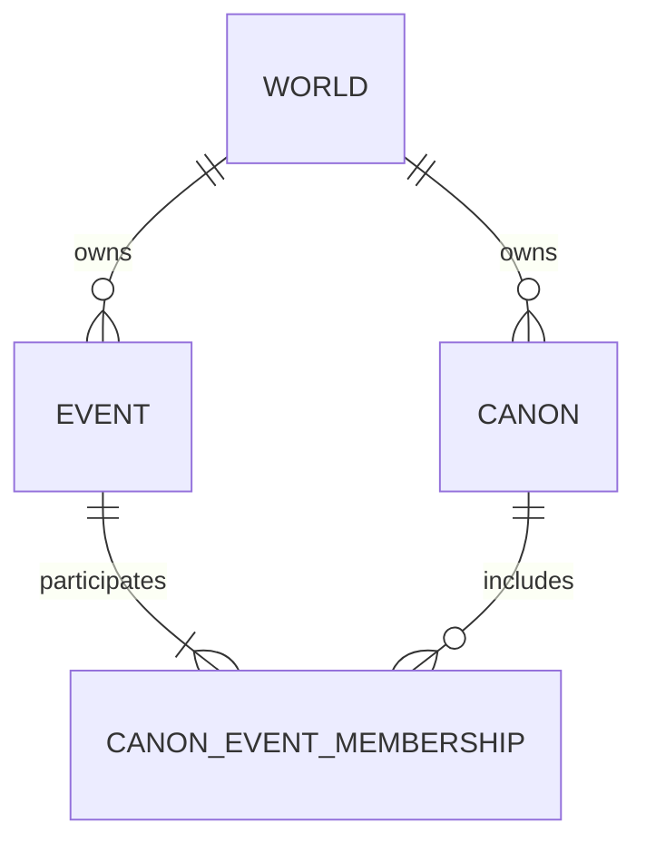

# IP-003 — Canon Semantic Realignment

## 1. 목적, 기준선과 실행 경계

IP-003은 Canon을 배타적 truth branch에서 World 안의 지속적이고 명명된 해석적 지식
범위로 재정렬하고, Event identity를 Canon membership과 분리하는 별도 구현 계획이다.
IP-001 M4.5의 후속 UI slice가 아니다. M4.5-C를 완료 checkpoint로 보존하며 M4.5-D와
M5는 IP-003 종료 및 후속 계획 승인 전까지 비활성이다.

조사 기준은 `main` `8854da284631f836cb34692f36070b718dce3e2d`이다.

| 기준 | 확인 결과 |
| --- | --- |
| GitHub `main` | `8854da2` (`docs: scope runtime evidence to M4.5-C`) |
| CI | run `34556657861` success; secret scan, typecheck/test/build/audit, smoke, mobile Playwright success |
| post-deploy | run `34556777058` success |
| production | Atropos `/__status` application SHA `8854da2`, deployed `2026-09-11T02:59:35.042Z`, smoke passed |
| M4.5-C | `/graph`에서 Sources island, Time System 우선 선택, 두 World·세 Canon, served Revision `7·42`, URL 복원 확인 |
| CURRENT | M4.5-C complete, M4.5-D inactive, M5 inactive로 실제 상태와 일치 |

이 문서의 slice 순서와 gate가 기존 IP-001의 일반 실행 순서보다 IP-003에 한해 우선한다.
승인 대상 ontology를 임의 구현하지 않는다. 기술적으로 추가형이고 lossless하며 이미
승인된 Canon/Event 의미만 반영하는 slice는 별도 재승인 없이 진행한다.

## 2. 기존 모델과 문제

현재 규범과 구현은 다음 모델을 결합한다.

- `World 1:N Canon`, `Canon 1:N Event`, `Canon 1:N Relation`, `Canon 1:N Narrative`
- `events.canon_id NOT NULL`; Event slug는 `(canon_id, slug)`로 유일하다.
- Relation은 `canon_id`를 가지며 양 endpoint Event가 같은 `canon_id`여야 한다.
- Narrative는 `canon_id`를 가지며 Event scope도 같은 Canon의 Event만 가리킨다.
- Subject/Process/State/Duration/Timeline은 Canon별 Event와 Relation 집합에서 파생된다.
- Publication, search, stable Event URL, graph result와 portability fingerprint가 Event의
  `canon_id`를 identity·ownership·filter context로 동시에 사용한다.
- historical Revision view는 `change_operations.after`의 구 payload를 재생한다.

이 구조에서는 Event 하나를 여러 Canon이 공유할 수 없다. Canon overlap을 표현하려면
Event를 복제해야 하며 stable identity, Relation endpoint, Narrative scope, derived handle,
search와 export가 모두 복제된 identity를 사실로 받아들인다. 이는 승인된 Event 1..N
Canon cardinality와 충돌한다. 또한 규범 문구가 Canon을 완결된 truth context나 World의
partition으로 설명해 authority·exclusivity를 암묵적으로 부여한다.

## 3. 새 normative semantics

영문 normative definition은 다음과 같다.

> A Canon is a persistent, named interpretive knowledge scope within a World. It
> identifies a curated body of world knowledge that is considered together without
> implying authority, exclusivity, completeness, consistency, or objective truth.

이에 따라 다음은 규범이다.

- Canon은 authority, objective truth, completeness 또는 internal consistency를 뜻하지 않는다.
- Canon들은 overlap할 수 있으며 서로 배타적이지 않다.
- Canon이 하나뿐이어도 official/default/primary 의미가 생기지 않는다.
- Canon은 curated/artificial boundary일 수 있고 source 중심과 subject 중심을 별도 entity로
  나누지 않는다.
- Canon은 Event/CompositeEvent/Process, Source/Corpus 또는 Narrative가 아니다.
- Canon은 World의 transaction, Revision, export, access와 publication isolation을 대체하지 않는다.
- Canon 내부의 상충하는 해석은 그 자체로 structural invalidity가 아니다.

## 4. canonical identity, ownership와 cardinality

- Event는 정확히 하나의 World에 속한다.
- Canon은 정확히 하나의 World에 속한다.
- active persisted Event는 같은 World의 active Canon 1개 이상에 참여한다.
- Event identity는 World-level이며 Canon membership 추가·제거로 바뀌지 않는다.
- 같은 Event를 Canon마다 복제하지 않는다.
- cross-World membership은 불가능하다.
- duplicate active membership은 거절하거나 동일 결과의 idempotent 처리만 허용한다.
- Change Set 최종 상태에서 active Event의 membership이 0이면 거절한다. 같은 Change Set에서
  Event를 철회하여 최종 상태가 inactive인 명시적 전환은 허용한다.

association row는 승인된 N:M을 구현하는 기술 record이며 새로운 비즈니스 entity가 아니다.
World ownership은 `events.world_id`로 명시하고 `event.canon_id`를 semantic source로 남기지 않는다.

## 5. semantic dependency map

| 표면 | 현재 의존 | IP-003 영향 |
| --- | --- | --- |
| constitution/BR/journey | Canon truth context, 독립 사실, 새 fact면 새 Canon | 새 정의·overlap·shared Event로 규범 교체 |
| TS-002 | `event.canon_id`, Canon-local slug, same-Canon endpoints | World-owned Event와 membership, 최종 상태 invariant |
| TS-003 | World-scoped Change Set, create/update/withdraw 규범 | membership lifecycle과 Event withdrawal 원자성 명시 |
| TS-004/Clotho | create Event에 `canon_id`; query slice `canon_ids` | World ownership + membership operations; scope filter 의미 교정 |
| persistence | `events.canon_id`, `(canon_id,slug)`, revision payload | migration, membership table, old payload read adapter |
| Relation | `relation.canon_id`, same-owner endpoint 검사 | endpoint membership 검사로 기계적 교정; 최종 ontology는 DP-001 |
| Narrative | `narrative.canon_id`, same-Canon Event scope | 단일 authored scope 보존; Event membership으로 참조 검증 |
| derived projection | Canon별 `event.canon_id` filtering | membership join으로 입력 선택; context별 handle은 유지 |
| publication | Event 문서 하나에 `canon_id`; Canon artifact filtering | Event에 `world_id`, `canon_memberships`; Canon view는 membership filter |
| search | Event URL과 entry가 단일 Canon | Event identity entry 하나 + context 정보/alias |
| graph contract | source filter는 `canon_ids`, result node는 단일 `canon_id` | filter는 유지하되 result Event node에 membership context 집합 |
| M4.5-C URL | World별 `canon_ids`, served Revision vector | selection grammar 유지; partition이 아닌 interpretive filter로 표현 |
| stable routes | `/worlds/:worldId/canons/:canonId/events/:eventId` | context alias 유지; World-level canonical Event URL 도입 |
| artifacts | `events/{eventId}.json`, Canon graph/temporal paths | identity artifact는 1개; Canon artifacts가 shared Event를 참조 |
| correspondence | 서로 다른 Canon의 Event/Subject 대응 | shared identity에는 불필요; distinct identity의 authored mapping만 유지 |
| portability | Event row가 단일 `canon_id`; membership section 없음 | membership section과 World-owned Event, v1 input adapter |
| Time System | Canon-TimeSystem N:M, Relation validation | TS-010 유지; Relation decision 전 ownership 변경 없음 |
| production fixtures | 각 Event가 한 Canon | lossless backfill 후 overlap acceptance fixture 별도 추가 |

## 6. Relation semantics — DP-001 승인 gate

Relation은 IP-003의 미확정 ontology다. Event 전환만으로 최종 Relation 모델을 선택하지 않는다.
현재 Relation 의미를 안전하게 보존하는 동안에는 Relation이 하나의 Canon에 속하는 assertion이고,
양 Event endpoint가 그 Canon의 member인지 검사한다. 이 호환 단계는 `event.canon_id`를 제거하기
위한 기계적 변경이며 Relation cardinality의 최종 결정이 아니다.

### 권장안 R1 — World-level Relation identity + Canon N:M membership

- Relation은 정확히 한 World의 두 endpoint 사이 assertion identity다.
- active Relation은 같은 World의 Canon 1개 이상에 membership을 가진다.
- 하나의 Relation을 여러 Canon이 공유할 수 있다.
- Canon마다 다른 assertion은 별도 Relation identity로 만들고 각 membership을 독립 구성한다.
- Relation이 참여하는 각 Canon에서 persisted Event endpoint도 모두 member여야 한다.

R1은 “A causes B”를 K1/K2가 하나의 assertion으로 공유하고, K3의 “A precedes B”를 별도
assertion으로 표현한다. 기존 `relation.canon_id`는 lossless하게 membership 하나로 backfill할
수 있어 추론이 필요 없다. Event 모델과 대칭이고 identity duplication을 피하므로 권장한다.

### 대안

| 선택 | 장점 | 비용·위험 |
| --- | --- | --- |
| R1 권장 | shared assertion과 Canon별 assertion을 모두 직접 표현; lossless backfill | Relation membership lifecycle·publication·query 계약 추가 필요 |
| R2 Canon-specific Relation 유지 | migration과 기존 TS-010 영향 최소 | shared assertion identity를 표현하지 못하고 Canon별 duplicate Relation 필요 |
| R3 shared Relation + Canon-specific interpretation entity | assertion/interpretation을 가장 세밀히 분리 | 새 핵심 entity와 더 큰 authoring·migration·governance 결정 필요 |

R1/R2/R3 선택은 사용자 승인 대상이다. Slice 4 이후 Relation cutover, shared Relation fixture와
IP-003 complete 판정은 DP-001 결정 전 진행하지 않는다. R3는 새로운 핵심 entity 승인이 추가로
필요하다.

## 7. Narrative 영향

Narrative는 persisted first-class authored prose로 유지한다. `body`, `locale`,
`primary|summary|annotation`, public references와 현재 scope 의미를 바꾸지 않는다.
IP-003에서는 Narrative↔Canon cardinality를 N:M으로 바꾸지 않는다.

- `narrative.canon_id`는 authored account의 단일 interpretive context로 유지한다.
- Canon scope Narrative는 해당 Canon을 가리킨다.
- Event scope Narrative는 World-level Event를 가리키되, 그 Event가 Narrative의 Canon에
  참여해야 한다.
- shared Event는 여러 Canon에서 각기 다른 Narrative를 가질 수 있지만 Narrative identity를
  자동 merge하지 않는다.

이는 기존 의미를 보존하는 mechanical FK/validation 변경이다. Narrative cardinality나 scope
체계를 더 바꿔야 한다면 별도 승인 gate로 올린다.

## 8. Time System 영향

TS-010의 lossless Event/Relation 시간 ontology와 Gregorian 비가정 원칙을 유지한다.
IP-003에서는 Canon-TimeSystem N:M을 제거하거나 ownership을 바꾸지 않는다.

- Canon별 temporal projection은 membership으로 Event 입력을 고른다.
- Relation 호환 단계에서는 해당 Relation Canon에 연결된 Time System 검사를 유지한다.
- DP-001이 R1이면 Relation이 참여하는 모든 Canon의 Time System capability 검증 규칙을 함께
  승인·명세해야 한다. Relation의 authored virtual Time Event reference 자체는 보존한다.
- Event-TimeSystem membership이나 Canon-owned Time System을 새로 만들지 않는다.

## 9. derived projection과 correspondence

Subject, Process, State, Duration, Timeline은 derived 지위를 유지한다. Canon 변경을 이유로
canonical entity로 승격하지 않는다.

- Canon별 projector 입력은 `event.canon_id`가 아니라 active membership이다.
- 같은 Event가 여러 Canon별 projection에 evidence로 나타나는 것은 duplication이 아니라
  명시적 context projection이다.
- Subject handle은 현재처럼 Canon-specific derived handle을 유지한다. Event identity와 Subject
  handle identity를 혼동하지 않는다.
- Process/CompositeEvent는 world 안의 사건 구조이고 Canon은 지식 scope다. Canon identity가
  Process 구조에 종속되지 않는다.
- shared Event identity 자체에는 correspondence가 필요 없다.
- correspondence는 distinct Event identities 또는 Canon-specific derived Subject를 작성자가
  대응시킨 경우에만 남는다. 자동 identity inference는 계속 금지한다.
- 기존 correspondence row는 삭제하지 않으며, 구현된 데이터가 있다면 shared identity 여부와
  target validity를 inventory한 뒤 ambiguous 항목을 진단한다.

## 10. publication, graph/query와 stable URL

Publication의 immutable revision path와 served Revision 원자성을 유지한다.

- Event artifact는 `world_id`와 모든 active `canon_memberships`를 싣고 ID당 한 번 발행한다.
- Canon artifact는 membership으로 Event 목록을 구성하며 shared Event ID를 그대로 참조한다.
- Canon별 temporal/graph/Subject artifact 경로는 context projection이므로 유지한다.
- graph query의 `canon_ids`는 ownership partition이 아니라 interpretive scope filter다.
- graph result의 Event node는 한 identity와 matched/all Canon membership을 구분해 표현한다.
- 여러 선택 Canon에서 같은 Event가 match돼도 node를 무조건 복제하지 않는다.
- Canon-specific Relation rendering은 DP-001 결과를 따른다.
- M4.5-C의 World/Canon selector, Revision vector, URL state와 mobile layout은 보존하고 truth
  branch 표현만 제거한다.

World-owned canonical Event route `/worlds/{worldId}/events/{eventId}`를 새 stable identity로
추가한다. 기존 `/worlds/{worldId}/canons/{canonId}/events/{eventId}`는 membership을 검사하는
context alias/redirect로 유지하여 public identity를 깨지 않는다. 기존 publication object key
`events/{eventId}.json`은 identity와 이미 정렬돼 있으므로 유지한다.

## 11. portability와 compatibility

새 `.moirai` content schema는 Event에 `world_id`, 별도 Canon-Event membership section과
semantic fingerprint를 포함한다. export/import는 World/Event/Canon identity와 모든 membership을
losslessly round-trip한다. clone은 World, Canon, Event와 membership FK를 같은 mapping으로
remap한다.

호환은 canonical layer가 아니라 boundary adapter에 둔다.

- 구 Change Operation/Event payload의 `canon_id`는 historical read에서 해당 Canon의 World와
  단일 membership으로 lossless normalize한다.
- 구 `.moirai` package는 Event `canon_id`를 단일 membership으로 preview 변환한다.
- 구 public context URL은 alias로 유지한다.
- 신규 write contract는 `event.canon_id`를 받지 않는다. legacy 입력을 계속 받을 필요가 있으면
  ingress adapter가 `world_id` + membership 하나인 새 Change Set으로만 번역한다.
- adapter는 ambiguity가 있으면 거절하며 Canon membership을 추론하지 않는다.

## 12. schema migration

physical name은 `canon_event_memberships`를 기본으로 한다.

1. `events.world_id`를 nullable로 추가한다.
2. `(world_id, id)` 참조를 위한 Event·Canon composite uniqueness/index를 추가한다.
3. membership table에 `id`, `world_id`, `canon_id`, `event_id`, revision lifecycle columns를
   추가하고 같은 World composite FK와 active pair uniqueness를 둔다.
4. `events.canon_id -> canons.world_id`로 `events.world_id`를 backfill한다.
5. 각 기존 Event에 기존 `canon_id`와의 membership 하나를 deterministic하게 backfill한다.
6. row counts, identity, World consistency, duplicate와 active orphan 0을 검증한다.
7. write/read/projection/publication을 새 source로 cutover한다.
8. `events.world_id NOT NULL`과 deferred transaction/domain invariant를 활성화한다.
9. 호환 관찰 기간 뒤 `events.canon_id`, Canon-local unique와 관련 FK를 제거한다.

DB 하나의 FK로 1..N을 표현하기 어려우므로 candidate final-state validator와 commit transaction
종료 시점의 deferred constraint를 함께 사용한다. current row와 historical operation log는 삭제하지
않는다. Event slug에는 새 authority 의미를 부여하지 않으며 migration inventory에서 collision을
먼저 측정한 뒤 non-unique indexed alias로 보존한다.

## 13. production migration, rollback과 repair

production mutation 직전 machine-readable preflight를 만든다.

- deployed application SHA와 schema migration ledger
- 대상 World ID, current/served Revision
- World/Canon/Event/Relation/Narrative/membership와 artifact counts
- Event `canon_id`가 같은 World Canon을 가리키는지
- duplicate Event ID/slug와 예상 collision
- 예상 backfill membership 수 = 기존 Event 수
- migration 전후 active orphan 수 = 0
- expected Publication regeneration object count와 served Revision 영향

순서는 `additive -> backfill -> validate -> dual-read/new-write -> cutover -> cleanup`이다. migration은
Event identity, Revision과 old operation log를 보존하며 Publication target을 조용히 전진시키지
않는다. 새 application과 migration이 준비된 뒤 target Revision을 같은 의미로 재생성한다.

rollback은 schema/data rollback이 아니라 구 application 호환 read를 유지한 forward repair를
기본으로 한다. cleanup 전에는 legacy `events.canon_id`와 deterministic membership backfill을
대조하여 membership을 repair할 수 있다. cleanup migration은 production evidence와 repair drill 뒤
별도 checkpoint에서만 실행한다. 삭제, 자동 merge/split, membership 추론, stable identity 변경,
Relation 의미 추론 또는 기존 Publication 재해석이 필요하면 중단한다.

## 14. 단계별 slices와 종료조건

### Slice 0 — 기준선, dependency map와 계획

이 문서, 실제 main/CI/production/M4.5-C evidence와 승인 gate를 고정한다. 문서 링크·ID·용어
검사를 통과하고 코드 변경 전에 commit한다.

### Slice 1 — normative 문서 정렬

constitution, BR/core model/journeys, TS-002~007, TS-010 영향 문구와 documented contract를 새
Canon 정의와 Event 1..N으로 정렬한다. Relation/Narrative/Time System의 미승인 선택은 명시적
gate로 남긴다. 종료 시 normative하게 old truth branch, Event single Canon ownership, World
partition 또는 single Canon authority가 남지 않는다.

### Slice 2 — additive Event persistence와 migration rehearsal

`events.world_id`, membership table, deterministic backfill, same-World FK, active orphan/duplicate
검사를 구현한다. 빈 DB와 구 schema fixture에서 upgrade를 검증하고 production read-only preflight를
만든다. 아직 old column을 삭제하거나 publication 의미를 바꾸지 않는다.

배포 순서 호환을 위해 이 slice에는 `event.canon_id`만 보내는 구 application write를 같은
Canon의 `world_id`와 단일 membership으로 변환하는 임시 persistence-boundary trigger를 둔다.
이는 명시된 `canon_id`만 lossless하게 옮기며 membership을 추론하지 않는다. 신규 write
cutover 뒤 제거 대상이고 canonical ownership source가 아니다.

### Slice 3 — Clotho write/validate/commit

Event create + 1..N membership, membership add/remove, duplicate/cross-World/orphan rejection과
Event withdrawal의 final-state rule을 한 validator와 transaction에서 구현한다. validate와 commit의
판정 corpus가 동일해야 한다. historical payload와 legacy ingress adapter를 경계에 둔다.

### Slice 4 — read, projection, publication와 portability

revision view, Subject/Process/State/Duration/Timeline, Event/Canon artifacts, search, Atropos read와
export/import를 membership source로 전환한다. acceptance fixture를 canonical write부터 public
read/round-trip까지 통과시킨다. M4.5-C layout과 URL state는 보존한다.

### Gate DP-001 — Relation ontology

R1/R2/R3 사용자 결정 전 Relation의 최종 cardinality, migration, shared assertion fixture와
Canon-specific rendering을 확정하지 않는다. Slice 2~4에서 기존 Relation 의미를 보존하기 위해
필요한 endpoint membership validation만 허용한다.

### Slice 5 — 승인된 Relation model

DP-001 결과를 contracts, schema, migration, temporal validation, publication, graph, portability와
fixture에 구현한다. R1이면 `relation.canon_id`를 World ownership + memberships로 lossless 전환한다.
R2이면 shared assertion 미지원이 제품 요구와 양립하는지 명시적으로 accepted한다. R3이면 별도
entity 승인 범위를 따른다.

### Slice 6 — production migration과 종단간 증거

preflight, additive migration, backfill, invariant validation, publication regeneration, Atropos/public
smoke와 export/import를 실제 production에서 실행한다. deployed SHA, World/Revision, counts, orphan
0, shared Event와 served Revision evidence를 기록한다. cleanup은 evidence 뒤 별도 checkpoint다.

### Slice 7 — cleanup, CURRENT와 후속 계획 재설계

legacy ownership column/adapter의 사용처가 0인지 machine-check하고 안전한 cleanup을 한다.
CURRENT와 acceptance evidence를 실제 상태에 맞춘다. M4.5-D~H와 M5를 아래 원칙으로 재설계하되
후속 구현은 시작하지 않는다.

각 slice는 독립 commit/CI checkpoint이며 뒤 slice의 성공을 앞 slice 완료 증거로 소급하지 않는다.

## 15. acceptance fixture와 전체 완료 기준

World W, Canon K1/K2/K3와 Event A/B/C/D를 실제 write한다.

| Event | membership |
| --- | --- |
| A | K1, K2 |
| B | K1, K2, K3 |
| C | K2 |
| D | K3 |

필수 positive/negative 판정:

- Event A/B row와 stable identity는 각각 하나다.
- persistence read, Publication, Atropos와 export/import에서 모든 membership이 같다.
- Canon filter는 shared Event를 같은 identity로 반환하고 graph node를 무조건 복제하지 않는다.
- Canon 없이 active Event create 거절, 마지막 membership remove 거절, cross-World와 duplicate 거절.
- Event withdrawal과 마지막 membership 정리를 같은 Change Set에서 수행한 valid final state는 허용.
- Canon overlap, single Canon, Canon 내부 contradiction은 structural error가 아니다.
- Relation은 DP-001 승인 모델에 따라 shared assertion, Canon별 다른 assertion과 구조적으로 유효한
  상충 해석을 검증한다.
- World/Canon/Event/Relation/Narrative read, temporal/Subject/Process/State/Duration projection,
  Publication, stable routes, M4.5-C query state/URL restore/Revision vector와 auth/public boundary가
  회귀하지 않는다.

IP-003은 normative docs, schema, write, persistence, migration, publication, public read,
portability, derived regression, acceptance fixture, CI, production과 후속 계획 재설계가 모두
실제 증거를 가질 때만 `complete`다. 문서-only, schema-only, orphan invariant 누락, identity
복제, membership collapse, 미승인 Relation 선택, production 미검증 또는 stale CURRENT 상태는
complete가 아니다.

## 16. M4.5 잔여 계획 예상 재설계 범위

최종 구현 결과 뒤 다음 초안을 실제 contract에 맞게 확정한다.

| 기존 slice | 예상 처리 | Canon realignment 영향 |
| --- | --- | --- |
| A | 유지·contract revision | source address의 단일 `canon_id`를 membership context로 교체 |
| B | 유지 | shell/navigation 변화 없음; 용어만 검증 |
| C | 유지·의미 교정 | `canon_ids`는 partition이 아닌 interpretive filter; shared Event count grammar 추가 |
| D | 분할 | Entities/Search와 Relations/Diagnostics를 DP-001 전후로 분리 |
| E | 재작성 | Publication composition이 Event identity 하나와 membership context를 보존 |
| F | 재작성 | World-level Event route, Canon context alias와 inspector membership 표시 |
| G | 유지·adapter 수정 | legacy viewport bridge가 shared Event를 duplicate하지 않고 loss를 진단 |
| H | 재설계 | multi-Canon shared node, Canon-specific Relation style, correspondence overlay, LOD/100k |

새 dependency는 `IP-003 -> D1 Entities/Search -> DP-001 기반 D2 Relations/Diagnostics -> E -> F -> G -> H`를
기본으로 한다. Entities filter는 identity와 membership match를 구분하고 Search는 Event 결과 하나에
context를 제시한다. comparison은 shared identity, distinct authored correspondence와 유사성 후보를
혼동하지 않는다. 정확한 slice acceptance criteria는 IP-003 결과 뒤 문서화하고 사용자 승인 전
구현하지 않는다.

## 17. M5 예상 재설계 범위

M5는 inactive다. 기존 lifecycle/portability/operational 범위를 유지하되 다음 의존성을 추가한다.

- update/withdraw/restore가 Event와 membership 최종 상태 invariant를 한 Revision에서 지킨다.
- tombstone은 World-level Event identity와 Canon context alias를 보존한다.
- Revision diff는 Event 본문 변경과 membership 변경을 구분한다.
- preserve-ID restore/clone remap과 scoped export가 N:M membership을 축소하지 않는다.
- governance는 official/default/priority Canon을 만들지 않는다.
- future private/multitenant access는 World publication/export isolation을 깨거나 cross-World Event
  identity를 만들지 않는다.
- backup/restore와 Publication rebuild는 orphan 0과 shared Event membership을 검증한다.

IP-003 Slice 7에서 M5를 구체 slice와 acceptance criteria로 다시 작성한다. 사용자 승인 전 M5
구현을 시작하지 않는다.

## 18. 종료 상태와 decision record

허용 종료 상태는 다음뿐이다.

- `complete`: 이 문서 15절 전체와 production evidence, 후속 계획 재설계를 완료했다.
- `blocked_on_decision`: DP-001 또는 새로 발견한 승인 대상 ontology가 다음 안전한 구현을 막는다.
- `incomplete`: 승인 문제는 아니나 구현·migration·test·production·문서 정렬이 남았다.

현재 decision register:

| ID | 상태 | 결정 | 권장 | 재개 지점 |
| --- | --- | --- | --- | --- |
| DP-001 | open, user approval required | Relation identity/cardinality | R1 World-level Relation + Canon N:M membership | Slice 5 |

Event 1..N, Canon 정의, Narrative authored prose, World boundary와 derived 지위는 이미 승인됐으므로
decision register로 되돌리지 않는다.
