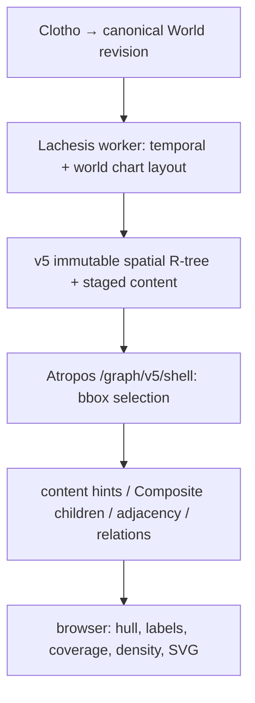
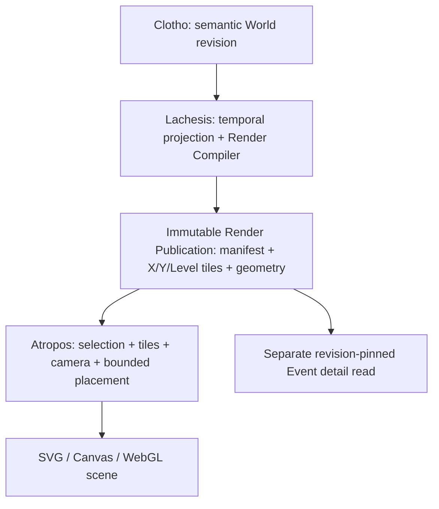

# IP-012 — Lachesis Render Publication / Atropos scene runtime

2026-09-29 planning baseline against main `d6dda43`. Implementation is **not activated** by this document. IP-011 A5 remains active; A6/M5 remain inactive. [Decision handoff](IP-011-render-publication-handoff.md) supplies the architectural invariants; this plan resolves its open design choices against the repository. This is a separate follow-up IP because A5 S0–S7 deliberately used the existing Publication and treated tile/engine changes as conditional experiments. Do not silently rewrite A5's execution gates. A4-B01–03 remain open until independently verified; IP-012 measurements may close them only with the specified evidence.

2026-09-29 execution update: the user's subsequent implementation instruction activates IP-012 work. A deterministic compiler, opt-in worker sidecar, revision-pinned render read, isolated browser tile client and public preview are implemented. `LACHESIS_RENDER_PUBLICATION=shadow` is set on the production worker for **future canonical revisions**; the currently served revision is immutable and has no sidecar. GraphShell still uses the prior semantic viewport pipeline. The preview and synthetic fixture do not constitute runtime cutover, mobile performance acceptance, A5 completion or closure of A4-B01–03. [CURRENT](CURRENT.md) owns exact deployment status.

### Operational missing-tile policy (2026-09-29)

The grid is `2^level × 2^level` over the published World geometry bounds. Empty cells are omitted from the manifest and mean empty space; the client requests only listed cells. A listed cell whose object is absent or fails its digest is a broken Publication, not a cue to recalculate geometry in Atropos or to silently fall back to semantic graph reads. `404 render_unavailable` means the served revision has no Render sidecar; `404 render_asset_not_found` means an explicitly requested key is unlisted. The latter is empty only when the client derived the absence from the manifest before making a request. The UI must distinguish these cases from a stale pointer (`409`) and storage/integrity failure (`503`).

Add an authenticated **operator rebuild request** to Lachesis, not a public per-tile generate endpoint. The request identifies World, canonical revision, compiler algorithm version and an idempotency key; it queues a bounded full-revision compile, records progress/errors, validates all tile, geometry, endpoint and manifest proofs, and only then atomically exposes a new complete Publication generation. No request-time graph traversal is allowed on Atropos. The current key layout binds render assets and the served root to a single canonical revision; it cannot safely attach a different manifest to an already served revision without changing that root. Before accepting rebuilds of a served revision, introduce a distinct immutable **publication generation ID** in the pointer and asset keys, keep canonical revision identity separate, and pin the client to both. A failed rebuild leaves the served generation untouched; repeated requests with the same idempotency key return the same job. An unlisted sparse tile never triggers a rebuild. This is a prerequisite for operational backfill of revision 56, not an excuse to mutate its existing revision-scoped root.

### Frequent writes: incremental invalidation and scheduling (2026-09-29)

**Separate three identities:** canonical World revision `R` records authored facts; compiler/grid version `C` determines representation semantics; immutable Render generation `G` identifies one validated output compiled from `(R,C)`. Each tile manifest entry carries a content digest, so `G` may reference an unchanged content-addressed payload from an earlier generation. Clients pin `(R,G)` for the whole scene, with Event detail at `R`; never mix geometry at an earlier `R` with latest-revision detail. A new canonical revision does not by itself force a different byte payload for every tile. A render pointer changes only after all output and proofs pass. While Render lags, keep the legacy graph path or the last consistent revision pair visibly available; do not claim the latest revision is rendered.

**First remove accidental global invalidation:** today's grid divides the current World-wide geometry bounds into `2^L` cells per axis; changing an extreme Event moves every boundary. Define a versioned grid with stable World-coordinate origin and X/Y cell spans per Level, independent of current occupied bounds. Signed X/Y indices and sparse manifest pages replace the existing nonnegative `0..2^L-1` contract. A grid-version change is an explicit full rebuild. The compiler may still recompute the entire World initially, but compares normalized primitive/geometry fingerprints and old/new tile membership, writes only changed content-addressed payloads, and reuses unchanged payload refs. This saves storage, uploads and client bytes before claiming to save CPU. Revision and generation metadata belong in the manifest, not in the hashed reusable geometry payload; integrity checks bind the payload digest and manifest entry to `(R,G)`. Measure hash/diff CPU against a full build rather than assuming this optimization is free.

**Dependency closure for eventual partial compilation:** start from changed Event IDs and changed relation/membership/temporal facts. Recompute affected placed Event coordinates, then expand to every Event whose output position actually changes; contains descendants affect every ancestor (including multiple parents), and moved endpoints affect incident relation geometry. Add old and new tile coverage for each changed point, line, polygon and cluster, plus neighboring label/LOD candidates and the levels where a membership signature changes. Remove old representations as well as writing new ones. A narrative-only edit leaves render payload unchanged if no label/read hint changes; title, membership and temporal edits have their own explicit dependencies. Time System or compiler/grid version changes force a full rebuild. **Current X-force layout can move more Events than the edited subgraph** (and the ≤500 Event mode uses broad repulsion); until a locality guarantee exists, calculate a full World layout and compare coordinates, treating any changed position as dirty. Abort selective reuse on unknown dependencies, changed grid version or failed equivalence proof. Test incremental output byte-for-byte against a full compile at the same `(R,C)` before enabling it.

**Scheduling at the present scale:** the existing PostgreSQL `publication_outbox` is already a durable queue for canonical revisions. Do not add Kafka or a second in-memory source of truth. Keep canonical write transactions short and keep their current publication integrity rules. Use a separate latest-desired Render job per World in PostgreSQL (or a compatible coalescing outbox extension), with `desired_revision`, `first_dirty_at`, `next_eligible_at`, lease, attempt and last error. New writes advance `desired_revision`; a quiet window of initially 5 seconds coalesces bursts, while `first_dirty_at + 30 seconds` caps wait under continuous edits. These are starting parameters to measure, not fixed product latency guarantees. Permit at most one Render compile per World and initially one globally; a worker owns a renewable lease and processes the newest eligible revision. After a build, if a newer desired revision arrived, either discard the obsolete generation before pointer swap or publish only if it remains a valid explicitly pinned pair, then schedule the latest; bound consecutive obsolete builds. On restart, the database row and lease recover the job. In-memory timers may wake the worker and hold a per-process recent result cache, but do not carry the only pending work. Rate-limit repeated failures with capped exponential backoff, record compile/upload CPU, memory, queue age and coalesced revision count, and protect the canonical worker's resource budget. Operator rebuild enters this same job path with an idempotency key and explicit priority/rate limit, never an unbounded synchronous HTTP compile.

**Rollout order:** (1) baseline burst workload and current publication lag; (2) generation ID and consistent `(R,G)` reader, including backfill and rollback; (3) durable coalescing scheduler with single worker; (4) stable grid and content-addressed payload reuse with full layout/full compilation; (5) proven dependency closure and selective compilation only when it beats full compilation. Gate each stage on burst and continuous-write tests, restart/lease recovery, unchanged tile reuse, endpoint/ancestor coverage, all-or-nothing pointer swap, and no mixed revision in pan, zoom or Event detail. Track p50/p95 age from committed `R` to served matching `G`; tune quiet/max windows from actual workload and CPU saturation.

## Verified before pipeline and limitations



`apps/lachesis-worker/src/index.ts` calls `buildV5WorldCompleteArtifacts` and `publishV5CompleteArtifacts`; the latter verifies a complete staged tree and advances the served pointer. `packages/graph-presentation/src/v5-world-layout.ts` calculates World/Event point positions, Event segments and **Composite bounds**, per compatible Time System. `v5-spatial-publication.ts` adds title and small membership hints to spatial leaf records; `v5-spatial-index.ts` builds immutable World R-tree nodes. These are presentation coordinates, not canonical historical facts. **A Composite's stored region is four bounds numbers, not a persisted hull vertex array.** Its semantic direct children live separately in staged content; the full rendered hull depends on browser support points and nested regions. There is no persisted renderer-ready relation polyline in this v5 path. The chart builder may produce line entities internally, but `v5-world-layout.ts` filters to `item.id === item.eventId`, explicitly excluding those relation entities from the spatial index.

`v5-graph-page.tsx` reads served root, first catalog/time system, spatial summary and initial shape to bootstrap `V5AtroposRoot`. Root recreates `createV5GraphReadLoader` on selection changes. The loader POSTs `/graph/v5/shell` and paginates snapshots; `/graph/v5/viewport` is a separate lower-level POST route using `createV5StagedAtroposReader.selectedViewport`, **not** the normal shell loader's endpoint. Both responses are `no-store`. `/shell` caps selection pages at 16, maps shapes through `v5ShellReader.shape`, calls `compositeChildren(id,0)` per region, then `edges`: up to 64 visible points → first adjacency page per point → at most 256 relation documents → endpoint matching only among returned points. It can truncate or miss edges spanning pages and client continuation batches; the loader explicitly marks cross-batch relations incomplete. Title hints usually avoid event content reads; a missing hint falls back to `eventContent`. Drawer `detail`/`collectionDetail` separately read Event/Narrative, children, adjacency and neighbors and must remain semantic reads.

`v5-staged-reader.ts` delegates spatial selection to graph-presentation readers and staged content to publication readers. `publication.ts` caches successful immutable revision objects per server process (2048 entries / 16 MiB), with a request-local 1024-object map in `v5ShellReader`. `viewport-cache.ts` keeps up to 8 bbox snapshots / 8 MiB and 30-second v5 expiry; complete coverage may be reused, partial only for exact bbox. Selection batches each repeat spatial traversal with shared objects inside one request, so many Collections increase intersection/union, selection paging, relation joins, bytes, and browser candidate work. A5's lifted 8-Collection cap does **not** establish bounded 30+ performance. The initial catalog currently reads page zero; do not infer it exposes every Collection.

`graph-shell.tsx` computes `prepareCompositeWorldGeometry`, selects regions for camera bounds, projects vertices, expands screen polygons, clips for coverage, resolves edge labels, builds spline SVG paths, walks region descendants for opacity, computes semantic density and relation endpoint presentation. Camera `view` participates in multiple memo dependencies. Pointer moves schedule animation frames but still update image viewport state and invalidate camera-dependent geometry; memoization alone cannot produce the target frame path. Some screen padding, collision, coverage, HUD ranking and relation rerouting to a suppressed Composite are camera-dependent and cannot simply be persisted as fixed screen coordinates. The latter must be specified as prepared alternative representation/anchor plus bounded runtime selection.

## Target and ownership



| Responsibility | Clotho | Lachesis compiler | Atropos runtime |
| --- | --- | --- | --- |
| Event/Narrative, Collection membership, contains and Relations | authoring interface; canonical commits remain behind Lachesis | read validated World revision | read detail only on explicit user action |
| World layout, transitive Composite support, hull, relation world path, simplification | none | own, version and validate | consume prepared geometry |
| LOD, text, anchors, style class, interaction eligibility | none | prepare representations by Level; keep semantic and graphic channels distinct | select/interpolate, apply user selection and camera |
| Tile assignment and revision integrity | none | compile, verify completeness, publish atomically | fetch and verify manifest/revision |
| Viewport coverage, final pixel padding/collision, HUD, focus, hit test, paint | none | prepare bounds, label candidates and alternatives | own bounded final calculation and drawing |

Do not make Clotho a rendering-policy owner or let browser fetch Composite descendants/adjacency for drawing. World layout is computed **independently of Collection selection**. Selection masks are compiled posting/bitset references per tile or revision and joined by stable Event/Relation IDs at runtime without changing World coordinates. Pinned, excluded and contextual Collections remain Atropos read state. Empty selection stays empty; direct Event/detail access remains possible.

## Renderer-neutral contract, version 1

Use a small shared schema/validator package (proposed `@moirai/render-contract`); a compiler-only package may import pure graph geometry, while Atropos imports the contract and a separate tile scene adapter. Do not share a FE/BE rendering pipeline. Canonical wire encoding remains undecided; measure JSON and compressed/binary candidates after semantics stabilize.

```ts
type RenderManifest = {
  format: 'render-publication/1'; worldId: string; revision: number;
  timeSystemId: string; algorithmVersion: string; coordinateSystem: string;
  bounds: Box; levels: readonly LevelSpec[];
  tiles: readonly TileRef[]; // hierarchical/paged manifest, not an unbounded root
  geometry: readonly GeometryRef[]; selectionIndex: SelectionIndexRef;
  digest: string; completeness: 'complete';
};
type TileRef = {level: number; x: number; y: number; key: string;
  bounds: Box; byteLength: number; digest: string};
type RenderTile = {format: 'render-tile/1'; worldId: string; revision: number;
  timeSystemId: string; algorithmVersion: string;
  tile: {level: number; x: number; y: number; bounds: Box};
  primitives: readonly RenderPrimitive[]; digest: string};
type RenderPrimitive = {
  id: string; // stable representation ID; dedupe across tiles/levels
  entity: {kind: 'event'|'relation'|'composite'|'collection-overlay'; id: string};
  geometry: {kind: 'point'; xy: Point} |
    {kind: 'line'; paths: readonly Point[][]} |
    {kind: 'polygon'; rings: readonly Point[][]} |
    {kind: 'external'; key: string; digest: string; bounds: Box};
  bounds: Box; drawOrder: number; visualClass: string;
  channel: 'semantic'|'geographic';
  interaction: {primary: boolean; hitGeometry?: GeometryRef; detailRef?: string};
  selection: {collectionPostingRef?: string; worldVisible?: boolean};
  lod: {visible: [number,number]; fadeIn?: [number,number];
    fadeOut?: [number,number]; groupId: string; counterpartIds: readonly string[]};
  label?: {text: string; worldAnchor: Point; priority: number;
    candidates: readonly LabelCandidate[]; collisionGroup: string};
};
```

Coordinates are world-space floating values with finite bounds and specified origin/unit/axis, including independent X/Y camera scales. Half-open tile ownership prevents boundary duplicates; overscan replicas have the same primitive ID and only one active instance draws. Polygon rings include holes and winding; clipped fragments retain parent geometry identity. A relation's geometry and endpoint references are already compiled, including alternate anchors if semantic LOD hides an endpoint. Geometry refs are digest-addressed, immutable and revision-scoped. No SVG `d` strings, device pixels, camera-dependent opacity, DOM IDs or historical Narrative bodies in tiles. Text is public label text only. Accessibility text and interaction must follow semantic eligibility; decorative geographic geometry has no primary target. Visual class/style tokens are renderer-neutral and versioned. Detail URLs resolve separately by World/Event/revision; Collection overlay identity is never an Event duplicate.

Level is **semantic scale**, separate from x/y grid coordinates and from the two anisotropic screen scales. Define a deterministic `effectiveLevel(camera.scaleX, camera.scaleY, viewport)` with a documented monotonic rule and golden cases; do not allow scaleY-only checks to silently contradict x-dependent footprint. Adjacent levels overlap: point fades out while hull fades in, using shared group ID and prepared geometry. Atropos evaluates weights and crossfades/interpolates matching primitives; topology-changing shapes crossfade, never interpolate unmatched vertices. Children and labels have independent visibility intervals and density budgets. No geometry generation on zoom. World-level suppression of redundant ancestors may be prepared, while full-viewport coverage and HUD topic ranking remain viewport-dependent. Preserve A5 HUD rule: choose exactly one screen-related Composite when candidates exist, regardless of paint area/fade.

## Tiling, buffering and large geometry

Compile deterministic quadtree-like fixed X/Y grids per Level and Time System, with sparse absent tiles and bounded hierarchical manifest pages. Fix world grid origin and dimensions per immutable revision manifest; camera movement does not alter tile IDs. Size targets are measured, not assumed. Every primitive is discoverable from every tile intersecting its drawn bounds including stroke/label candidate allowance; use conservative world-space envelope and runtime screen overscan for device-dependent padding. A representation spanning many tiles cannot disappear because only its anchor tile was fetched. Prepare level L and adjacent transition levels when within prefetch distance of overlap. Keep at least one screen of XY overscan initially as a measured candidate; trigger fetch before entering its inner guard, retain exiting tiles during transition, evict LRU outside guard and cap decoded bytes with mobile-specific budget. Parameterize and measure screen overscan, level guard, hysteresis, concurrency, retention, memory; ensure continuous pan/zoom at boundaries with throttled network. Do not commit magic values as contracts.

| Strategy | Advantage | Cost / failure |
| --- | --- | --- |
| Clip and duplicate every line/polygon | self-contained local tiles | large hull duplicated across many tiles; seam/topology and invalidation cost |
| External immutable geometry per large primitive | one geometry payload/digest | many requests; tile bounds/ref lookup and cache misses |
| Hybrid **chosen** | inline small clipped shapes, externalize large shapes with tile-local refs/bounds | needs deterministic threshold, dedupe, ref integrity and preload |

Compile both encodings in representative fixtures and choose the inline/external threshold from duplication bytes, cold requests, decode and memory measurements before locking wire format. Tiles carry references for *every intersecting tile*; fetch shared geometry once per revision/digest and render once by stable ID. Preserve rings and clipping provenance. Use bounded geometry ref fan-out; if an object crosses extreme tile counts, hierarchical coverage references can replace per-tile fan-out without reverting to semantic reads. Verify isolated visible region with all descendant Events outside viewport.

## Serving and cache boundary

The current mutable served pointer/root selects a **complete** revision. Publish render manifest/tile/geometry digests under revision keys before pointer CAS; preserve old served tree until complete verification. Browser pins one revision across tiles, details and selection postings; on pointer change, atomically switch working set or keep old set until new ready, never combine revisions. Revision-keyed render assets may be served directly from object storage/CDN with immutable long-lived caching **only after** public access policy, CORS, MIME, digest and signed/allowlisted path behavior are verified; do not expose credentials or private provenance. Current World is public, but CON-005/RM-001 prohibit assuming every future Publication is anonymous. Mutable discovery/pointer stays short-lived/revalidated; immutable tiles use content/revision key, HTTP cache + browser cache + decoded bounded LRU. Retire arbitrary bbox snapshot cache after tile route cutover; retain semantic `/read` and drawer reads. Keep a Next route proxy fallback for environments lacking a verified public tile origin, not viewport JSON reconstruction. Preserve per-process immutable object caching only for semantic reads/proxy misses as needed.

## Migration mapping

| Existing path/function | Action |
| --- | --- |
| worker `index.ts`, `buildV5WorldCompleteArtifacts`, `v5-serving.ts` | extend compiler outputs, proofs, upload and atomic served pointer; retain canonical read/lease checks |
| `v5-world-layout.ts`, `v5-spatial-index.ts` | retain deterministic layout as compiler input; replace bbox R-tree as ordinary render scene source after cutover |
| `v5-spatial-publication.ts` and staged content/selection readers | add render manifest and posting assets; keep semantic content/search/discovery readers |
| `v5ShellReader.shape`, `.edges`, `/graph/v5/shell` viewport branch | replace with tile scene reads; keep `.detail`/`.collectionDetail` and revision checks |
| `/graph/v5/viewport` | retain temporarily for shadow comparison and rollback; remove from render path after gate |
| `v5-graph-page.tsx`, `V5AtroposRoot`, `v5-graph-read-loader.ts` | bootstrap render manifest and selection; replace bbox snapshot loading; preserve URL, focus and drawer semantics |
| `viewport-cache.ts` | replace snapshot coverage/TTL with tile memory LRU and revision invalidation; keep only legacy fallback while gated |
| `graph-shell.tsx` / `graph-shell-region-geometry.ts` | move world hull support, closure, geometry simplification, relation path and representation policy into compiler; retain camera transforms, pixel clipping/collision, HUD, input and paint; remove descendant traversal and world hull generation from hot path |
| `graph-shell-label-policy.ts`, density helpers | split compiled candidate/priority/visibility from bounded screen collision and A5 user interaction/density state; remove runtime graph-wide semantic selection |
| `publication.ts` immutable cache | retain for existing semantic path; direct immutable asset serving reduces viewport server involvement |

## Ordered implementation and gates

1. **Baseline/coordination:** refresh main and open PRs, record SHA/served revision and A5 working files; isolate branch. Reproduce 30+ Collection slowdown with cold/warm profiles (server object reads, selection batches, JS geometry, React frames, bytes). Capture existing 1k/10k/100k and dense composite fixtures; record A4-B01–03 separately. Freeze visual/identity/accessibility golden screenshots and selection semantics. No production pointer change.
2. **Contract + compiler prototype:** implement schema, deterministic grid/level mapping, stable IDs, child closure/cycle diagnostics, full hull rings, relation paths, LOD/label candidates and membership references. Compile synthetic fixtures offline, compare World Event coordinates and drawing against v5. Test descendants outside bbox, huge crossing geometry, nested Composite, selection overlap/empty, unplaced Event, unsupported Time System, duplicate membership and anisotropic zoom.
3. **Complete publication:** add hierarchical manifest, tiled assets, external geometry refs, per-object digest, completeness and endpoint/coverage proof to Lachesis staging. Compile entire revision first. Failure, lease loss or malformed asset must leave served pointer untouched. Measure full rebuild before incremental invalidation; dependency metadata records affected ancestors, relations, labels and tile keys, but incremental rebuild is deferred.
4. **Shadow server reader:** resolve manifest/tiles with no semantic rendering joins; compare scene identity, relation completeness and hull coordinates against golden fixtures. Keep old `/shell` path for rollback. Record mismatches explicitly; do not silently substitute old graph reads for missing render data.
5. **Atropos tile client behind flag:** pin revision, fetch/decode XY+neighbor Level working set, dedupe primitives, apply collection selection and separate Semantic/Geographic budgets, camera/LOD interpolation, final collision, HUD and hit testing. Preserve event detail on separate existing route. Handle abort, stale pointer, partial fetch and mobile memory limits visibly.
6. **Hot path:** during gesture update camera transform/draw without broad React tree reconciliation; recalculate tile set/labels on guarded thresholds or settle, while bounded device-dependent opacity/culling/LOD weight can run per frame. Instrument decode/transform/label/render separately. SVG remains valid if budgets pass; Canvas/WebGL is a later renderer choice against the same contract.
7. **Cutover:** CI contract/projection/security/accessibility checks; synthetic and production-like shadow replay; public mobile pan/zoom/drawer/URL/selection smoke; deploy flagged and attribute to commit. Verify served pointer and manifest digests, observe rollback, enable gradually, then remove obsolete bbox rendering joins and cache. Do not alter A5 product behavior or activate A6/M5.

## Performance and correctness exit

Measure 1k, 10k, 100k Events with same local viewport and distant added records; 1/9/16/30+ Collections; sparse/dense nested Composite, long relations, cold/warm cache, mobile viewport, 30 round trips, sustained pan and continuous anisotropic zoom. Record compiler wall/CPU and peak memory; storage bytes, tile count, duplication ratio and manifest size; cold/warm asset requests/bytes and decode; active memory/eviction; per-frame transform, label, paint, p50/p95/max; tile and LOD crossings. Compare to before baseline on identical hardware/fixtures; no full-World semantic read in normal render, and local read bytes/object counts must not scale linearly with distant World growth or selected Collections when rendered scene is unchanged. Prove completeness: every visible Event/relation/region appears once, no cross-tile seams, no zoom popping, no mixed revisions, no loss of A5 HUD/selection/keyboard/touch/drawer behavior. Keep TS-006's initial viewport payload ≤1 MiB and object-read ≤256 as a comparison baseline, not a claim that tile reads satisfy it; replace with measured per-visible-set tile/network budgets during prototype and record them before flag-on. A4 sustained p95 ≤33.4 ms and max ≤100 ms over 30 visits/returns remain independent exit gates; B02 region calculation and B03 physical mobile/heap require their own recorded proof. A regression in correctness, security, or old A5 behavior blocks cutover regardless of frame speed.

## Document reconciliation

CON-003/005, CORE-MODEL, BR-003 and TS-005 already support World-owned layout, Collection-as-selection, single Event identity, separate Narrative and immutable Publication. TS-006 currently specifies spatial/scale shards and a request-time catalog→index→membership→neighbor query; this remains the **semantic/discovery/detail path**, not the ordinary render path after IP-012. Its bounded adjacency and Event detail remain useful for explicit reading; its old viewport response contract must not be interpreted as a mandatory draw API. Amend TS-006 when implementation activates to name Render Publication and split both read contracts, and update TS-001's service diagram then. IP-011 A5 expressly says SVG/existing Publication and tile only conditionally within its scope: IP-012 is a subsequent structural migration, not a retroactive assertion that A5 selected tiles. A4 backlog is not closed by acceptance of this plan. CURRENT continues to show A5 implementation active. This plan resolves handoff's hybrid choice and level semantics without changing accepted product ontology.
