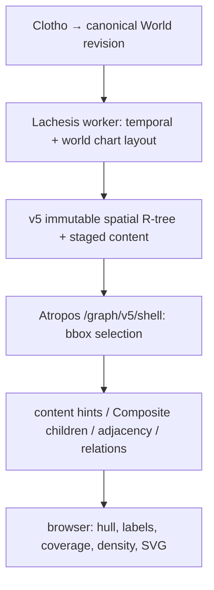
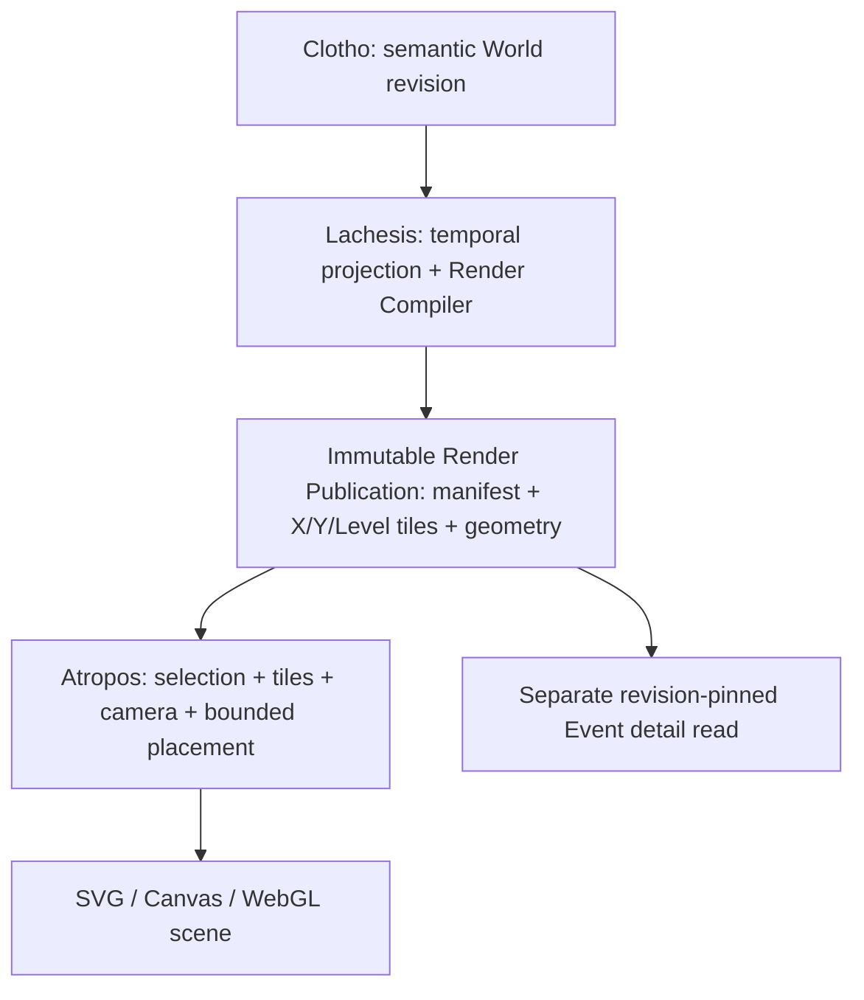

# IP-012 — Lachesis Render Publication / Atropos scene runtime

2026-10-04 planning reconciliation: [IP-013](IP-013-real-history-development-plan.md) supersedes the previous execution order. World management and Clotho/publication acceptance precede parallel real-history input and Composite representation work; an isolated X-layout lab follows, then Collection automation/discovery. This documentation task ends at a draft PR. The default GraphShell Render integration is implemented, not a completed claim for all publication work. [CURRENT](CURRENT.md) owns runtime evidence; [ADR-012](../architecture/ADR-012-render-read-architecture.md) owns read architecture. [Mobile tuning closed by user acceptance](IP-012-mobile-continuity-closeout.md); numeric A4/frame/heap backlog does not reopen it.

Compiler v4 emits `render-publication/2` with a fixed signed spatial frame, bounded per-cell candidates, authored Composite support and coarse overflow geometry. `/graph/v5/render` resolves viewport metadata directly and then serves missing immutable geometry; the browser does not download the complete manifest for this normal path. Existing GraphShell hull/point/label/relation/HUD/drawer grammar remains the presentation baseline. `?tileData=0` is the semantic rollback route; `?renderTiles=1` is the separate tile scene observation route. Default Render data use does not establish smooth mobile transitions or full performance acceptance.

Independent Render generations and the `deferred` scheduler are implemented; the production burst experiment ended at Revision 62. Full compilation, partial invalidation/reuse and scheduler recovery are distinct claims: only full generation publication and the recorded burst coalescing are evidenced so far. Initial shadow/prototype/backfill checkpoints are preserved in [execution evidence](../evidence/ip012/render-publication-2026-09-29.md) and [checkpoint history](CURRENT-HISTORY-THROUGH-PR303.md). [The original handoff](IP-011-render-publication-handoff.md) is historical rationale, not a new planning-only restriction.

### Operational missing-tile policy (reconciled 2026-10-02)

The active v4 grid uses fixed origin/spans and signed levels/indices, independent of occupied World bounds. The read service derives intersecting addresses and verifies their existence through the staged digest index; known absent sparse cells are empty. A required indexed object that is missing or fails its digest is a broken Publication, not a cue to reconstruct the graph or silently switch to semantic reads. The old v3 manifest-addressed grid remains a compatibility path only. Distinguish absent Render publication (`404 render_unavailable`), explicitly unlisted asset (`404 render_asset_not_found`), stale revision/generation (`409`), bounded read overflow (`413`) and integrity/storage failure (`503`). The client must not turn a transient failure into an authoritative empty scene.

Add an authenticated **operator rebuild request** to Lachesis, not a public per-tile generate endpoint. The request identifies World, canonical revision, compiler algorithm version and an idempotency key; it queues a bounded full-revision compile, records progress/errors, validates all tile, geometry, endpoint and manifest proofs, and only then atomically exposes a new complete Publication generation. No request-time graph traversal is allowed on Atropos. The independent generation pointer and asset keys are now implemented for one-shot worker backfill of Revision 56, without changing the canonical root. The queued operator request and idempotency/progress API remain to implement. A failed rebuild leaves the served generation untouched; repeated requests with the same idempotency key must return the same job. An unlisted sparse tile never triggers a rebuild.

### Frequent writes: incremental invalidation and scheduling (2026-09-29)

**Separate three identities:** canonical World revision `R` records authored facts; compiler/grid version `C` determines representation semantics; immutable Render generation `G` identifies one validated output compiled from `(R,C)`. Each tile manifest entry carries a content digest, so `G` may reference an unchanged content-addressed payload from an earlier generation. Clients pin `(R,G)` for the whole scene, with Event detail at `R`; never mix geometry at an earlier `R` with latest-revision detail. A new canonical revision does not by itself force a different byte payload for every tile. A render pointer changes only after all output and proofs pass. While Render lags, keep the legacy graph path or the last consistent revision pair visibly available; do not claim the latest revision is rendered.

**Fixed addressing implemented; payload reuse remains:** v4 removed the earlier bounds-derived grid. Its fixed origin/spans and signed indices keep existing cell boundaries stable when distant Events arrive. A grid-version change still requires an explicit full rebuild. The compiler may still recompute the entire World initially, but compares normalized primitive/geometry fingerprints and old/new tile membership, writes only changed content-addressed payloads, and reuses unchanged payload refs. This saves storage, uploads and client bytes before claiming to save CPU. Revision and generation metadata belong in the manifest, not in the hashed reusable geometry payload; integrity checks bind the payload digest and manifest entry to `(R,G)`. Measure hash/diff CPU against a full build rather than assuming this optimization is free.

**Fixed L0 and signed levels, before selective reuse:** store a grid specification with a fixed origin `(O_x,O_y)` and positive base spans `(S_x,S_y)` in the compiler contract; choose these constants from coordinate units and expected camera coverage, never from occupied World bounds. For integer spatial level `z`, cell spans are `(S_x·2⁻ᶻ,S_y·2⁻ᶻ)` and tile indices are `(floor((x−O_x)/spanX),floor((y−O_y)/spanY))`, including negative indices. A cell owns `[min,max)` on each axis; a boundary point belongs to the cell on its positive side. Negative `z` expands coverage, positive `z` refines it. Parents nest exactly around the fixed origin, including cells across zero; test negative coordinates, exact boundaries and range expansion. Occupied bounds determine only camera framing and sparse manifest coverage. They never determine cell edges or force an automatic grid migration. Choose a finite published level window by camera/point-budget policy; sparse cells outside the currently occupied range do not need documents. A newly occupied cell can be added without moving existing edges. A grid-spec or layout-algorithm change increments `C`, compiles an entirely new generation, then atomically switches the pointer; old `(R,G)` clients keep their original grid until released. The legacy `render-publication/1` contract retains its original nonnegative/bounds-derived interpretation. Compiler v4 uses `render-publication/2` and `render-tile/2` with `render-spatial-frame/1`; compiler, route validation and client coverage support the signed grid together. Existing v3 assets are not reinterpreted in place. See `packages/graph-presentation/src/v5-render-grid.ts` and the fixed-grid evidence for current constants.

Spatial `z` and semantic LOD are distinct. The legacy preview helper `levelForCamera` is not the normal v4 viewport selection contract. Normal visibility follows camera footprint and explicit density policy over fixed spatial coverage, rather than spatial count-cluster identity or occupied World width. Refine screen-space transitions independently of the selected signed spatial level. A negative spatial level need not imply a negative semantic LOD; document both indices separately in the new manifest. For large geometries intersecting many fine cells, retain digest-checked shared geometry and bound tile-reference fan-out. Verify a wide overview and a fine local viewport render the same eligible identities exactly once, with no seam or sudden LOD change as distant Events arrive.

**Dependency closure for eventual partial compilation:** start from changed Event IDs and changed relation/membership/temporal facts. Recompute affected placed Event coordinates, then expand to every Event whose output position actually changes; contains descendants affect every ancestor (including multiple parents), and moved endpoints affect incident relation geometry. Add old and new tile coverage for each changed point, line, polygon and cluster, plus neighboring label/LOD candidates and the levels where a membership signature changes. Remove old representations as well as writing new ones. A narrative-only edit leaves render payload unchanged if no label/read hint changes; title, membership and temporal edits have their own explicit dependencies. Time System or compiler/grid version changes force a full rebuild. **Current X-force layout can move more Events than the edited subgraph** (and the ≤500 Event mode uses broad repulsion); until a locality guarantee exists, calculate a full World layout and compare coordinates, treating any changed position as dirty. Abort selective reuse on unknown dependencies, changed grid version or failed equivalence proof. Test incremental output byte-for-byte against a full compile at the same `(R,C)` before enabling it.

**Scheduling at the present scale:** the existing PostgreSQL `publication_outbox` is already a durable queue for canonical revisions. Do not add Kafka or a second in-memory source of truth. Keep canonical write transactions short and keep their current publication integrity rules. Use a separate latest-desired Render job per World in PostgreSQL (or a compatible coalescing outbox extension), with `desired_revision`, `first_dirty_at`, `next_eligible_at`, lease, attempt and last error. New writes advance `desired_revision`; a quiet window of initially 5 seconds coalesces bursts, while `first_dirty_at + 30 seconds` caps wait under continuous edits. These are starting parameters to measure, not fixed product latency guarantees. Permit at most one Render compile per World and initially one globally; a worker owns a renewable lease and processes the newest eligible revision. After a build, if a newer desired revision arrived, either discard the obsolete generation before pointer swap or publish only if it remains a valid explicitly pinned pair, then schedule the latest; bound consecutive obsolete builds. On restart, the database row and lease recover the job. In-memory timers may wake the worker and hold a per-process recent result cache, but do not carry the only pending work. Rate-limit repeated failures with capped exponential backoff, record compile/upload CPU, memory, queue age and coalesced revision count, and protect the canonical worker's resource budget. Operator rebuild enters this same job path with an idempotency key and explicit priority/rate limit, never an unbounded synchronous HTTP compile.

**First scheduler slice:** the opt-in `deferred` worker mode derives pending work from completed canonical outbox rows newer than the Render pointer, avoiding a second queue table at the current scale. It reconstructs the first/last dirty time on restart, waits 5 seconds after the last commit with a 30-second cap from the first, and holds one PostgreSQL session advisory lock through a full generation publish across worker replicas. The immutable publish checks the served root again before pointer swap. Retry backoff and diagnostics are currently process-local; pending work remains in PostgreSQL. Production now has this mode enabled after Revision 56 backfill. A first three-edit burst exposed a lagging-canonical-target flaw (two generations); a target guard was deployed, and the second burst produced only one final Revision 62 generation. Restart/lease recovery under contention, sustained edits, CPU impact and starvation remain unproven. If operator requests, durable retry state, or fair prioritization cannot be achieved simply with the existing outbox, introduce the separate job row described above. Do not describe this first slice as selective tile invalidation or a fully accepted scheduling gate.

**Publication optimization dependency order (not the history-entry gate):** (1) baseline burst workload and current publication lag; (2) generation ID and consistent `(R,G)` reader, including backfill and rollback; (3) durable coalescing scheduler with single worker; (4) stable grid and content-addressed payload reuse with full layout/full compilation; (5) proven dependency closure and selective compilation only when it beats full compilation. Gate each stage on burst and continuous-write tests, restart/lease recovery, unchanged tile reuse, endpoint/ancestor coverage, all-or-nothing pointer swap, and no mixed revision in pan, zoom or Event detail. Track p50/p95 age from committed `R` to served matching `G`; tune quiet/max windows from actual workload and CPU saturation.

**Backlog IP-012-B01 — publication locality optimization.** IP-013 L now gives X-layout experimentation its own product priority after Composite review, independent of this optimization trigger. Alternatives to force-directed layout may be slower in the isolated lab. This paragraph remains an optional optimization hypothesis, not a required winning algorithm or a blocker for the history pilot. The current `v5-world-layout.ts` calls `buildGraphShellChartPlane` for the entire World. At >500 Events it bounds repulsion to 24 neighbors per side within 10 years, but incident relation forces and repeated iterations can propagate movement; at ≤500 Events repulsion is broader. For a locality optimization claim, the stable grid and full-layout diff above must first measure changed Event coordinates, tile payloads and compile CPU under one local edit, a distant edit, insertion at a dense year, changed temporal constraints and many simultaneous edits. Reuse based only on the edited Event ID is unsound.

If measurements show broad coordinate changes, prototype a **versioned locality-preserving layout**: use stable time-window/space-bucket anchors and deterministic slots with spare capacity; relax X positions within a bounded neighborhood and a small pinned halo, with an explicit maximum displacement and overflow diagnostic. Temporal order and placed/unplaced semantics remain authoritative; long relations route between prepared endpoints rather than pulling every distant Event's X position. A crowded bucket may rebalance a bounded neighboring region; an unsatisfiable region falls back to a visible, measured broader recompile, never silently overlaps Events. Compare this against retaining the existing solver with pinned previous coordinates and bounded influence; choose by visual parity, edit locality, cold rebuild reproducibility and cost. If previous-generation anchors are an input, record that generation and layout algorithm version so rebuilds are deterministic from the same inputs. Do not make edit history an unrecorded source of World coordinates.

The target is bounded **point-coordinate** invalidation for a local edit, not a false guarantee that every affected tile is local: changed Composite ancestors may span many tiles, and long relations can cross them. Keep large hull/line geometry content-addressed and measure separately the number of changed geometry objects, tile references and payload bytes. Enable this solver only after full-compile equivalence under its own version, chronology/overlap regression fixtures, and 1k/10k/100k edit-replay benchmarks show it reduces dirty tiles without unacceptable visual jumps. A layout algorithm switch creates a new `C` and forces one explicit full generation; it does not rewrite the canonical World.

## Historical before pipeline and limitations (baseline `d6dda43`)



This section records the traced pre-cutover path; it is still relevant to semantic rollback/detail reads but does not describe the default Render path.

`apps/lachesis-worker/src/index.ts` calls `buildV5WorldCompleteArtifacts` and `publishV5CompleteArtifacts`; the latter verifies a complete staged tree and advances the served pointer. `packages/graph-presentation/src/v5-world-layout.ts` calculates World/Event point positions, Event segments and **Composite bounds**, per compatible Time System. `v5-spatial-publication.ts` adds title and small membership hints to spatial leaf records; `v5-spatial-index.ts` builds immutable World R-tree nodes. These are presentation coordinates, not canonical historical facts. **A Composite's stored region is four bounds numbers, not a persisted hull vertex array.** Its semantic direct children live separately in staged content; the full rendered hull depends on browser support points and nested regions. There is no persisted renderer-ready relation polyline in this v5 path. The chart builder may produce line entities internally, but `v5-world-layout.ts` filters to `item.id === item.eventId`, explicitly excluding those relation entities from the spatial index.

`v5-graph-page.tsx` reads served root, first catalog/time system, spatial summary and initial shape to bootstrap `V5AtroposRoot`. Root recreates `createV5GraphReadLoader` on selection changes. The loader POSTs `/graph/v5/shell` and paginates snapshots; `/graph/v5/viewport` is a separate lower-level POST route using `createV5StagedAtroposReader.selectedViewport`, **not** the normal shell loader's endpoint. Both responses are `no-store`. `/shell` caps selection pages at 16, maps shapes through `v5ShellReader.shape`, calls `compositeChildren(id,0)` per region, then `edges`: up to 64 visible points → first adjacency page per point → at most 256 relation documents → endpoint matching only among returned points. It can truncate or miss edges spanning pages and client continuation batches; the loader explicitly marks cross-batch relations incomplete. Title hints usually avoid event content reads; a missing hint falls back to `eventContent`. Drawer `detail`/`collectionDetail` separately read Event/Narrative, children, adjacency and neighbors and must remain semantic reads.

`v5-staged-reader.ts` delegates spatial selection to graph-presentation readers and staged content to publication readers. `publication.ts` caches successful immutable revision objects per server process (2048 entries / 16 MiB), with a request-local 1024-object map in `v5ShellReader`. `viewport-cache.ts` keeps up to 8 bbox snapshots / 8 MiB and 30-second v5 expiry; complete coverage may be reused, partial only for exact bbox. Selection batches each repeat spatial traversal with shared objects inside one request, so many Collections increase intersection/union, selection paging, relation joins, bytes, and browser candidate work. A5's lifted 8-Collection cap does **not** establish bounded 30+ performance. The initial catalog currently reads page zero; do not infer it exposes every Collection.

`graph-shell.tsx` computes `prepareCompositeWorldGeometry`, selects regions for camera bounds, projects vertices, expands screen polygons, clips for coverage, resolves edge labels, builds spline SVG paths, walks region descendants for opacity, computes semantic density and relation endpoint presentation. Camera `view` participates in multiple memo dependencies. Pointer moves schedule animation frames but still update image viewport state and invalidate camera-dependent geometry; memoization alone cannot produce the target frame path. Some screen padding, collision, coverage, HUD ranking and relation rerouting to a suppressed Composite are camera-dependent and cannot simply be persisted as fixed screen coordinates. The latter must be specified as prepared alternative representation/anchor plus bounded runtime selection.

## Target and ownership

### 2026-09-29 GraphShell-preserving migration decision

The first tile-only SVG cutover removed authored Composite surfaces, color,
child fades, edge labels and HUD behavior, even though selection felt much
faster. That is not an acceptable default. Preserve the existing GraphShell
renderer, camera, input, drawer, Semantic/Geographic selection, color assignment,
screen-space hull padding and spline, hull↔point switching, descendant opacity,
label placement and context HUD. Replace its *viewport data source*, not the
whole painter. Screen-dependent decisions stay in Atropos; Lachesis prepares
revision-pinned World points, complete Composite concave hulls, direct authored
child IDs, support completeness, relation endpoints and paths. The detail reader
stays semantic. Never label a spatial membership aggregate as an authored
Composite or Event: the existing `N Events` grid cluster is a transport LOD
artifact, not the product's grouping semantics.

Allow small differences in exact spline, hue assignment, label location or
cross-tile fade timing when bounded and measured. Do not remove colorful
Composite surfaces, child visibility transitions, hull/point morph, primary
Event navigation, relation semantics, Collection filtering or the context HUD.
`render-compiler/3` adds hierarchy metadata to hull representations. Gate the
tile-backed GraphShell to this compiler version; a v2 sidecar must not be
silently interpreted as complete. First deploy the new data path under an
explicit URL option, recompile the same served Revision through the existing
operator backfill, and compare production camera/selection/interaction scenes
against the restored default. Only then make it the default; retain a query
rollback to the semantic path. Large-world transport LOD and the stable
fixed-coordinate L0 remain independent follow-up gates, not grounds for an
arbitrary numbered cluster in the default scene.



| Responsibility | Clotho | Lachesis compiler | Atropos runtime |
| --- | --- | --- | --- |
| Event/Narrative, Collection membership, contains and Relations | authoring interface; canonical commits remain behind Lachesis | read validated World revision | read detail only on explicit user action |
| World layout, transitive Composite support, hull, relation world path, simplification | none | own, version and validate | consume prepared geometry |
| LOD, text, anchors, style class, interaction eligibility | none | prepare representations by Level; keep semantic and graphic channels distinct | select/interpolate, apply user selection and camera |
| Tile assignment and revision integrity | none | compile, verify completeness, publish atomically | pin revision/generation; fetch bounded viewport metadata and verified geometry |
| Viewport coverage, final pixel padding/collision, HUD, focus, hit test, paint | none | prepare bounds, label candidates and alternatives | own bounded final calculation and drawing |

Do not make Clotho a rendering-policy owner or let browser fetch Composite descendants/adjacency for drawing. World layout is computed **independently of Collection selection**. Selection masks are compiled posting/bitset references per tile or revision and joined by stable Event/Relation IDs at runtime without changing World coordinates. Pinned, excluded and contextual Collections remain Atropos read state. Empty selection stays empty; direct Event/detail access remains possible.

## Renderer-neutral contract: design draft and implemented versions

The following TypeScript is the original conceptual draft, not the current wire schema. Implemented types live in `packages/graph-presentation/src/v5-render-publication.ts`, viewport metadata in `apps/atropos-web/src/lib/v5-render-viewport-client.ts`, and request validation in `/graph/v5/render/route.ts`. Current compiler output is v4 with publication/tile format `/2`; the complete manifest is operational metadata, not a browser bootstrap requirement. Proposed fields such as `selectionIndex` or `counterpartIds` are not claims of implemented fields.

Use a small shared schema/validator package (proposed `@moirai/render-contract`); a compiler-only package may import pure graph geometry, while Atropos imports the contract and a separate tile scene adapter. Do not share a FE/BE rendering pipeline. Canonical wire encoding remains undecided; measure JSON and compressed/binary candidates after semantics stabilize.

```ts
type RenderManifest = {
  format: 'render-publication/1'; worldId: string; revision: number;
  timeSystemId: string; algorithmVersion: string; coordinateSystem: string;
  bounds: Box; levels: readonly LevelSpec[];
  tiles: readonly TileRef[]; // hierarchical/paged manifest, not an unbounded root
  geometry: readonly GeometryRef[]; selectionIndex: SelectionIndexRef;
  digest: string; completeness: 'complete';
};
type TileRef = {level: number; x: number; y: number; key: string;
  bounds: Box; byteLength: number; digest: string};
type RenderTile = {format: 'render-tile/1'; worldId: string; revision: number;
  timeSystemId: string; algorithmVersion: string;
  tile: {level: number; x: number; y: number; bounds: Box};
  primitives: readonly RenderPrimitive[]; digest: string};
type RenderPrimitive = {
  id: string; // stable representation ID; dedupe across tiles/levels
  entity: {kind: 'event'|'relation'|'composite'|'collection-overlay'; id: string};
  geometry: {kind: 'point'; xy: Point} |
    {kind: 'line'; paths: readonly Point[][]} |
    {kind: 'polygon'; rings: readonly Point[][]} |
    {kind: 'external'; key: string; digest: string; bounds: Box};
  bounds: Box; drawOrder: number; visualClass: string;
  channel: 'semantic'|'geographic';
  interaction: {primary: boolean; hitGeometry?: GeometryRef; detailRef?: string};
  selection: {collectionPostingRef?: string; worldVisible?: boolean};
  lod: {visible: [number,number]; fadeIn?: [number,number];
    fadeOut?: [number,number]; groupId: string; counterpartIds: readonly string[]};
  label?: {text: string; worldAnchor: Point; priority: number;
    candidates: readonly LabelCandidate[]; collisionGroup: string};
};
```

Coordinates are world-space floating values with finite bounds and specified origin/unit/axis, including independent X/Y camera scales. Half-open tile ownership prevents boundary duplicates; overscan replicas have the same primitive ID and only one active instance draws. Polygon rings include holes and winding; clipped fragments retain parent geometry identity. A relation's geometry and endpoint references are already compiled, including alternate anchors if semantic LOD hides an endpoint. Geometry refs are digest-addressed, immutable and revision-scoped. No SVG `d` strings, device pixels, camera-dependent opacity, DOM IDs or historical Narrative bodies in tiles. Text is public label text only. Accessibility text and interaction must follow semantic eligibility; decorative geographic geometry has no primary target. Visual class/style tokens are renderer-neutral and versioned. Detail URLs resolve separately by World/Event/revision; Collection overlay identity is never an Event duplicate.

Level is **semantic scale**, separate from x/y grid coordinates and from the two anisotropic screen scales. Define a deterministic `effectiveLevel(camera.scaleX, camera.scaleY, viewport)` with a documented monotonic rule and golden cases; do not allow scaleY-only checks to silently contradict x-dependent footprint. Adjacent levels overlap: point fades out while hull fades in, using shared group ID and prepared geometry. Atropos evaluates weights and crossfades/interpolates matching primitives; topology-changing shapes crossfade, never interpolate unmatched vertices. Children and labels have independent visibility intervals and density budgets. No geometry generation on zoom. World-level suppression of redundant ancestors may be prepared, while full-viewport coverage and HUD topic ranking remain viewport-dependent. Preserve A5 HUD rule: choose exactly one screen-related Composite when candidates exist, regardless of paint area/fade.

## Tiling, buffering and large geometry

Compile deterministic fixed X/Y grids per spatial Level and Time System, with sparse absent tiles and bounded indexed lookup. The grid origin/spans are compiler-version constants independent of revision occupancy; camera movement does not alter tile IDs. Operational manifests may enumerate artifacts, while the normal browser path uses directly resolved viewport metadata. Size targets are measured, not assumed. Every primitive is discoverable from every tile intersecting its drawn bounds including stroke/label candidate allowance; use conservative world-space envelope and runtime screen overscan for device-dependent padding. A representation spanning many tiles cannot disappear because only its anchor tile was fetched. Prepare level L and adjacent transition levels when within prefetch distance of overlap. Keep at least one screen of XY overscan initially as a measured candidate; trigger fetch before entering its inner guard, retain exiting tiles during transition, evict LRU outside guard and cap decoded bytes with mobile-specific budget. Parameterize and measure screen overscan, level guard, hysteresis, concurrency, retention, memory; ensure continuous pan/zoom at boundaries with throttled network. Do not commit magic values as contracts.

| Strategy | Advantage | Cost / failure |
| --- | --- | --- |
| Clip and duplicate every line/polygon | self-contained local tiles | large hull duplicated across many tiles; seam/topology and invalidation cost |
| External immutable geometry per large primitive | one geometry payload/digest | many requests; tile bounds/ref lookup and cache misses |
| Hybrid **chosen** | inline small clipped shapes, externalize large shapes with tile-local refs/bounds | needs deterministic threshold, dedupe, ref integrity and preload |

Compile both encodings in representative fixtures and choose the inline/external threshold from duplication bytes, cold requests, decode and memory measurements before locking wire format. Tiles carry references for *every intersecting tile*; fetch shared geometry once per revision/digest and render once by stable ID. Preserve rings and clipping provenance. Use bounded geometry ref fan-out; if an object crosses extreme tile counts, hierarchical coverage references can replace per-tile fan-out without reverting to semantic reads. Verify isolated visible region with all descendant Events outside viewport.

## Serving and cache boundary

The current mutable served pointer/root selects a **complete** revision. Publish render manifest/tile/geometry digests under revision keys before pointer CAS; preserve old served tree until complete verification. Browser pins one revision across tiles, details and selection postings; on pointer change, atomically switch working set or keep old set until new ready, never combine revisions. Revision-keyed render assets may be served directly from object storage/CDN with immutable long-lived caching **only after** public access policy, CORS, MIME, digest and signed/allowlisted path behavior are verified; do not expose credentials or private provenance. Current World is public, but CON-005/RM-001 prohibit assuming every future Publication is anonymous. Mutable discovery/pointer stays short-lived/revalidated; immutable tiles use content/revision key, HTTP cache + browser cache + decoded bounded LRU. Bounded viewport coverage snapshots are valid caches under ADR-012 when tied to revision/generation, spatial level and proven coverage. Keep them only when measured reuse exceeds their merge/eviction cost; no blanket removal is required. The Next route is the current thin spatial resolver/assembler over immutable buckets, not a semantic graph renderer. Direct CDN/object delivery is optional future work after access/integrity verification. Retain semantic `/read`, drawer reads and useful immutable server caches.

## Migration mapping

| Existing path/function | Action |
| --- | --- |
| worker `index.ts`, `buildV5WorldCompleteArtifacts`, `v5-serving.ts` | extend compiler outputs, proofs, upload and atomic served pointer; retain canonical read/lease checks |
| `v5-world-layout.ts`, `v5-spatial-index.ts` | retain deterministic layout as compiler input; replace bbox R-tree as ordinary render scene source after cutover |
| `v5-spatial-publication.ts` and staged content/selection readers | add render manifest and posting assets; keep semantic content/search/discovery readers |
| `v5ShellReader.shape`, `.edges`, `/graph/v5/shell` viewport branch | replace with tile scene reads; keep `.detail`/`.collectionDetail` and revision checks |
| `/graph/v5/viewport` | retain temporarily for shadow comparison and rollback; remove from render path after gate |
| `v5-graph-page.tsx`, `V5AtroposRoot`, `v5-graph-read-loader.ts` | bootstrap generation metadata and selection; use bounded viewport representation/geometry reads; preserve URL, focus and drawer semantics |
| `viewport-cache.ts` | replace snapshot coverage/TTL with tile memory LRU and revision invalidation; keep only legacy fallback while gated |
| `graph-shell.tsx` / `graph-shell-region-geometry.ts` | move world hull support, closure, geometry simplification, relation path and representation policy into compiler; retain camera transforms, pixel clipping/collision, HUD, input and paint; remove descendant traversal and world hull generation from hot path |
| `graph-shell-label-policy.ts`, density helpers | split compiled candidate/priority/visibility from bounded screen collision and A5 user interaction/density state; remove runtime graph-wide semantic selection |
| `publication.ts` immutable cache | retain for existing semantic path; direct immutable asset serving reduces viewport server involvement |

## Ordered implementation and gates

### Current gates — supersede the former product order

1. **W/C actual-write readiness:** under IP-013, verify World/empty bootstrap, policy/identity reuse, validation, atomic commit/exact retry/read-back and first Event visibility. Demonstrate target/served revision and Render generation consistency, failure/restart recovery and safe bounded pilot batches. A full compile is sufficient if measured reliable; unresolved integrity/recovery failures block real writes.
2. **D1 ∥ R:** dot supplies sourced real history; Codex uses revision-pinned cases for Composite zoom stages, visual transitions and visible/tunable thresholds. Synthetic scale cases stay regression/performance tests, not the primary exploratory acceptance driver. Preserve #321 closeout.
3. **L:** after Composite review, compare X algorithms/parameters in an isolated lab with unchanged temporal semantics, identity, membership and camera intent. Experiment selection never changes production's served pointer. Review the chosen version before normal compiler integration, complete generation validation, atomic publication, rollback and any required backfill.
4. **A:** Collection automatic activation/deactivation and discovery follow R/L. Only manual controls necessary to read and validate belong in W/C/R. Broader incremental reuse/selective compile is driven by actual workload, not an all-or-nothing entry gate. Do not build a multi-publication selection product for the lab.

### Historical migration dependency record

The sequence below records the earlier migration design. Compiler/publication/default GraphShell integration are implemented; remaining items are backlog, not instructions to restart migration or finish all optimization before history. ADR-012 supersedes earlier global-manifest assumptions. Historical mobile frame work is closed; current ordering is above.

1. **Baseline/coordination:** refresh main and open PRs, record SHA/served revision and A5 working files; isolate branch. Reproduce 30+ Collection slowdown with cold/warm profiles (server object reads, selection batches, JS geometry, React frames, bytes). Capture existing 1k/10k/100k and dense composite fixtures; record A4-B01–03 separately. Freeze visual/identity/accessibility golden screenshots and selection semantics. No production pointer change.
2. **Contract + compiler prototype:** implement schema, deterministic grid/level mapping, stable IDs, child closure/cycle diagnostics, full hull rings, relation paths, LOD/label candidates and membership references. Compile synthetic fixtures offline, compare World Event coordinates and drawing against v5. Test descendants outside bbox, huge crossing geometry, nested Composite, selection overlap/empty, unplaced Event, unsupported Time System, duplicate membership and anisotropic zoom.
3. **Complete publication:** add hierarchical manifest, tiled assets, external geometry refs, per-object digest, completeness and endpoint/coverage proof to Lachesis staging. Compile entire revision first. Failure, lease loss or malformed asset must leave served pointer untouched. Measure full rebuild before incremental invalidation; dependency metadata records affected ancestors, relations, labels and tile keys, but incremental rebuild is deferred.
4. **Shadow server reader:** resolve manifest/tiles with no semantic rendering joins; compare scene identity, relation completeness and hull coordinates against golden fixtures. Keep old `/shell` path for rollback. Record mismatches explicitly; do not silently substitute old graph reads for missing render data.
5. **Atropos tile client behind flag:** pin revision, fetch/decode XY+neighbor Level working set, dedupe primitives, apply collection selection and separate Semantic/Geographic budgets, camera/LOD interpolation, final collision, HUD and hit testing. Preserve event detail on separate existing route. Handle abort, stale pointer, partial fetch and mobile memory limits visibly.
6. **Hot path:** during gesture update camera transform/draw without broad React tree reconciliation; recalculate tile set/labels on guarded thresholds or settle, while bounded device-dependent opacity/culling/LOD weight can run per frame. Instrument decode/transform/label/render separately. SVG remains valid if budgets pass; Canvas/WebGL is a later renderer choice against the same contract.
7. **Cutover:** CI contract/projection/security/accessibility checks; synthetic and production-like shadow replay; public mobile pan/zoom/drawer/URL/selection smoke; deploy flagged and attribute to commit. Verify served pointer and manifest digests, observe rollback, enable gradually, then remove obsolete bbox rendering joins and cache. Do not alter A5 product behavior or activate A6/M5.

## Performance and correctness exit

Use revision-pinned real-history pilot tasks as primary exploratory acceptance. Retain the following synthetic profiles for regression and scoped cost comparisons, without declaring their historical failures passed. Measure 1k, 10k, 100k Events with same local viewport and distant added records; 1/9/16/30+ Collections; sparse/dense nested Composite, long relations, cold/warm cache, mobile viewport, 30 round trips, sustained pan and continuous anisotropic zoom. Record compiler wall/CPU and peak memory; storage bytes, tile count, duplication ratio and manifest size; cold/warm asset requests/bytes and decode; active memory/eviction; per-frame transform, label, paint, p50/p95/max; tile and LOD crossings. Compare to before baseline on identical hardware/fixtures; no full-World semantic read in normal render, and local read bytes/object counts must not scale linearly with distant World growth or selected Collections when rendered scene is unchanged. Prove completeness: every visible Event/relation/region appears once, no cross-tile seams, no zoom popping, no mixed revisions, no loss of A5 HUD/selection/keyboard/touch/drawer behavior. Keep TS-006's initial viewport payload ≤1 MiB and object-read ≤256 as a comparison baseline, not a claim that tile reads satisfy it; replace with measured per-visible-set tile/network budgets during prototype and record them before flag-on. The original A4 sustained p95 ≤33.4 ms/max ≤100 ms, B02 calculation and B03 physical mobile/heap criteria remain recorded deferred evidence after #321, not current history or lab entry gates. Keep regression assertions; a new concrete regression is assessed separately from reopening the closed tuning task. A regression in correctness, security or preserved A5 behavior prevents claiming final acceptance regardless of frame speed. The user-authorized development checkpoint policy allows deploying incomplete improvements with failures disclosed; it does not authorize suppressing integrity/security checks or changing accepted product meaning.

## Document reconciliation

CON-003/005, CORE-MODEL, BR-003 and TS-005 continue to own World/Event/Collection/Narrative meaning and immutable publication. TS-001 and TS-006 now distinguish the deployed normal Render path from semantic discovery/detail/rollback. IP-013 owns the new order and A5 disposition preserves its deferred Collection Discovery requirements; IP-012 supplies the publication boundary without making all S0–S7 a history prerequisite. ADR-012 owns normal viewport addressing, candidate/geometry separation, local filtering and buffer invariants. CURRENT owns activation and current verification; historical evidence is not silently rewritten. [IS-001](IS-001-agent-mobile-strategy.md) and AGENTS persist the mobile-only frequent-checkpoint policy. Acceptance of this plan or successful checkpoint deployment does not close A4-B01–03.
