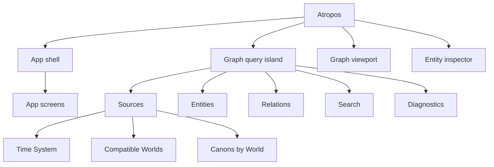

# IP-001 M4.5 — Atropos 탐색 UI와 Moirai-native graph query

> IP-003 interrupt: M4.5-C는 완료 checkpoint로 보존한다. 기존 M4.5-D는 폐기·분할됐고
> 재설계된 D1~H는 사용자 승인 전까지 비활성이다. 이 문서의 `canon_id` 단일 source-address와
> Canon partition을 전제한 query/result 예시는 IP-003 이전 역사적 계약이며 신규 구현의
> source of truth가 아니다.

> 2026-09-11 재설계 checkpoint: IP-003 Event/Canon/R1 Relation cutover와 production acceptance는
> 완료됐다. 아래 기존 D~H의 실행 단위는 그대로 재개하지 않는다. 사용자 승인 뒤의 새 순서는
> `D1 Entities/Search -> D2 Relations/Diagnostics -> E Publication composition ->
> F inspector/routes -> G legacy bridge -> H graph viewport`이며, 범위와 slice별 종료조건은
> [IP-003 §16](IP-003-canon-semantic-realignment.md#16-m45-잔여-계획-재설계-범위)이 소유한다.
> 사용자 승인 전에는 D1도 시작하지 않는다.

## 1. 결정과 상태

2026-09-09 KST 사용자 결정으로 IP-001 M4의 추가 구현을 즉시 중단하고 M4를
조기 종료한다. M4-A~F의 구현·배포·검증 결과는 유효한 기준선으로 보존하지만,
원래 M4 종료조건을 모두 만족한 것으로 간주하지 않는다. 아직 끝나지 않은 Canon
비교, 100k scope·LOD, subject lane, metro routing과 composite region은 이 계획에서
Moirai의 탐색 계약을 먼저 확정한 뒤 다시 수행한다.

M4.5-C는 완료 checkpoint다. IP-003은 완료됐고 M4.5 후속 실행은 재설계 승인 대기 상태다.
M5는 M4.5 종료조건이 충족되고 사용자가 전환을 승인할 때까지 비활성이다.

## 2. 목표

Atropos의 현재 `/graph` 화면이 가진 기본적인 UI 구성과 interaction 문법을 유지한
채 각 영역의 내용과 데이터 흐름을 Moirai에 맞게 재구성한다.

- App shell은 그래프 외의 화면·서비스·운영 기능으로 이동하는 전역 navigation이다.
- 상단 floating island는 graph query와 filter 전체를 소유한다.
- Time System을 graph source 선택의 최상위 조건으로 삼는다.
- 호환되는 World를 복수 선택하고 각 World의 Canon을 복수 선택할 수 있게 한다.
- Event·Relation과 Moirai의 파생 읽기 모델을 손실 없이 질의하는 계약을 만든다.
- 기존 graph viewport는 마지막 slice 전까지 보존한다.
- 마지막 slice에서 앞서 확정된 Moirai-native 계약을 입력으로 graph viewport를 전면
  재구축한다.

완료된 화면은 URDR의 데이터 모델을 표시하는 Moirai 스킨이 아니라, Moirai의
정본·projection·diagnostic을 최대 표현력으로 탐색하는 Atropos여야 한다.

## 3. 변경할 수 없는 설계 원칙

### 3.1 UI 구성 계승과 제품 의미의 분리

URDR에서 계승하는 것은 다음에 한정한다.

- fullscreen graph를 중심으로 한 공간 구성
- 상단의 접히고 펼쳐지는 floating island
- 하단 app navigation dock
- graph selection과 detail sheet의 interaction 문법
- mobile touch, transition, 표면, 색, 타이포그래피와 정보 밀도

다음은 URDR에서 계승하지 않는다.

- entity 종류와 계층
- Timeline·World·Canon의 의미와 선택 cardinality
- API, loader, workspace와 graph document 계약
- Gregorian 숫자 좌표를 전제한 시간 모델
- 하나의 World·하나의 Revision을 가정한 query
- URDR의 Vite runtime, domain package와 application architecture

UI 공간을 보존한다는 이유로 Moirai 데이터를 URDR 모양으로 축소하지 않는다.

### 3.2 Moirai-native 중심

graph query와 결과 계약은 다음 의미를 직접 표현해야 한다.

- World별 Canon과 동등한 복수 Canon
- Atomic·Composite Event, roles와 attributes
- 저장 Event와 비영속 virtual Time Event의 tagged reference
- 모든 Relation type, direction과 endpoint
- lossless Time System coordinate와 definition version
- exact, bounded, relative-only, mixed와 unplaced 시간 결과
- Subject handle, member, identity equivalence와 split·merge lineage
- Composite의 direct child·descendant, 명시적 boundary와 Duration 근거
- State family, open-ended, unresolved와 Subject 근거
- Narrative의 scope, locale, kind와 public reference
- projection evidence, diagnostics, completeness와 algorithm version
- scope·LOD budget, truncation과 다음 scope 제안
- 선택한 각 World의 served Revision

새 public/query contract가 URDR component prop에 맞춰 설계되는 것은 실패다.

### 3.3 반부패 계층의 위치

필요하면 다음 단방향 adapter를 허용한다.

```text
Moirai Publication artifacts
→ MoiraiGraphQueryResult
→ temporary legacy viewport adapter
→ existing URDR-derived viewport
```

역방향 의존은 금지한다.

- canonical schema와 Publication artifact가 legacy viewport model을 import하지 않는다.
- `MoiraiGraphQueryResult`가 `workspace.tabs` 같은 URDR 용어를 사용하지 않는다.
- legacy adapter에서 표현할 수 없는 의미는 버리지 않고 machine-readable loss report와
  진단으로 남긴다.
- legacy adapter의 제약을 이유로 query/result contract를 축소하지 않는다.
- 마지막 viewport 교체 뒤 legacy adapter를 제거할 수 있어야 한다.

### 3.4 World 경계와 multi-World read

World는 계속 transaction, Revision, export와 access의 필수 경계다. multi-World graph는
여러 World의 정본을 병합하는 기능이 아니라, 각각 고정된 Publication Snapshot을
Atropos에서 함께 읽는 query다.

- cross-World Event identity나 Relation을 추론하지 않는다.
- World canonical content나 Event identity를 World 사이에서 병합하지 않는다.
- 결과는 단일 Revision이 아니라 World별 Revision vector를 가진다.
- 한 World의 실패가 다른 World의 Revision을 최신값으로 다시 선택하게 만들지 않는다.
- private source를 추가하는 작업은 RM-001 활성화가 아니며 별도 요구사항 전에는 mock
  또는 기존 공개 범위로 제한한다.

## 4. UI 영역의 책임



### App shell

하단 navigation과 전체 page frame을 유지한다. 이 영역은 public graph, private area,
explore, operations와 settings처럼 성격이 다른 화면으로 이동한다. Time System, World,
Canon과 graph filter는 app shell에 넣지 않는다. 아직 요구사항이 없는 private·operations
기능은 동작하는 것처럼 꾸미지 않고 명시적인 unavailable 상태로 둔다.

### Graph query island

기존 island의 위치, 접힘·펼침, overlay와 mobile 동작을 유지한다. 내부 탭은 다음으로
재구성한다.

1. `Sources`: Time System → compatible Worlds → Canons → Revision vector
2. `Entities`: Event kind·role, Subject, Composite/Process, State와 Narrative
3. `Relations`: temporal, containment, causal, identity와 provenance relation
4. `Search`: 현재 source set 안에서 찾기·focus·selection에 추가
5. `Diagnostics`: incompatible, unresolved, unplaced, cycle와 truncated 결과

공통 header는 현재 Time System, World 수, Canon 수와 scope를 접힌 상태에서도
요약한다. Time System이나 World 변경처럼 하위 선택을 대량 무효화하는 조작은 draft와
영향 preview 후 적용한다. 작은 filter는 즉시 반영할 수 있다.

### Entity inspector

Event, Subject, Process/Composite와 State의 상세를 현재 query context를 유지한 채 읽는다.
Narrative, evidence, diagnostic과 stable public URL을 제공한다. graph viewport의 모양과
독립적으로 server-rendered 상세·텍스트 탐색이 가능해야 한다.

### Graph viewport

M4.5-H 전까지 현재 구현의 배치와 기본 상호작용을 보존한다. 앞선 slice의 query 결과를
임시 adapter로 받을 수 있지만, viewport의 한계를 새로운 데이터 계약에 전파하지 않는다.

## 5. Graph query 계약

M4.5-A에서 구체 필드를
[`@moirai/contracts`의 graph contract](../../packages/contracts/src/graph.ts)로 확정했다.
공개 schema ID는 `moirai.graph-query.v1`, `moirai.graph-query-result.v3`,
`moirai.graph-url-state.v1`, `moirai.graph-legacy-loss-report.v1`이다. 아래 코드는 핵심
구조를 요약하며 실제 JSON Schema와 전체 필드는 contract source를 기준으로 한다.

IP-003은 query와 URL state v1을 유지해 M4.5-C 복원을 보존하고 result를 R1 Relation membership을
포함하는 v3로 올렸다.
v3 Event는 단일 `canon_id` 대신 `world_id`, 전체 `canon_memberships`와 선택 source에 실제로
match한 `matched_canon_ids`를 가진다. 같은 Event ID를 Canon별 result node로 복제하지 않는다.

```ts
interface MoiraiGraphQuery {
  temporal_frame: {
    target_time_system_id: string;
    definition_version: string;
  };
  sources: readonly {
    world_id: string;
    served_revision: number;
    canon_ids: readonly string[];
    source_time_system_ids: readonly string[];
  }[];
  scope:
    | { kind: "overview" }
    | { kind: "selection"; references: readonly GraphEntityReference[] }
    | { kind: "neighborhood"; event_ref: GraphEventReference; depth: number }
    | { kind: "subject"; world_id: string; canon_id: string; subject_handle_id: string }
    | { kind: "composite"; event_ref: GraphEventReference }
    | {
        kind: "state";
        world_id: string;
        canon_id: string;
        composite_event_id: string;
        subject_handle_id: string;
        state_family: string;
      };
  entity_filter: MoiraiGraphEntityFilter;
  relation_filter: MoiraiGraphRelationFilter;
  diagnostics_filter: MoiraiGraphDiagnosticsFilter;
  budget: MoiraiGraphBudget;
}
```

결과는 renderer cell이 아니라 의미 graph다.

```ts
interface MoiraiGraphQueryResult {
  query: MoiraiGraphQuery;
  revision_vector: readonly {
    world_id: string;
    served_revision: number;
  }[];
  events: readonly MoiraiGraphEvent[];
  virtual_time_events: readonly MoiraiGraphTimeEvent[];
  relations: readonly MoiraiGraphRelation[];
  subjects: readonly MoiraiGraphSubject[];
  composites: readonly MoiraiGraphComposite[];
  states: readonly MoiraiGraphState[];
  narratives: readonly MoiraiGraphNarrative[];
  evidence: readonly MoiraiGraphEvidence[];
  diagnostics: readonly MoiraiGraphDiagnostic[];
  completeness: "complete" | "partial" | "unresolved";
  budget: MoiraiGraphBudgetResult;
}
```

layout node, SVG path와 pixel coordinate는 별도 presentation projection이다. 의미 결과에
렌더러 좌표를 필수 필드로 넣지 않는다.

## 6. Time System 호환성 계약

Time System이 source 선택의 최상위다. 다만 현재 canonical Time System은 World-scoped
entity이므로, UI에서 선택하는 기준은 여러 World의 Time System을 비교할 수 있는
operational query frame이다. 이를 새로운 canonical content로 저장하지 않는다.

World는 다음 중 하나일 때만 함께 선택할 수 있다.

1. source와 target이 accepted contract가 정한 동일한 adapter identity, comparison
   domain과 definition version을 사용한다.
2. 등록된 deterministic conversion adapter가 source에서 target으로 lossless conversion을
   제공한다.

서로 다른 World의 Time System ID가 다르다는 사실만으로 비호환이라고 판정하지도
않는다. `kind`, title, slug, 숫자 모양이나 LLM 추론만으로 호환성을 만들지 않는다. TS-010이
conversion 신뢰도 schema를 연기했으므로 실제 cross-system conversion을 구현하기 전에
별도의 accepted technical contract가 필요하다. 그 전에는 동일한 명시적 adapter identity와
definition version을 공유하는 native compatibility만 허용한다.

호환성 결과는 최소한 다음 상태와 이유를 제공한다.

- `native`
- `convertible`
- `incompatible`
- `adapter_unavailable`
- `definition_version_mismatch`

World가 호환되는 것과 개별 Event가 시간축에 배치되는 것은 다르다. 호환 World의
근거 없는 Event는 제거하지 않고 `unplaced`로 보존한다.

## 7. URL과 복원

의미 있는 query 상태는 공유·복원 가능해야 한다.

- app screen은 path로 표현한다.
- graph source, scope와 filter는 versioned query state로 표현한다.
- 단순 query string 또는 압축 token을 사용하더라도 public decoder schema와 version을
  가진다.
- local storage는 panel 접힘과 같은 표시 선호에만 사용한다.
- source마다 `world_id`, `canon_ids`, `served_revision`을 보존한다.
- 권한이나 artifact 소실로 일부 source를 복원할 수 없으면 나머지를 조용히 다른
  Revision으로 올리지 않고 partial restoration diagnostic을 보여준다.
- stable Event·Subject route는 기존 공개 URL을 유지하고 graph로 돌아갈 query context를
  별도 state로 전달한다.

## 8. Slice 계획

각 slice는 독립 PR·CI·배포 checkpoint다. 다음 slice는 이전 slice의 종료조건을 통과한
뒤에만 활성화한다. M4.5-H 전에는 viewport algorithm을 변경하지 않는다.

### M4.5-A — 계약과 anti-corruption 경계

상태: complete. [PR #21](https://github.com/neocjmix/moirai/pull/21)에서 versioned
query·result·URL state·loss report와
[golden contract test](../../packages/contracts/src/graph.test.ts)를 추가했고 architecture
검사가 `@moirai/contracts`에서 `urdr-port`로 향하는 import를 거절한다. Cross-system
conversion은 구현하지 않았으며 accepted TS의 native compatibility 경계만 고정했다.

#### 외부에서 확인할 결과

- public 문서에서 URDR UI 계승 범위와 Moirai 의미 경계를 구분할 수 있다.
- graph query source와 result의 JSON Schema 예시를 읽을 수 있다.
- Time System compatibility, multi-World Revision vector와 loss report가 golden fixture로
  고정된다.

#### 구현

- 관련 TS-005·TS-006·TS-010의 충돌과 공백을 추적한다.
- cross-system conversion을 구현하려면 먼저 candidate TS를 작성하고 사용자 승인을
  받는다.
- `MoiraiGraphQuery`, `MoiraiGraphQueryResult`와 versioned URL state contract를 추가한다.
- URDR type import를 금지하는 architecture test를 추가한다.
- temporary legacy viewport adapter의 입력·출력과 loss report를 정의한다.

#### 종료조건

1. contract가 모든 canonical EventReference와 Relation type을 손실 없이 왕복한다.
2. 두 World의 서로 다른 Revision이 단일 Revision으로 축소되지 않는다.
3. incompatible Time System이 title·kind 일치만으로 허용되지 않는다.
4. query/result package가 `urdr-port`를 import하지 않는다.
5. accepted 규범과 계획의 문서 링크·trace 검사가 통과한다.

### M4.5-B — App shell 의미 재구성

상태: complete. [PR #22](https://github.com/neocjmix/moirai/pull/22)와 locale hydration
[PR #23](https://github.com/neocjmix/moirai/pull/23)에서 Atropos screen registry가
`/graph`, `/graph/private`, `/graph/explore`, `/graph/settings`를 소유하게 했다.
Private·Explore는 접근 가능한 unavailable 상태이며, Operations는 future auth-gated
slot으로 registry에만 존재하고 navigation에는 노출하지 않는다. 화면 전환은 현재
graph query string을 보존하며 기존 graph viewport 구현은 변경하지 않았다. Mobile
WebKit, production build와 Railway production SHA를 검증했다.

#### 외부에서 확인할 결과

- `/graph`의 전체 화면, 하단 dock, 접힘과 mobile layout은 유지된다.
- 하단 navigation은 graph query가 아니라 앱 화면 전환으로만 동작한다.
- 아직 구현하지 않은 화면은 기능이 있는 것처럼 보이지 않는다.

#### 구현

- copied URDR shell을 Atropos screen registry에 연결한다.
- public graph, private placeholder, explore placeholder, settings와 향후 권한 기반
  operations slot의 책임을 구분한다.
- locale, error boundary와 accessibility를 Moirai app shell로 이동한다.
- graph source state를 App component에서 제거하고 query island owner로 옮길 준비를 한다.

#### 변경하지 않음

- graph canvas geometry와 layout
- canonical/publication contract
- private Publication과 ACL 구현

#### 종료조건

1. 기존 `/`와 stable World·Canon·Event·Subject route가 회귀하지 않는다.
2. `/graph` 하단 navigation을 mobile touch로 전환하고 복귀할 수 있다.
3. screen 변경이 graph query를 의도 없이 초기화하지 않는다.
4. placeholder와 실제 동작이 접근 가능한 문구로 구분된다.

### M4.5-C — Sources query island

상태: complete. [PR #25](https://github.com/neocjmix/moirai/pull/25)에서 Time System 우선
선택, native-compatible multi-World, World별 peer Canon·served Revision vector와 versioned
URL 복원을 Sources island에 연결했다. Time System 변경은 draft 영향 preview와
apply/cancel을 거치며 incompatible World는 이유와 함께 비활성화된다. 현재 source catalog는
실제 Publication composition 전 UI 계약을 검증하는 명시적 `MOCK` fixture다. CI
[34428583825](https://github.com/neocjmix/moirai/actions/runs/34428583825)의 unit·architecture·
production build·mobile WebKit과 production SHA
`2c9002848e91c337876103d21e17804148d9f159`, post-deploy smoke
[34428902256](https://github.com/neocjmix/moirai/actions/runs/34428902256)를 확인했다. 기존
graph viewport algorithm은 변경하지 않았다.

#### 외부에서 확인할 결과

- island에서 Time System을 먼저 선택한다.
- 호환 World를 복수 선택하고 World별 Canon을 복수 선택한다.
- 비호환 World는 선택할 수 없고 이유를 확인할 수 있다.
- 각 World의 served Revision을 확인한다.

#### 구현

- island 공통 query summary와 `Sources` 탭을 만든다.
- Time System → World → Canon의 종속 선택을 구현한다.
- 연쇄 무효화는 draft, 영향 preview, apply/cancel로 처리한다.
- source set과 Revision vector를 versioned URL state에 연결한다.
- 첫 vertical slice는 synthetic public Worlds와 native compatibility만 사용한다.

#### 종료조건

1. compatible World 두 개와 incompatible World 하나의 mobile fixture가 통과한다.
2. 두 World·세 Canon 선택이 새로고침과 공유 URL에서 복원된다.
3. Time System 변경 시 제거될 source를 적용 전에 보여준다.
4. Canon에 우위·official·base 의미를 부여하지 않는다.
5. 결과가 각 source의 Revision을 그대로 가진다.

### M4.5-D — Entities·Relations·Search·Diagnostics (폐기·분할)

상태: superseded. 이 결합 slice는 실행하지 않는다. IP-003 결과에 따라 D1과 D2로 분할했으며
둘 다 inactive다. 사용자 승인 전에는 D1도 시작하지 않는다.

#### 외부에서 확인할 결과

- Event kind·role과 Subject, Composite/Process, State, Narrative를 필터링한다.
- temporal, containment, causal, identity와 provenance relation family를 조절한다.
- 현재 source set에서 검색하고 focus 또는 selection scope를 만든다.
- unresolved, unplaced, cycle, incompatibility와 truncation을 숨기지 않는다.

#### 구현

- `Entities`, `Relations`, `Search`, `Diagnostics` 탭을 추가한다.
- Subject·Process·State가 canonical entity처럼 보이지 않도록 `derived` 지위와 evidence를
  표시한다.
- Relation family에서 모든 현재 Relation type으로 drill down할 수 있게 한다.
- query budget과 다음 scope 제안을 UI에 연결한다.

#### 역사적 종료조건

1. 모든 Relation type이 family와 개별 filter 양쪽에서 주소 가능하다.
2. virtual Time Event를 persisted Event처럼 검색 결과에 만들지 않는다.
3. unsupported renderer feature가 query에서 사라지지 않고 diagnostic으로 남는다.
4. keyboard와 mobile touch로 모든 filter를 사용할 수 있다.
5. JavaScript 없이 같은 source와 핵심 결과를 읽는 텍스트 fallback이 존재한다.

### M4.5-D1 — Identity-aware Entities와 Search

상태: complete. PR #38, CI `34613884767`, production `5157962a821eba7b021db494f59c14bce5d6104e`에서 완료했다.

#### 외부에서 확인할 결과

- 검색 결과의 Event identity는 하나이며 matched Canon과 전체 membership을 따로 읽는다.
- Event kind·role, Subject, Composite/Process, State와 Narrative filter는 persisted/derived 지위를
  혼동하지 않는다.
- 선택한 interpretive scope와 focus/selection이 URL에 losslessly 복원된다.

#### 종료조건

1. K1/K2가 공유하는 Event A/B를 combined search가 각각 한 번만 반환한다.
2. Canon filter는 ownership partition이 아니라 membership match로 동작한다.
3. virtual Time Event를 persisted Event 검색 결과로 만들지 않는다.
4. keyboard, mobile touch와 JavaScript 없는 텍스트 fallback이 같은 scope를 사용한다.
5. M4.5-C Time System·World·Canon·Revision vector와 URL restore가 회귀하지 않는다.

### M4.5-D2 — R1 Relations와 Diagnostics

상태: complete. PR #39, CI `34615164602`, production `b3677cf0fad03d9643c0f09784ae5295a7b926eb`에서 완료했다.

#### 외부에서 확인할 결과

- shared Relation identity와 Canon-specific Relation을 membership context와 함께 구분한다.
- Canon마다 다른 assertion과 한 Canon 내부의 contradiction을 구조 오류로 오인하지 않는다.
- unresolved, unplaced, cycle, incompatibility, truncation과 renderer loss를 숨기지 않는다.

#### 종료조건

1. shared Relation은 combined scope에서 한 번 렌더링되고 matched/전체 Canon을 함께 표시한다.
2. K1 `causes`와 K2 `prevents` 같은 distinct Relation identity가 각 filter에서 정확히 선택된다.
3. Relation family의 모든 type을 family/개별 filter 양쪽에서 주소 지정한다.
4. per-Canon endpoint membership과 virtual Time Event의 Canon-TimeSystem evidence를 추적한다.
5. contradiction diagnostic은 knowledge 상태를 설명하되 canonical invalidity로 승격하지 않는다.

### M4.5-E — Moirai Publication query composition

상태: complete. PR #40, CI `34616417588`, merge `bb490bfb83b6e504dd220dc7a595a61bd5acb2e1`에서 완료했다.

#### 외부에서 확인할 결과

- 실제 Publication Snapshot의 Event·Relation·temporal·Subject·graph scope 자료가 하나의
  query result에서 같은 World별 Revision으로 관찰된다.
- multi-World query가 World 경계를 보존하며 partial failure를 설명한다.
- shared Event/Relation은 한 identity로 조합되고 matched Canon과 전체 membership이 분리된다.

#### 구현

- Atropos server가 선택한 source별 immutable artifacts를 조합한다.
- canonical document, temporal projection, Subject와 graph scope artifact를 ID와 evidence로
  결합한다.
- 결과 digest는 query, Revision vector, algorithm versions와 source artifact digest를
  포함한다.
- bounded source fan-out, timeout, budget과 partial result policy를 구현한다.
- 새로운 multi-World canonical endpoint나 cross-World DB query를 만들지 않는다.

#### 종료조건

1. 한 결과의 모든 항목이 source World·Canon·Revision으로 역추적된다.
2. source 하나의 실패가 다른 source를 다른 Revision으로 바꾸지 않는다.
3. 문자열·시간 유사성으로 cross-World identity나 correspondence를 만들지 않는다.
4. 같은 query와 artifact 집합은 같은 semantic digest를 만든다.
5. public/private leakage와 resource exhaustion test가 통과한다.
6. Canon 수에 비례해 shared Event나 shared Relation node가 복제되지 않는다.

### M4.5-F — Inspector와 stable navigation

상태: complete. PR #41, CI `34617357534`, merge `e2260aafdf3ffa9e51bdd7fd7b9f4df29f9ce6c7`에서 완료했다.

#### 외부에서 확인할 결과

- graph selection에서 Event, Subject, Composite/Process와 State 상세를 연다.
- Narrative, public reference, temporal evidence, completeness와 diagnostic을 읽는다.
- stable 상세 URL과 현재 graph query 사이를 왕복한다.
- World-level Event canonical URL과 Canon context alias의 책임을 구분한다.

#### 구현

- 현재 bottom sheet의 구조와 gesture를 유지하며 entity별 content renderer를 분리한다.
- persisted Event와 virtual Time Event를 다른 detail grammar로 표시한다.
- evidence link가 정확한 World·Canon·Revision을 가리키게 한다.
- server-rendered stable route와 hydrated inspector의 의미가 같게 한다.

#### 종료조건

1. mobile selection→sheet→stable route→graph 복귀가 통과한다.
2. derived item은 algorithm version, evidence와 completeness를 표시한다.
3. 다른 Canon의 같은 이름을 동일 entity로 합치지 않는다.
4. detail sheet가 표현하지 못하는 attributes를 폐기하지 않고 확장 가능한 structured
   section으로 보존한다.
5. Canon context alias는 membership을 검증하지만 Event identity를 새로 만들지 않는다.

### M4.5-G — Legacy viewport bridge와 규모 검증

상태: active. F 완료 뒤 승인된 순서에 따라 시작했다.

#### 외부에서 확인할 결과

- 현재 viewport UI 안에 실제 Moirai query의 지원 가능한 Event·Relation이 표시된다.
- 지원하지 않는 의미와 잘린 범위는 island와 텍스트 fallback에서 확인된다.
- 100k Event fixture를 browser 전체 적재 없이 scope·budget으로 탐색한다.

#### 구현

- R1 membership을 가진 `MoiraiGraphQueryResult` v3에서 기존 viewport prop으로 가는 단방향
  adapter를 구현한다.
- adapter의 모든 omission과 approximation을 loss report로 반환한다.
- 기존 viewport용 mock loader는 demo fixture로 격리하고 production query path에서 제거한다.
- scope·LOD artifact 요청과 budget을 query island에 연결한다.

#### 종료조건

1. adapter 밖의 package가 URDR contract를 import하지 않는다.
2. 모든 omission이 stable diagnostic code와 source ID를 가진다.
3. renderer가 loss report를 이유로 canonical/query 데이터를 변경하지 않는다.
4. 100k fixture에서 visible budget을 넘는 cell을 browser에 적재하지 않는다.
5. 기존 pan·zoom·selection·sheet와 URL 복원이 회귀하지 않는다.
6. shared Event/Relation duplication 또는 membership collapse는 loss diagnostic 없이 허용하지 않는다.

### M4.5-H — Graph viewport 전면 재구축

이 slice는 A~G가 모두 종료되기 전에는 시작하지 않는다.

#### 외부에서 확인할 결과

- legacy adapter 없이 `MoiraiGraphQueryResult`의 전체 의미를 표현한다.
- chronology, Subject, Composite, relation, Canon과 World 차이를 근거와 함께 탐색한다.
- 현재 화면의 fullscreen viewport, island, bottom dock와 inspector 배치를 유지한다.

#### 구현

- vertical chronology, independent Time System component와 unplaced 영역을 재설계한다.
- subject lane, metro routing과 y-sweep composite region을 Moirai evidence에서 계산한다.
- multi-World와 multi-Canon을 우열 없는 source identity와 범례로 표시한다.
- shared Event는 하나의 node로, shared/Canon-specific Relation은 서로 구분되는 context style로
  표시한다.
- Canon correspondence는 명시된 correspondence만 overlay한다.
- semantic zoom이 실제 bounded scope artifact를 교체하며 전체 graph를 CSS로 숨기지 않는다.
- temporary legacy viewport adapter와 복제한 URDR data contract를 제거한다.

#### 종료조건

1. M4.5-A의 query/result fixture를 legacy shape 변환 없이 렌더링한다.
2. exact, bounded, relative-only, mixed, unplaced와 incompatible을 거짓 좌표 없이 구분한다.
3. Subject equivalence와 lineage, Composite containment와 boundary, 모든 Relation family를
   탐색할 수 있다.
4. multi-World·multi-Canon source와 Revision vector를 UI에서 확인한다.
5. 100k fixture scope·LOD, mobile pan·pinch·selection·sheet·URL 복원이 통과한다.
6. accessibility text fallback이 같은 query와 Revision vector를 사용한다.
7. URDR graph contract가 production bundle과 Moirai packages에서 제거된다.
8. K1/K2/K3 overlap fixture에서 shared Event와 shared Relation identity가 각각 하나로 유지된다.

## 9. 검증 fixture

M4.5는 하나의 단순 World만으로 합격하지 않는다. synthetic fixture는 최소 다음을
포함한다.

1. 같은 native Time System을 사용하는 두 World
2. 같은 `kind`이지만 definition이 달라 incompatible인 World
3. 한 World 안의 동등한 두 Canon과 명시적 correspondence
4. Atomic·Composite Event와 persisted/virtual Time Event endpoint
5. 모든 Relation family와 directed/undirected 사례
6. exact, bounded, relative-only, mixed, unplaced 결과
7. Subject equivalence, split과 merge lineage
8. nested Composite, Process boundary와 Duration/descendant span 차이
9. complete, partial과 unresolved State
10. Narrative locale·kind와 public reference
11. source별로 서로 다른 served Revision
12. budget truncation과 unavailable source

실제 public integration 검증에는 새 데이터 쓰기 전에 target World, application SHA,
Change Plan, 예상 Revision과 rollback/repair를 명시한다.

## 10. 공통 검증과 배포

각 runtime slice는 다음을 수행한다.

- format, lint와 strict typecheck
- contract schema와 round-trip test
- deterministic projection golden test
- architecture dependency test
- public/private leakage와 secret scan
- production build
- mobile Playwright
- selected Revision과 query URL 복원 E2E
- Railway readiness와 정확한 build SHA
- synthetic public source의 post-deploy smoke

UI 비교 기준은 URDR commit `0267c8fd081ca9a3cd556f8f7319c600248c3760`와 현재
`/graph` port다. 이는 layout·interaction 회귀 기준이며 데이터 의미의 기대값이 아니다.

## 11. 제외 범위

- canonical entity를 UI 편의에 맞춰 추가·변경하는 작업
- title·시간 유사성 기반 자동 cross-World/Canon identity
- conversion adapter가 없는 Time System의 공통 좌표 생성
- private Publication, Tenant, ACL과 E2EE
- graph에서 canonical data를 수정하는 authoring UI
- 일반 LLM runtime 추론으로 State·correspondence를 확정하는 기능
- M5의 update·withdraw·restore·export lifecycle 구현

## 12. M4.5 전체 종료조건

1. App shell과 graph query island가 역할상 분리되고 현재 기본 UI 배치를 유지한다.
2. Time System → compatible Worlds → Canons의 복수선택과 Revision vector가 공유 URL에서
   복원된다.
3. query/result contract가 URDR type에 의존하지 않고 Moirai 정본과 파생 의미를 최대
   표현력으로 보존한다.
4. 모든 EventReference, Relation family, Subject, Composite, State, Narrative, evidence,
   diagnostic과 completeness를 탐색할 수 있다.
5. temporary legacy adapter의 loss가 관찰 가능하고 마지막 viewport slice에서 제거된다.
6. multi-World read가 World의 Revision·access·export 경계를 병합하지 않는다.
7. 100k fixture를 전체 browser 적재 없이 scope·LOD로 탐색한다.
8. 실제 모바일에서 source 선택, filter, search, graph 선택, inspector와 URL 복원이
   통과한다.
9. server-rendered fallback과 graph가 같은 query·Revision vector를 읽는다.
10. production에서 정확한 build SHA와 synthetic multi-World scenario를 검증한다.

M4.5 종료 전에는 M5를 활성화하지 않는다.
