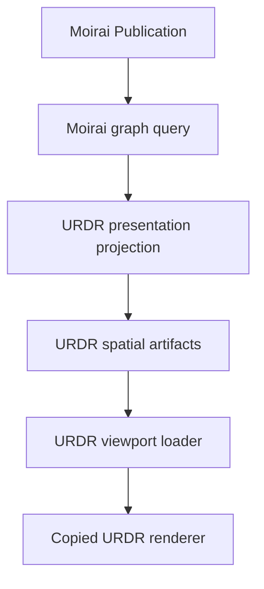

# IP-001 M4.6 — URDR graph pipeline 위의 Moirai data

실행 상태: A~F 완료. Runtime `f2aa9f123e61d817ba95ae2dbba23756c983e379`,
CI `34701770563`, post-deploy smoke `34701897131` success.
[종료 증거](../evidence/m46-f-acceptance.md)에 조건별 근거와 남은 백로그를 기록했다.
M5는 활성화하지 않는다.

## 1. 결정과 출발점

2026-09-12 KST 사용자 결정으로 M4.5의 남은 graph viewport 구현 계획을 폐기한다.
M4.5-A~G에서 완료한 Moirai-native query, Publication composition, 검색, inspector,
Revision vector와 진단은 유지한다. M4.5-H의 native renderer와 그 후속 재설계는 다시
사용하지 않는다.

M4.6의 runtime 출발점은 `main`의
`dcad5305aadc8d0181e2b6ff33701385310ebb70`이다. 이 SHA는 Atropos `/graph`를 원본
URDR 목데이터 viewport로 복구했고, Railway의 Atropos·Clotho·worker 세 서비스에서 같은
SHA로 배포돼 있다. CI와 post-deploy smoke는 모두 성공했으며 Graph Scope Observatory는
Revision 4다.

M4.6의 결정은 한 문장으로 요약한다.

> 현재 Atropos에 복사된 URDR의 renderer, layout, viewport interaction과 spatial read
> pipeline을 유지하고, 그 pipeline의 입력만 Moirai Publication data로 교체한다.

코드가 Atropos port에 복사되지 않았거나 동작 근거가 불명확하면 URDR repository의
고정 commit `0267c8fd081ca9a3cd556f8f7319c600248c3760`을 source로 사용한다. 최신 URDR
HEAD를 따라가지 않는다.

## 2. 보존 경계

### 2.1 그대로 유지하는 것

- `graph-shell.tsx`, `chart-plane-adapter.ts`, `chart-surface.ts`, `image-viewport.ts`와
  region·label·share-state helper가 만드는 시각 결과와 interaction
- pointer drag, pinch-centroid zoom, selection, detail sheet와 URL 복원.
  고정 원본 graph-shell에는 wheel handler가 없으므로 wheel 무동작을 보존한다.
- world↔viewport 좌표 변환, 동적 grid와 viewport bbox 계산
- temporal constraint로 가능한 `y` 범위를 계산하고 그 범위 안에 Event를 놓는 방식
- 자유로운 `x`를 deterministic force layout으로 정하는 방식과 상수·반복 횟수
- deepest-first Composite region 계산과 현재 fallback 순서
- bbox를 world 좌표로 역변환하고 padding한 뒤 필요한 spatial artifact만 요청하는 방식
- `y-band`, artifact class, overscan, selection·neighbor retention과 parent/child region
  closure
- scope별 local X와 `widthHint + preferredGap`에 의한 수평 합성
- immutable revision manifest, metadata, band/object document와 cache-reset-on-error 동작

2026-09-12 후속 사용자 결정: 재현된 기존 결함은 백로그로 분리하고 M4.6을 계속한다.
시간 cluster의 개별 범위 이탈은 [#57](https://github.com/neocjmix/moirai/issues/57)에 기록했다.
원본 출력과 lossless 의미를 보존하고 이탈을 진단으로 드러낸다. 수정은 M4.6 이후다.

알고리즘 상수 조정, renderer 교체, 새로운 자동 layout, 새 graph library 도입은 M4.6의
일부가 아니다. 보존된 동작의 기존 결함은 재현 증거와 함께 백로그로 관리한다.

### 2.2 Moirai가 소유하는 것

- World, peer Canon membership, Event와 Relation identity
- persisted Event와 virtual Time Event의 구분
- Time System, lossless coordinate와 temporal evidence
- Composite membership와 boundary, Subject·State·Narrative와 projection evidence
- source별 served Revision, completeness, diagnostics와 budget
- stable public URL과 inspector의 의미

URDR의 `Dataset`, `canonId`, Gregorian helper 또는 viewport cell은 canonical schema나
Moirai graph query contract로 역전파하지 않는다. URDR shape는 Publication 뒤의
presentation projection이다.

## 3. 목표 파이프라인

`Moirai graph query`까지는 renderer와 무관한 의미 결과다. `URDR presentation
projection`부터는 재생성 가능한 표시 자료다. 이 경계에서 표시 instance가 필요해도
Moirai의 stable Event·Relation identity와 전체 Canon membership은 inspector/query
context에 보존한다.

## 4. 원본 코드 기준선

| 책임 | Atropos의 현재 port | 누락 시 참조할 URDR source |
| --- | --- | --- |
| graph shell·gesture·SVG renderer | `apps/atropos-web/src/urdr-port/src/components/` | `urdr/apps/web/src/components/` |
| 현재 임시 data loader | `apps/atropos-web/src/urdr-port/src/graph-read-loader.ts` | `urdr/apps/web/src/graph-read-loader.ts` |
| graph static contract | local contract bridge 일부만 존재 | `urdr/apps/web/src/graph-static-contract.ts`, `shared/contracts` |
| temporal Y·force X·region projection | port에 완전한 producer 없음 | `shared/domain/src/chart-plane-projection.ts` |
| y-band·index·object document bake | port에 없음 | `shared/domain/src/static-viewport-bake.ts` |
| immutable artifact publish | Moirai Publication worker에 맞춰 구현 필요 | `urdr/apps/api/src/server/static-bake/static-bake.service.ts` |

모든 비사소한 복사는 source commit과 path를 파일 주석 또는 port README에 기록한다.
복사 뒤 Next.js·Moirai type seam을 제외한 차이는 golden test로 설명해야 한다.

## 5. Spatial read 불변식

초기 parity 기준은 원본 URDR 코드의 현재 값이다.

1. viewport bbox는 `projectViewportPointToWorld`와 동일한 변환으로 계산한다.
2. 요청 bbox는 가로·세로 span의 `1.5`배를 양쪽에 더한다.
3. 기본 band size는 `4096`이며 기본 overscan은 앞 `1`, 뒤 `2`다.
4. region은 뒤쪽 overscan `3`과 band `0` retention을 사용한다.
5. point는 자신의 band, segment·region은 교차하는 모든 y-band에 들어간다.
6. 선택 entity는 bbox 밖이어도 읽고, 요청 시 직접 neighbor와 containment region closure를
   함께 읽는다.
7. 요청한 Canon 순서대로 scope의 local X를 `widthHint + preferredGap`으로 합성한다.
8. 중복 artifact는 presentation entity ID로 제거하고 partial missing은 diagnostic과
   `truncated`로 드러낸다.
9. browser는 현재 bbox와 retention에 필요한 artifact만 적재한다. 전체 World를 먼저
   내려받아 CSS로 숨기지 않는다.

이 숫자와 규칙은 개선 후보가 아니라 parity fixture다.

## 6. Slice 계획

각 runtime slice는 독립 PR, CI, Railway 배포와 production smoke checkpoint다.
2026-09-12 후속 사용자 지시에 따라 현재 production은 공개서비스 전 개발 관측면이며,
실패한 검사나 미충족 종료조건만으로 배포 또는 다음 작업을 보류하지 않는다. 가능한 자주
현재 구현을 배포하고, 실패·미완료 항목은 명시적으로 추적한다. milestone 완료 선언에는
아래 종료조건의 증거가 필요하다.

### M4.6-A — 기준선과 규범 정렬

상태: completed. A에서 runtime 동작은 바꾸지 않았다.

#### 구현

- 현재 port와 고정 URDR source의 파일·함수·상수 provenance matrix를 만든다.
- copied source에 없는 loader, static contract, projection과 bake 경계를 목록화한다.
- TS-006의 native renderer/JointJS 전면 재구축 문구를 이번 사용자 결정과 일치하도록
  별도 문서 변경으로 정렬한다.
- viewport transform, bbox expansion, band range, Canon offset과 retention의 characterization
  test를 추가한다.
- 현재 production `/graph`의 mobile·desktop screenshot과 gesture 결과를 회귀 기준으로
  고정한다.

#### 종료조건

1. renderer부터 artifact producer까지 모든 보존 책임에 고정 source path가 있다.
2. TS-006과 M4.6 사이에 renderer 소유권 충돌이 없다.
3. 위 §5의 spatial read 불변식이 자동 test로 고정된다.
4. runtime과 production data는 변경되지 않는다.

### M4.6-B — Moirai→URDR presentation projection

#### 구현

- `MoiraiGraphQueryResult` v3를 입력으로 받는 presentation projection을 만든다.
- Event, Relation, Composite와 virtual Time Event를 URDR point·segment·region·anchor로
  만드는 명시적 mapping table을 고정한다.
- 하나의 stable Moirai identity와 Canon별 표시 instance를 구분한다. 표시 instance가
  여러 개여도 검색·focus·inspector identity를 복제하지 않는다.
- URDR shape가 담지 못하는 membership, evidence, attributes와 diagnostics는 별도 sidecar와
  loss report에 보존한다.
- unsupported 의미를 버리거나 거짓 좌표를 만들지 않고 `unplaced` 또는 diagnostic으로
  남긴다.

#### 종료조건

1. K1/K2 shared Event·Relation의 stable identity와 전체 membership이 유지된다.
2. persisted Event와 virtual Time Event가 같은 identity namespace로 합쳐지지 않는다.
3. 모든 omission·approximation은 stable diagnostic code와 source reference를 가진다.
4. canonical, Publication과 graph query package가 URDR type을 import하지 않는다.

### M4.6-C — URDR layout·artifact producer 이식

#### 구현

- 고정 URDR source의 temporal Y solver, deterministic X force layout과 Composite region
  producer를 Moirai presentation input 앞에 이식한다.
- force 상수, iteration, tie-break, 처리 순서와 region fallback을 변경하지 않는다.
- static viewport metadata, entity index, y-band와 generalized object document를 같은
  분할 규칙으로 생성한다.
- Moirai World별 immutable Publication revision path와 digest에 artifact를 연결한다.

#### 종료조건

1. 동일 입력·algorithm version은 byte-stable geometry와 artifact index를 만든다.
2. exact·bounded·relative-only Event의 lossless 시간 근거를 보존한다. 원본의 알려진 범위 이탈은 backlog #57 및 안정적 진단으로 명시하며, 새로운 seam의 의미 오류는 허용하지 않는다.
3. 근거 없는 Event는 날짜를 발명하지 않고 unplaced로 남는다.
4. nested Composite가 모든 직접 child geometry를 포함하고 deepest-first로 안정된다.
5. source fixture에 대한 원본 URDR와 Moirai port의 geometry parity test가 통과한다.

### M4.6-D — URDR spatial loader 복원

#### 구현

- 현재 MOCK `graphReadLoader`를 revision-pinned Moirai spatial artifact reader로 교체한다.
- manifest→scope meta→band/object document의 원본 read 순서, cache와 오류 동작을 보존한다.
- query island의 World·Canon·Revision vector를 source별 spatial request로 변환한다.
- bbox, artifact class, selected entity, neighbor와 region closure를 §5와 동일하게 처리한다.
- 한 source의 partial failure가 다른 source Revision을 바꾸지 않게 한다.

#### 종료조건

1. pan·zoom에 따라 요청 band가 바뀌며 동일 band는 cache에서 재사용된다.
2. bbox 밖 선택 entity와 필요한 neighbor·region이 유지된다.
3. partial missing source는 다른 source를 오염시키지 않고 diagnostic으로 보인다.
4. visible cell hard cap을 넘기 전에 query budget과 `truncated`가 동작한다.

### M4.6-E — 실제 Moirai data를 기존 viewport에 연결

#### 구현

- renderer와 graph shell은 유지한 채 loader 입력을 MOCK에서 production Publication으로
  전환한다.
- query island, viewport, inspector와 server-rendered fallback이 같은 source set과
  Revision vector를 사용하게 한다.
- selection은 presentation instance에서 stable Moirai reference로 역매핑한다.
- MOCK badge와 fixture는 개발용으로 격리하되 production fallback으로 사용하지 않는다.

#### 종료조건

1. Graph Scope Observatory Revision 4의 실제 Event·Relation이 `/graph`에 보인다.
2. node/region 선택→sheet→stable route→graph 복귀가 같은 identity와 query를 유지한다.
3. 현재 기준선의 pan, pinch, wheel, label, region, sheet와 app shell 동작이 회귀하지 않는다.
4. graph와 text fallback의 Event·Relation 집합과 Revision vector가 일치한다.

### M4.6-F — 규모·production acceptance

#### 구현

- 100k Event synthetic artifact로 spatial request와 browser 적재 상한을 검증한다.
- mobile WebKit 실제 viewport에서 pan·pinch·selection·sheet·URL 복원을 검증한다.
- Railway 세 서비스의 build SHA, health, status와 post-deploy smoke를 확인한다.
- 고정 synthetic World에서 Clotho read, immutable Publication, graph와 stable detail을
  하나의 evidence packet으로 기록한다.

#### 종료조건

1. 100k fixture 전체를 browser에 적재하지 않고 viewport 이동으로 탐색한다.
2. current URDR baseline screenshot과 의도하지 않은 구조·interaction 차이가 없다.
3. production Atropos·Clotho·worker가 같은 성공 SHA를 실행한다.
4. 실제 Moirai identity, membership, temporal evidence와 diagnostics가 graph와 inspector에서
   추적된다.
5. M4.6 전체 종료 evidence가 저장되고 M5는 별도 사용자 승인 전까지 비활성이다.

## 7. 공통 검증

- format, lint, strict typecheck와 production build
- contract round-trip, deterministic geometry와 spatial query golden test
- architecture dependency와 URDR import direction 검사
- public/private leakage, dependency audit와 secret scan
- mobile WebKit과 desktop browser visual regression
- selected Revision·query URL·focus restoration E2E
- Railway readiness, exact build SHA와 post-deploy smoke
- Clotho Graph Scope Observatory read-back과 immutable Publication 확인

## 8. 제외 범위

- M4.5-H native renderer 부활 또는 또 다른 renderer 재설계
- React Flow, JointJS 등 새 graph library로 교체
- URDR layout/spatial 상수의 미세조정이나 UX 개선
- canonical schema를 URDR Dataset 또는 viewport cell 모양으로 변경
- 근거 없는 cross-World identity, Canon 우열 또는 Time System conversion
- private Publication, Tenant, ACL, E2EE와 graph authoring
- M5 lifecycle 범위

## 9. M4.6 전체 종료조건

1. 현재 URDR renderer·layout·interaction·spatial query 방식이 production에서 유지된다.
2. MOCK 대신 실제 Moirai Publication이 같은 viewport pipeline을 통과한다.
3. Moirai graph query contract와 canonical model은 URDR presentation shape에 의존하지 않는다.
4. stable identity, Canon membership, Revision vector, temporal evidence와 diagnostics가
   adapter 경계에서 소실되지 않는다.
5. 100k fixture에서 bounded spatial loading이 검증된다.
6. mobile interaction과 stable navigation이 현재 기준선과 동등하다.
7. 정확한 build SHA의 Railway 배포와 Graph Scope Observatory 종단간 smoke가 성공한다.
