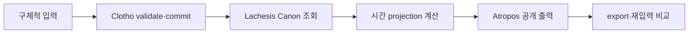

# 시간 표현력 종단간 수용시험

이 문서는 [TS-010](../technical-specifications/TS-010-event-relational-time.md)이 목표로 하는 표현력을 **실제 데이터 입력과 출력**으로 판정하는 기준이다. 타입 정의, unit test, solver 내부 상태만으로는 통과할 수 없다. 최종 합격은 Clotho를 통해 구체적인 데이터를 쓰고 Lachesis가 보존·계산한 결과와 Atropos가 공개한 결과를 다시 읽어 확인해야 한다.

TS-010이 draft인 동안 이 문서는 시험 계약의 초안이다. 아직 production이나 기존 synthetic World에 아래 데이터를 쓰라는 지시가 아니다.

## 1. 합격의 정의

다음 전체 경로가 한 번의 검증 기록으로 이어져야 한다.



합격하려면 다음을 모두 만족해야 한다.

1. 아래 fixture가 실제 Change Plan으로 validate되고 승인된 시험 World에 commit된다.
2. commit 뒤 Canon을 다시 읽으면 입력한 Event·Relation과 lossless 좌표가 그대로 나온다.
3. Time Event는 결정적으로 resolve되지만 저장된 Event 목록에는 생기지 않는다.
4. 계산된 시간 상태가 각 사례의 기대 출력과 일치한다.
5. Atropos가 같은 served Revision에서 의미를 잃지 않고 보여준다.
6. `.moirai` export 후 빈 시험 World에 import해도 semantic fingerprint와 기대 출력이 같다.
7. 입력·Canon·projection·공개 화면의 증거를 한 검증 문서에 남긴다.

unit/property/integration test와 DB 조회는 원인 진단과 회귀 방지를 위한 보조 증거다. 이것만 성공하고 실제 입력·출력 경로를 확인하지 못하면 미통과다.

## 2. 시험 World와 실행 안전장치

권장 World:

```text
name: Temporal Expressiveness Observatory
slug: temporal-expressiveness
purpose: TS-010 acceptance only
```

- 기존 Lantern fixture와 `Clotho Synthetic Observatory`를 재사용하지 않는다.
- production과 동일한 application build를 사용하되 별도 승인된 시험 World에서만 쓴다.
- 모든 ID와 입력 순서를 fixture에 고정한다.
- secret, bearer token, 사용자 식별자는 fixture와 증거에 넣지 않는다.
- validate 결과를 저장한 뒤 한 Change Set으로 commit한다.
- 같은 idempotency key 재실행이 같은 revision을 만들지 않는지 확인한다.
- 실패 사례는 별도 Change Plan으로 validate만 하고 commit하지 않는다.

## 3. 공통 Time System

fixture는 결정된 하나의 Time System과 definition version을 사용한다. 아래 표기의 예시는 `proleptic-gregorian-utc@1`이며, TS-010 결정 과정에서 이름이 바뀔 수 있다. 좌표 문자열의 자릿수는 의미가 있으므로 숫자형으로 변환하지 않는다.

```text
time-system: proleptic-gregorian-utc
definition-version: 1
coordinate-format: signed year + ISO calendar fields + 12 fractional digits
```

달력 경계와 1ms·1ps 후속 좌표는 동일한 boundary adapter로 계산한다. 단위마다 별도 Event 종류를 만들지 않는다.

### 실행 전에 확정해야 할 컨텍스트

현재 문서만으로 **무엇을 검증할지**는 충분하지만, 곧바로 실행 가능한 최종 JSON과 명령을 만들기에는 다음 계약이 아직 비어 있다. 이를 추측해서 fixture에 박지 않는다.

| 필요한 결정 | 없을 때 생기는 문제 | 닫는 시점 |
|---|---|---|
| strict/non-strict와 same-instant 관계 | 경계 포함 여부와 exact instant 입력을 직렬화할 수 없음 | Slice 0 |
| virtual Time Event reference의 Change Plan 형식 | Clotho 입력 payload를 고정할 수 없음 | Slice 0 |
| canonical coordinate·calendar·timezone 규칙 | 연·월·일과 ps 경계의 실제 값이 불안정 | Slice 0 |
| 시험 World 생성·쓰기 승인과 ID | 실제 commit 대상이 없음 | 종단간 시험 직전 |
| Canon read-back과 solver projection API | 기대 출력을 자동 비교할 관찰면이 없음 | Slice 2–4 |
| Atropos 공개 JSON·접근 가능한 텍스트 계약 | 화면만 보고 의미 보존을 판정하게 됨 | Slice 5–6 |
| `.moirai` export/import 실행 계약 | 이동 가능성 검증을 재현할 수 없음 | Slice 4–6 |

Slice 0은 앞의 세 의미 계약을 닫고, fixture의 최종 machine-readable Change Plan과 expected-output 파일을 작성해야 끝난다. 나머지는 각 구현 slice가 실제 관찰면을 제공하면서 채운다.

## 4. 구체적 입력 corpus

아래 표는 의미 fixture다. 최종 Change Plan JSON은 승인된 API 계약에 맞춰 작성하되 ID, 좌표, 관계와 기대 의미를 바꾸지 않는다.

| ID | 입력 Event | 입력 관계·경계 | 의도 |
|---|---|---|---|
| `te-year-220` | `220년에 기록된 사건` | `T(0220-01-01T00:00:00.000000000000Z) < event < T(0221-01-01T00:00:00.000000000000Z)` | 연도만 알고 그 안의 월·일·초는 모름 |
| `te-month-1969-07` | `1969년 7월에 기록된 사건` | `T(1969-07-01T00:00:00.000000000000Z) < event < T(1969-08-01T00:00:00.000000000000Z)` | 월까지만 알고 그 안의 날짜·초는 모름 |
| `te-day-1969-07-20` | `1969년 7월 20일에 기록된 사건` | `T(1969-07-20T00:00:00.000000000000Z) < event < T(1969-07-21T00:00:00.000000000000Z)` | 날짜까지만 앎 |
| `te-ms-123` | `밀리초 해상도 관측` | `T(2026-09-05T08:13:21.123000000000Z) < event < T(2026-09-05T08:13:21.124000000000Z)` | 1ms 폭의 알려진 범위 |
| `te-ps-012` | `피코초 해상도 관측` | `T(2026-09-05T08:13:21.123456789012Z) < event < T(2026-09-05T08:13:21.123456789013Z)` | 1ps 폭의 알려진 범위와 lossless 왕복 |
| `te-exact-time` | `T(2026-09-05T08:13:21.123456789012Z)` | 같은 reference를 두 관계에서 사용하고 resolver로 직접 조회 | 정확한 순간은 일반 Event가 아니라 하나의 virtual Time Event |
| `te-window` | Composite `센서 보정 작업` | 시작 `T(2026-09-05T08:13:22.000000000000Z)`, 종료 `T(2026-09-05T08:13:24.000000000000Z)`가 각각 `starts`, `ends`, `contains` 근거 | 2초간 지속된 사건 |
| `te-child` | `보정 중 측정` | `T(2026-09-05T08:13:22.500000000000Z) < event < T(2026-09-05T08:13:22.501000000000Z)` 및 `te-window contains te-child` | 구성 사건의 span과 전체 Duration 분리 |
| `te-during` | `보정 중 외부 경보` | `start(te-window) < te-during < end(te-window)`; `contains` 없음 | 다른 사건 도중이지만 구성요소는 아님 |
| `te-relative-a` | `원인 불명의 선행 사건` | `te-relative-a < te-relative-b` | 절대 시각 없이 선후만 앎 |
| `te-relative-b` | `원인 불명의 후행 사건` | 위 관계 외 시간 좌표 없음 | timestamp를 발명하지 않아야 함 |

`<` 표기는 최종적으로 채택할 strict/non-strict 관계의 읽기 쉬운 축약이다. exact instant와 경계 포함 규칙을 결정한 뒤 fixture serialization을 고정한다.

## 5. 기대 Canon 출력

commit 후 Canon 조회에서 다음을 확인한다.

- 입력한 일반 Event와 Composite Event가 stable ID로 존재한다.
- 입력한 `precedes`, `contains`, `starts`, `ends` 근거가 source ID와 함께 존재한다.
- `te-during`과 `te-window` 사이에는 `contains`가 없다.
- `te-relative-a`, `te-relative-b`에는 absolute Placement가 새로 생기지 않는다.
- `.123456789012`와 `.123456789013`가 문자열 그대로 왕복한다.
- `T(...)` reference는 resolve되지만 persisted Event row 수에 포함되지 않는다.
- 같은 Time System·version·coordinate를 두 번 resolve하면 같은 Time Event ID가 나온다.

legacy 호환 기간에는 기존 Placement가 남아 있을 수 있다. 하지만 새 입력 한 건이 Placement와 Relation 양쪽에 서로 독립적인 정본으로 이중 기록되면 실패다.

## 6. 기대 계산 출력

출력 필드명은 구현 과정에서 달라질 수 있지만 의미는 다음과 정확히 대응해야 한다.

| ID | 기대 계산 결과 | 금지되는 출력 |
|---|---|---|
| `te-year-220` | 220년 경계 안의 `bounded` | 임의의 월·일·시·초 또는 exact timestamp |
| `te-month-1969-07` | 7월 경계 안의 `bounded` | 7월 1일에 발생했다고 단정 |
| `te-day-1969-07-20` | 하루 경계 안의 `bounded` | 정오·자정 등 임의 순간 |
| `te-ms-123` | 폭 1ms의 `bounded` | `.123`을 exact instant로 오해하거나 float 반올림 |
| `te-ps-012` | 폭 1ps의 `bounded`; 두 경계가 서로 다름 | 두 좌표가 같은 값으로 collapse |
| `te-exact-time` | 하나의 결정적 virtual Event ID와 exact coordinate | persisted Event 생성 또는 같은 좌표의 ID 불일치 |
| `te-window` | explicit boundary 기반 Duration `2s` | descendant 최솟값·최댓값을 Duration으로 사용 |
| `te-child` | window 내부 구성 사건; descendant span `1ms` | 전체 window Duration을 1ms로 변경 |
| `te-during` | window 내부 시간 제약; membership false | window의 child로 표시 |
| `te-relative-a/b` | `relative-only`, A before B | 임의 absolute timestamp 또는 근거 없는 간격 |

모든 결과는 source Event/Relation, Time System version과 algorithm version을 제공해야 한다. unresolved라면 단순 null이 아니라 무엇이 부족한지 설명해야 한다.

## 7. 기대 Atropos 출력

Atropos의 최종 디자인을 이 문서가 고정하지는 않는다. 그러나 모바일과 데스크톱에서 다음 의미를 사람이 확인할 수 있어야 한다.

- 연·월·일 사례는 아는 범위까지만 표시한다.
- ms와 ps의 원문 좌표를 상세 보기에서 손실 없이 읽을 수 있다.
- 지속 사건은 시작·종료와 2초 Duration을 보여준다.
- `te-child`는 구성요소로, `te-during`은 “진행 중 발생”으로 서로 다르게 보인다.
- 상대-only 두 사건은 선후 관계를 보여주되 날짜나 시각을 꾸며내지 않는다.
- projection이 지연 계산되더라도 같은 Revision에서 재조회한 의미와 digest가 같다.

스크린샷만으로 판정하지 않는다. 접근 가능한 텍스트 또는 공개 JSON에서도 같은 의미를 읽을 수 있어야 한다.

## 8. 거절 corpus

다음 Change Plan은 validate 단계에서 거절되어야 한다.

| ID | 잘못된 입력 | 기대 진단 |
|---|---|---|
| `te-bad-cycle` | A precedes B, B precedes A | cycle을 구성한 두 Relation 표시 |
| `te-bad-boundary` | 종료가 시작보다 앞선 Composite | starts·ends·시간 경계 근거 표시 |
| `te-bad-system` | 변환 규칙 없는 두 Time System 좌표 직접 비교 | 필요한 conversion 부재 표시 |
| `te-bad-coordinate` | 비정규 또는 정밀도 손실 좌표 | 원본 좌표와 codec 오류 표시 |
| `te-bad-duplicate-start` | 한 Composite에 서로 다른 start 두 개 | 충돌한 boundary Relation 표시 |

오류 코드만 맞고 어떤 입력끼리 충돌했는지 알 수 없으면 실패다.

## 9. 증거 묶음

검증 기록에는 최소한 다음을 남긴다.

1. application SHA, schema version, algorithm version
2. 시험 World ID와 시작·종료 revision
3. redacted Change Plan 원문과 validate 결과
4. commit 결과와 idempotent replay 결과
5. Canon read-back
6. virtual Time Event resolve와 비영속성 확인
7. projection JSON과 semantic digest
8. Atropos 접근 가능한 텍스트·공개 JSON·필요한 화면 캡처
9. 거절 corpus의 설명 가능한 오류
10. export/import 뒤 fingerprint 비교
11. 각 사례별 pass/fail 표와 남은 예외

## 10. 최종 판정

다음 중 하나라도 해당하면 TS-010 표현력 검증은 미통과다.

- 사례 일부를 enum별 특수 입력이나 수동 DB 수정으로만 만들 수 있다.
- Clotho에서는 쓸 수 있지만 Canon 또는 Atropos에서 의미가 소실된다.
- 피코초 좌표가 반올림된다.
- 기간과 알려진 범위, containment와 during, absolute와 relative-only가 섞인다.
- 성공 사례만 있고 모순 입력의 설명 가능한 거절이 없다.
- unit test만 있고 실제 validate→commit→read→publish 실행 증거가 없다.

모든 corpus가 하나의 일반 모델과 실제 제품 경로를 통과하고, 기대 Canon·계산·Atropos 출력이 확인될 때만 합격이다.
