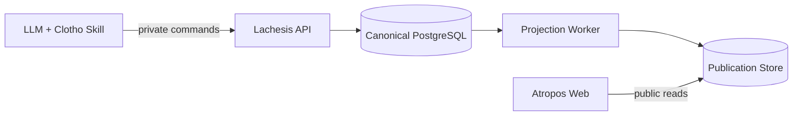

# TS-001 — 시스템 아키텍처와 책임 경계

## TS-001.1 목적

이 명세는 Clotho, Lachesis와 Atropos의 런타임 책임, 데이터 소유권과 의존 방향을 정의한다. 세 이름은 배포 단위의 수를 강제하지 않지만 서로 다른 책임이 하나의 모듈에 섞여 규칙을 중복 소유하지 않게 한다.

## TS-001.2 기준 아키텍처

1차 구현은 하나의 코드베이스 안에서 책임을 분리한 modular monolith를 기본으로 한다. 공개 읽기 표면과 비공개 작성·관리 표면은 런타임 및 권한 경계에서 분리한다.

### 기술 stack

| 영역 | 기준 기술 |
|---|---|
| runtime | Node.js active LTS, TypeScript strict mode |
| workspace | pnpm workspace monorepo |
| Lachesis HTTP | Fastify와 versioned JSON Schema |
| persistence | PostgreSQL, Kysely 기반 typed SQL과 명시적 migration |
| background work | PostgreSQL outbox·job table과 같은 domain/projector module |
| Atropos | Next.js App Router, React, JointJS |
| Publication·attachment | S3-compatible object storage, public artifact는 CDN 사용 |
| test | Vitest, Playwright, database integration test |

특정 hosting 사업자의 독점 기능을 정본 형식이나 domain contract에 포함하지 않는다.



### 구성 요소

| 구성 요소 | 책임 | 금지되는 책임 |
|---|---|---|
| Clotho Skill | LLM에 탐색·작성 도구를 제공하고 자연어 작업을 Lachesis 계약으로 변환한다. | 정본 검증을 단독으로 결정하거나 저장소에 직접 쓰지 않는다. |
| Lachesis API | 명령 검증, Change Set 적용, 정본 조회, 이력·복구와 운영 진단을 소유한다. | 공개 독자 UI를 제공하거나 Projection을 정본으로 취급하지 않는다. |
| Projection Worker | 정본 Revision으로부터 파생 모델과 Publication Snapshot을 결정적으로 생성한다. | Canon의 사실을 수정하거나 작성 명령을 승인하지 않는다. |
| Atropos Web | 완성된 공개 Snapshot을 읽어 탐색·비교·공유 화면을 제공한다. | 정본 저장소와 비공개 운영 정보에 접근하거나 세계 내용을 수정하지 않는다. |
| Canonical PostgreSQL | 현재 정본 상태, Change Set, Revision과 비공개 운영 정보를 보존한다. | UI 전용 배치·좌표·캐시를 정본 사실로 승격하지 않는다. |
| Publication Store | Revision별 불변 공개 Snapshot과 현재 제공 포인터를 보존한다. | 작성 유래, 검증 로그, 자격 정보 등 비공개 운영 정보를 저장하지 않는다. |

## TS-001.3 정본 소유권

- Lachesis만 정본 상태를 변경할 수 있다.
- 정본 상태의 물리적 저장소는 PostgreSQL이다.
- 모든 쓰기는 Lachesis의 명령 계약과 하나의 데이터베이스 트랜잭션을 통과한다.
- Clotho, worker, migration 도구와 운영 스크립트도 별도의 우회 쓰기 경로를 만들지 않는다.
- seed, import와 restore도 일반 Change Set 또는 명시적으로 동일한 불변식을 보장하는 관리 명령을 사용한다.
- Publication Snapshot, 검색 인덱스, Subject·Timeline projection과 그래프 배치는 삭제 후 재생성할 수 있어야 한다.

## TS-001.4 의존 방향

도메인 규칙과 계약은 프레임워크, 데이터베이스 드라이버와 UI보다 안쪽에 둔다.

### 기준 module layout

```text
apps/lachesis-api
apps/lachesis-worker
apps/atropos-web
packages/contracts
packages/domain
packages/persistence
packages/projections
packages/publication
skills/clotho
```

- `contracts`: 외부 JSON schema와 공유 식별자·오류 형식
- `domain`: framework-independent 불변식과 Change Set 검증
- `persistence`: Kysely repository, transaction과 migration
- `projections`: Subject·Timeline·graph 등 결정적 projector
- `publication`: 공개 allowlist, Snapshot builder와 artifact contract
- `skills/clotho`: instruction과 Lachesis client wrapper

1. 공유 계약은 식별자, 명령, 결과와 오류 형식을 정의한다.
2. 도메인 모듈은 정본 불변식과 Change Set 검증을 정의한다.
3. Lachesis adapter가 계약을 HTTP, CLI 또는 skill transport에 연결한다.
4. persistence adapter가 도메인 변경을 PostgreSQL 트랜잭션으로 반영한다.
5. projection 모듈은 특정 UI 프레임워크 없이 Revision 입력을 공개·파생 출력으로 변환한다.
6. Clotho와 Atropos는 공유 계약에 의존하지만 persistence adapter에는 의존하지 않는다.

## TS-001.5 공개와 비공개 경계

### 공개 가능 데이터

- 활성 상태의 World, Canon, Time System, Event, Relation과 Narrative
- 공개 가능한 Canon 간 대응
- 명시적으로 세계 내용으로 작성된 인용과 출처 설명
- 정정·철회된 안정적 링크에 필요한 공개 상태와 안내
- 공개 데이터로부터 계산된 Subject, Process, State, Duration과 Timeline

### 비공개 데이터

- 원자료 원문과 비공개 첨부물
- LLM의 작업 과정, 프롬프트, 추론 기록과 세션 정보
- Change Set의 내부 검증 결과, 실패 명령과 운영 진단
- 자격 정보, 인증 정보, 내부 actor 식별 정보
- 비공개 작성 유래와 시스템 감사 로그

Projection Worker는 허용 목록 방식으로 공개 Snapshot을 만든다. 정본 레코드를 그대로 직렬화한 뒤 일부 필드를 제거하는 방식은 사용하지 않는다.

## TS-001.6 쓰기와 읽기 가용성의 분리

- Atropos는 Lachesis의 private API를 공개 읽기 경로로 사용하지 않는다.
- 작성 기능이나 Projection 생성이 중단되어도 마지막으로 완성된 Publication Snapshot은 계속 제공할 수 있어야 한다.
- 새로운 Snapshot 생성 중에는 기존 Snapshot을 수정하지 않는다.
- Snapshot이 완성되고 검증된 뒤 현재 제공 포인터만 원자적으로 교체한다.
- Atropos는 요청 하나를 처리하는 동안 하나의 Snapshot Revision만 읽는다.

## TS-001.7 1차 배포 단위

1차 구현은 다음의 논리적 단위를 가진다.

- private Lachesis API process
- private Projection Worker process
- public Atropos web deployment
- PostgreSQL database
- Publication Snapshot을 위한 읽기 전용 저장 표면

API와 worker는 같은 애플리케이션 artifact를 다른 process role로 실행할 수 있다. Publication Store는 [TS-006](TS-006-atropos-publication.md)에 따라 S3-compatible object storage의 불변 artifact와 CDN으로 구현한다. Atropos에 정본 DB 자격 정보를 제공해서는 안 된다.

## TS-001.8 계약과 버전

- 외부 경계를 지나는 요청과 응답은 버전이 있는 명시적 schema로 검증한다.
- Clotho 명령 계약과 Publication Snapshot 계약은 서로 분리한다.
- 저장 schema version, 명령 contract version과 Publication format version을 하나의 버전으로 묶지 않는다.
- 이전 공개 링크의 식별자는 UI route 변경과 무관하게 해석할 수 있어야 한다.
- breaking migration은 기존 World의 읽기와 반출 가능성을 확인하는 검증 절차를 포함한다.

## TS-001.9 보안 기준선

- Lachesis와 Clotho는 비공개 인증 경계 안에 둔다.
- 1차 구현은 하나의 운영 권한으로 충분하지만 익명 쓰기는 허용하지 않는다.
- Atropos의 실행 자격은 공개 읽기 데이터에만 접근할 수 있다.
- private API 응답도 호출 목적에 필요한 최소 데이터만 반환한다.
- 로그에 원자료, Narrative 본문, 프롬프트와 자격 정보가 기본적으로 기록되지 않게 한다.

## TS-001.10 구현별 선택 가능 범위

다음 사항은 이 문서에서 고정하지 않는다.

- object storage, CDN, OIDC와 hosting의 구체적인 사업자
- worker 수평 확장의 instance 수와 autoscaling 방식
- 검색 엔진과 전문 인덱스

이 선택들은 본 문서의 소유권, 원자성, 공개 격리와 재생성 가능성을 보존해야 한다.
