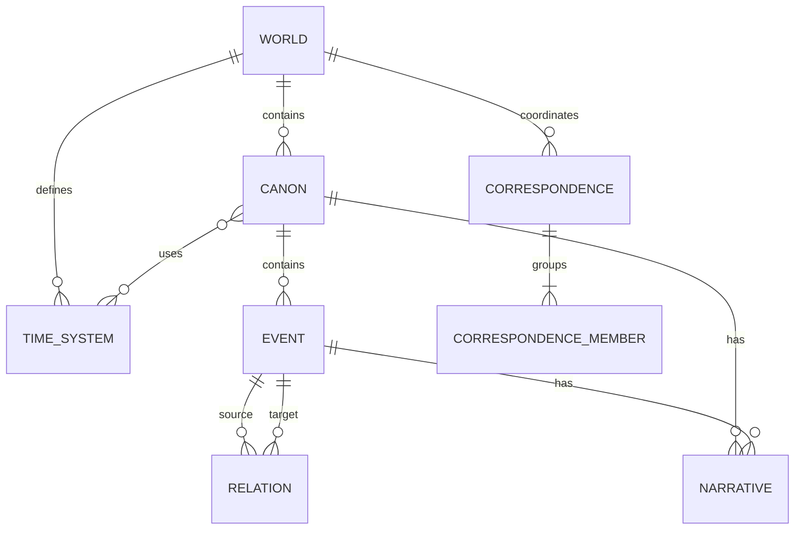

# TS-002 — 정본 데이터 모델

## TS-002.1 목적

이 명세는 Moirai가 PostgreSQL에 보존할 현재 정본 상태의 논리적 schema와 불변식을 정의한다. 테이블 이름은 기준 이름이며 구현에서 변경할 수 있지만 의미, 식별자와 참조 규칙은 보존해야 한다.

변경 이력과 Publication 전파는 [TS-003](TS-003-change-revision-publication.md)에서 정의한다.

## TS-002.2 공통 식별자와 필드

### 식별자

- 모든 지속 레코드는 전역적으로 유일한 opaque UUID 식별자를 가진다.
- 새 식별자는 시간 순서 정렬이 가능한 UUIDv7을 사용한다.
- 식별자는 생성 후 변경하거나 재사용하지 않는다.
- 사람이 읽는 `slug`, `title`, `label`과 외부 자료의 식별자를 primary key로 사용하지 않는다.
- 공개 URL의 정체성은 immutable ID에 기반한다. slug는 읽기 편의를 위한 별칭이며 변경 후에도 기존 별칭을 redirect할 수 있어야 한다.

### 공통 운영 필드

정본 레코드는 최소한 다음 운영 필드를 가진다.

| 필드 | 의미 |
|---|---|
| `id` | immutable UUIDv7 |
| `created_revision` | 레코드를 처음 만든 World Revision |
| `updated_revision` | 현재 값을 만든 마지막 World Revision |
| `withdrawn_revision` | 현재 공개 상태에서 철회된 Revision. 활성 상태이면 `null` |

생성·수정 시각과 actor는 레코드마다 중복 저장하지 않고 Change Set에서 추적할 수 있다. 조회 최적화를 위한 중복 필드는 허용하지만 Change Set 기록과 모순되어서는 안 된다.

### 생명주기

- 1차 구현의 세계 내용은 `active` 또는 `withdrawn` 상태만 가진다.
- `draft`, `pending publication`, `approved but unpublished` 상태를 만들지 않는다.
- 철회는 물리 삭제가 아니다.
- 개인 정보 삭제나 저장소 유지보수를 위한 물리 삭제는 별도의 운영 절차이며 세계 내용의 철회와 구분한다.

## TS-002.3 전체 논리 모델

## TS-002.4 World

`worlds`는 함께 작성·관리·반출하는 최상위 트랜잭션 범위다.

| 필드 | 제약 |
|---|---|
| `id` | primary key |
| `slug` | 현재 공개 별칭. 설치 범위에서 unique |
| `title` | 필수 표시 이름 |
| `description` | 선택적 운영·탐색 설명 |
| `current_revision` | 성공한 최신 World Revision 번호 |
| `publication_target_revision` | 자동 공개 대상인 최신 Revision 번호 |

World는 Canon 사이의 진위를 판정하는 필드나 `default_canon_id`를 갖지 않는다.

## TS-002.5 Canon

`canons`는 Event와 Relation이 사실로 성립하는 범위다.

| 필드 | 제약 |
|---|---|
| `id` | primary key |
| `world_id` | 필수 World 참조 |
| `slug` | World 안에서 unique인 공개 별칭 |
| `title` | 필수 표시 이름 |
| `description` | 선택적 범위 설명 |

금지되는 필드와 동작:

- `is_default`, `is_official`, `priority`, `authority_rank`처럼 Canon의 우열을 만드는 필드
- 다른 Canon의 Event 또는 Relation을 Canon 내부 사실처럼 직접 참조하는 동작
- Canon을 이동시켜 기존 Event의 진실 범위를 암묵적으로 바꾸는 동작

Canon을 다른 World로 이동하는 것은 1차 구현에서 지원하지 않는다.

## TS-002.6 Time System과 시간 배치

### Time System

`time_systems`는 하나의 World 안에서 좌표와 비교 규칙을 정의한다. 같은 의미의 일반 시간 체계라도 World 반출의 자기완결성을 위해 각 World가 필요한 정의를 소유한다.

| 필드 | 제약 |
|---|---|
| `id` | primary key |
| `world_id` | 필수 World 참조 |
| `slug` | World 안에서 unique |
| `title` | 필수 표시 이름 |
| `kind` | `calendar`, `ordinal`, `relative`, `custom` 중 하나 |
| `definition_version` | 좌표 해석 schema version |
| `definition` | 좌표 검증·정렬·표시에 필요한 JSON document |

`canon_time_systems`는 Canon과 Time System의 다대다 사용 관계를 보존한다. 같은 World에 속한 Canon과 Time System만 연결할 수 있다. 어떤 연결도 기본 또는 정본 시간축으로 표시하지 않는다.

### 시간 배치

Event의 시간은 `event_temporal_placements`로 표현한다. 시간 배치는 Canon의 Event와 그 Canon이 사용하는 Time System을 연결하는 Canon 내부 사실이다.

| 필드 | 의미 |
|---|---|
| `id` | 시간 배치 식별자 |
| `event_id` | 대상 Event |
| `time_system_id` | 좌표를 해석할 Time System |
| `kind` | `point` 또는 `interval` |
| `earliest_start`, `latest_start` | 시작 좌표의 가능한 경계 |
| `earliest_end`, `latest_end` | 종료 좌표의 가능한 경계. point이면 `null` 가능 |
| `precision` | 좌표의 유효 정밀도 |
| `certainty` | `exact`, `approximate`, `uncertain` |
| `display_label` | 원자료의 표기를 보존해야 할 때 사용하는 선택적 문자열 |

각 좌표는 Time System의 `definition_version`으로 검증되는 JSON 값이다. 정렬과 범위 비교는 Time System adapter가 담당하며 임의 문자열 비교를 사용하지 않는다.

- 정확한 point는 `earliest_start`와 `latest_start`가 같다.
- 부정확한 point는 두 경계 사이의 어느 지점임을 뜻한다.
- interval은 시작과 종료의 가능한 경계를 각각 가진다.
- 시간을 알 수 없는 Event는 시간 배치를 갖지 않아도 된다.
- 구조적 순서는 시간 좌표가 아니라 Relation으로 별도 보존할 수 있다.

## TS-002.7 Event

`events`는 특정 Canon 안에서 발생하거나 성립하는 사실의 핵심 단위다.

| 필드 | 제약 |
|---|---|
| `id` | primary key |
| `canon_id` | 필수 Canon 참조, 생성 후 변경 불가 |
| `slug` | Canon 안에서 선택적으로 unique |
| `kind` | `atomic` 또는 `composite` |
| `title` | 필수 표시 이름 |
| `summary` | 선택적 짧은 설명 |
| `roles` | open vocabulary 문자열 배열 |
| `attributes` | versioned JSON schema로 검증되는 확장 속성 |

### Composite Event와 Process

- Composite Event는 `kind = composite`인 Event다.
- 포함 구조는 Relation type `contains`로 표현한다.
- Process는 별도 테이블이나 별도 사실 resource가 아니다.
- 작성자가 과정으로 읽히도록 지정한 Composite Event는 `roles`에 `process`를 가진다.
- Process projection은 `kind`, `roles`, 포함·순서 Relation을 읽어 계산한다.
- `roles`는 Event의 해석 분류일 뿐 새로운 정체성이나 별도 생명주기를 만들지 않는다.

## TS-002.8 Relation

`relations`는 같은 Canon의 Event 사이에 성립하는 사실이다.

| 필드 | 제약 |
|---|---|
| `id` | primary key |
| `canon_id` | 양 endpoint와 동일한 Canon |
| `type` | versioned open vocabulary의 관계 type |
| `source_event_id` | 필수 Event 참조 |
| `target_event_id` | 필수 Event 참조 |
| `direction` | `directed` 또는 `undirected` |
| `attributes` | 관계별 schema로 검증되는 확장 속성 |

초기 vocabulary는 최소한 다음 의미 영역을 포함한다.

- 구성: `contains`
- 구조적 순서: `precedes`
- 인과: `causes`, `enables`, `prevents`, `influences`
- 경계: `starts`, `ends`
- 정체성 연속: `identity_continues`, `identity_splits`, `identity_merges`
- 유래와 전달: `derives_from`, `transfers`

관계 type은 문자열만 추가해 의미를 바꾸지 않는다. 새 type은 방향성, 허용 endpoint, 역관계, cycle 허용 여부와 파생 영향 규칙을 registry에 정의해야 한다.

### 무결성

- endpoint는 모두 존재하고 활성 또는 같은 Change Set에서 생성되어야 한다.
- Relation과 endpoint는 같은 Canon에 속해야 한다.
- `contains`는 cycle을 만들 수 없다.
- self relation은 type registry가 명시적으로 허용하지 않는 한 거부한다.
- endpoint 철회 시 영향을 받는 Relation을 같은 Change Set에서 철회하거나 유효한 대체 구조를 제공해야 한다.

## TS-002.9 Narrative와 공개 인용

`narratives`는 사람이 읽을 수 있는 서술이다.

| 필드 | 제약 |
|---|---|
| `id` | primary key |
| `canon_id` | Narrative의 Canon 범위 |
| `scope_type` | `canon` 또는 `event` |
| `scope_id` | Canon 또는 Event 식별자 |
| `locale` | BCP 47 언어 tag |
| `kind` | `primary`, `summary`, `annotation` 등 versioned vocabulary |
| `title` | 선택적 제목 |
| `body` | CommonMark Markdown 원문 |
| `public_references` | 명시적으로 공개할 인용·출처 설명의 내장 배열 |

Composite Event와 Process Narrative도 Event를 대상으로 하므로 별도 scope type을 만들지 않는다. 렌더링 시 raw HTML은 기본적으로 허용하지 않으며 허용할 경우 Publication 생성 단계에서 정화한다.

`public_references`는 Narrative에 포함된 값 객체이며 독립적인 핵심 엔티티가 아니다. 비공개 원자료 및 작성 유래와 자동으로 연결하거나 공개하지 않는다.

## TS-002.10 Canon 간 대응

Canon 간 대응은 Canon 내부의 사실이 아닌 World 범위의 관리·비교 관계다. 구현 레코드는 필요하지만 비즈니스 핵심 엔티티나 Relation으로 노출하지 않는다.

### 레코드

- `correspondences`: `id`, `world_id`, 공개 설명과 공통 비교 label
- `correspondence_members`: `correspondence_id`, `canon_id`, `target_kind`, `target_id`
- `target_kind`: `event` 또는 `subject_handle`

불변식:

- 하나의 correspondence는 둘 이상의 member를 가진다.
- member의 Canon은 모두 correspondence와 같은 World에 속한다.
- 같은 Canon의 여러 member와 다른 Canon의 하나의 member를 연결할 수 있다.
- correspondence는 member의 Event, Relation 또는 Subject 구성원을 변경하지 않는다.
- correspondence 자체의 철회는 Canon 내부의 사실을 철회하지 않는다.

## TS-002.11 파생 Subject의 안정적 식별

Subject는 identity Relation으로 연결된 Event 집합에서 계산한다. 정본 Subject 테이블은 만들지 않지만 공개 링크와 Canon 간 대응을 위해 `subject_handles`라는 운영 식별 표면을 둔다.

| 필드 | 의미 |
|---|---|
| `id` | 안정적인 opaque 식별자 |
| `canon_id` | Subject가 파생되는 Canon |
| `anchor_event_id` | handle의 연속성을 결정하는 활성 Event |
| `status` | `active`, `redirected`, `unresolved` |
| `redirect_to` | 병합으로 대체된 handle |
| `projection_revision` | 마지막으로 해석된 Revision |

규칙:

1. Subject projection은 같은 Canon의 identity Relation만 사용한다.
2. handle은 Subject가 아니라 계산 결과를 다시 찾기 위한 안정적 주소다.
3. identity 구조가 분리되면 anchor Event를 포함한 쪽이 기존 handle을 유지하고 나머지 구성요소는 새 handle을 받는다.
4. identity 구조가 병합되면 하나의 handle을 대표로 유지하고 나머지는 대표 handle로 redirect한다.
5. anchor가 철회되어 연속성을 결정할 수 없으면 임의 재지정하지 않고 `unresolved`로 표시해 운영 진단을 만든다.
6. handle, redirect와 projection cache를 삭제해도 Canon의 Event와 Relation 사실은 손실되지 않는다.

정확한 Subject 계산과 handle reconciliation 알고리즘은 TS-005에서 정의한다.

## TS-002.12 작성 유래와 운영 정보

비공개 작성 유래는 정본 세계 레코드의 자유 형식 `provenance` 필드로 섞지 않는다.

- `source_materials`: 원자료의 식별 정보, 보관 위치, digest와 접근 등급
- `change_origins`: Change Operation과 원자료 또는 인간 지시를 연결
- origin kind: `source_explicit`, `human_instruction`, `llm_inference`, `system_derived`
- 하나의 Operation은 여러 origin을 가질 수 있다.
- 원자료 원문은 데이터베이스 외부에 보관할 수 있지만 digest와 참조는 export에서 의미 있게 보존한다.
- `system_derived` 결과는 정본 세계 테이블에 쓰지 않고 projection에서 재생성한다.

Change Set과 Operation의 구체적인 구조는 TS-003에서 정의한다.

## TS-002.13 정본과 파생 저장소 분류

| 분류 | 데이터 |
|---|---|
| 현재 정본 | World, Canon, Time System, Canon-Time System 연결, Event, 시간 배치, Relation, Narrative, Canon 간 대응 |
| 정본 운영 이력 | Change Set, Change Operation, World Revision, 작성 유래, 철회 기록 |
| 운영 식별 표면 | Subject Handle, slug alias |
| 재생성 가능한 파생 | Subject 구성, Process·State·Duration·Timeline, 검증 진단, 검색 문서 |
| 공개 읽기 모델 | Publication Snapshot, 그래프 배치, 비교 view, 공개 tombstone |

UI 좌표, 그래프 hull, lane, 색상, zoom level과 layout cache는 정본 테이블에 저장하지 않는다.

## TS-002.14 반출 가능한 논리 schema

PostgreSQL table layout은 반출 형식이 아니다. 반출은 다음을 가진 versioned 논리 문서로 정의한다.

- World와 모든 핵심 내용
- Time System 정의와 시간 배치
- Canon 간 대응
- 공개 상태와 철회 정보
- Change·Revision 이력과 구분 가능한 작성 유래
- schema version 및 변환 결과

구체적인 파일 구성과 import 검증은 TS-007에서 정의한다.
