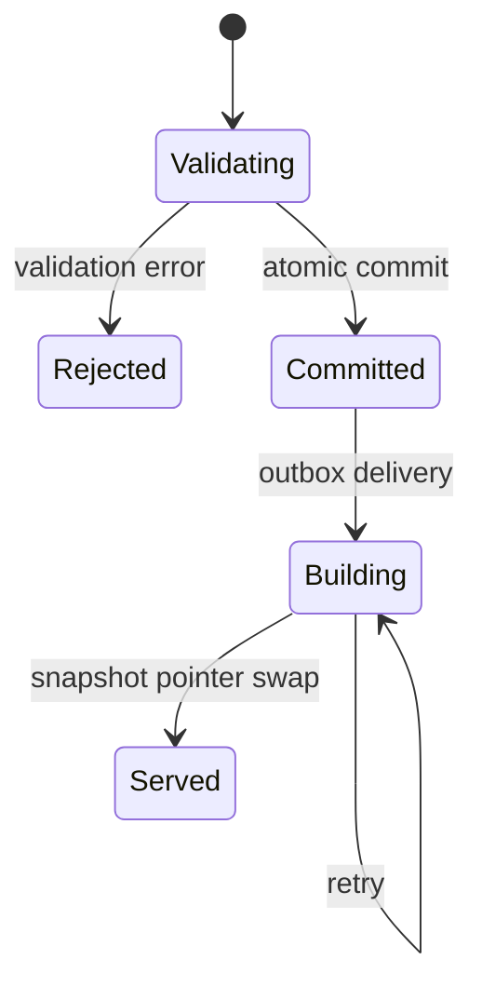

# TS-003 — 변경·Revision·Publication 모델

## TS-003.1 목적

이 명세는 하나의 의미 있는 변경을 검증하고 원자적으로 저장하며, 충돌과 이력을 보존하고, 완성된 공개본으로 전파하는 방식을 정의한다.

도메인의 Event와 시스템 변경 기록을 혼동하지 않기 위해 변경 단위는 `Change Set`, 개별 조작은 `Change Operation`, 성공한 World 상태 번호는 `World Revision`으로 부른다.

## TS-003.2 Change Set 범위

- 하나의 Change Set은 정확히 하나의 World만 변경한다.
- World 생성 Change Set은 World, 초기 Canon, Time System, Event, Relation과 Narrative를 함께 만들 수 있다.
- 여러 World를 동시에 바꾸는 원자적 작업은 1차 구현에서 지원하지 않는다.
- 하나의 이야기 단위는 여러 Operation을 가진 하나의 Change Set으로 제출한다.
- Change Set 일부만 성공시키는 옵션은 제공하지 않는다.

### Change Set 입력

| 필드                | 의미                                                      |
| ------------------- | --------------------------------------------------------- |
| `change_set_id`     | 재시도에 사용하는 client-generated UUIDv7 idempotency key |
| `world_id`          | 대상 World. 새 World이면 생성할 ID                        |
| `expected_revision` | 작성자가 읽은 기준 Revision. 새 World이면 `0`             |
| `actor`             | 인증된 운영 주체의 내부 식별자                            |
| `intent`            | 사람이 확인할 수 있는 변경 목적 요약                      |
| `operations`        | 순서 있는 typed Change Operation 목록                     |
| `origins`           | 원자료, 인간 지시와 LLM 작성 유래                         |
| `contract_version`  | 명령 schema version                                       |

LLM의 chain-of-thought나 숨은 추론 전문은 입력 또는 이력에 요구하지 않는다. `intent`와 origin에는 변경을 설명하고 감사하는 데 필요한 요약만 저장한다.

## TS-003.3 Change Operation

초기 Operation은 다음 형식을 지원한다.

- `create`: 새 레코드 전체 값
- `update`: 대상 ID, 변경할 명시적 필드와 새 값
- `withdraw`: 대상 ID, 비공개 사유와 선택적 공개 안내

restore는 별도 저수준 Operation이 아니다. 이전 상태와 현재 상태의 차이를 계산해 `create`·`update`·`withdraw` Operation으로 이루어진 새 Change Set을 만드는 관리 흐름이다.

저장된 Operation은 `entity_type`, `entity_id`, `operation_index`, `before`, `after`와 field-level origin 연결을 가진다. `before`와 `after`는 변경된 필드 조각이 아니라 해당 시점의 정규화된 전체 레코드 값이다.

- client가 `before`를 신뢰 경계의 입력으로 제공하지 않는다.
- Lachesis가 현재 Revision에서 `before`를 읽어 기록한다.
- JSON Merge Patch처럼 `null`과 누락의 의미가 불명확한 범용 patch를 외부 명령의 유일한 계약으로 사용하지 않는다.
- entity type별 command schema가 수정 가능한 필드와 불변 필드를 제한한다.
- 임시 client reference를 사용해 같은 Change Set에서 생성되는 레코드를 뒤의 Operation이 참조할 수 있다.

## TS-003.4 검증 단계

Change Set 검증은 다음 순서를 따른다.

1. contract version과 command schema를 검증한다.
2. actor의 운영 권한과 World 범위를 검증한다.
3. `expected_revision`과 현재 Revision을 비교한다.
4. 임시 reference를 실제 ID 후보로 해석한다.
5. Operation을 메모리의 후보 상태에 순서대로 적용한다.
6. [TS-002](TS-002-canonical-data-model.md)의 참조·Canon·시간·관계 불변식과 [TS-010](TS-010-event-relational-time.md)의 시간 제약 모순을 검증한다.
7. 철회와 수정이 관련 Relation, Narrative, correspondence와 공개 링크에 미치는 영향을 계산한다.
8. 오류와 warning을 안정적인 code, 관련 ID와 수정 가능한 설명으로 반환한다.

### 오류와 warning

- 오류가 하나라도 있으면 전체 Change Set을 거부한다.
- warning은 변경을 막지 않지만 성공 결과와 운영 진단에 보존한다.
- 오류 응답은 LLM이 수정 후 재시도할 수 있도록 `code`, `path`, `affected_ids`, `affected_refs`, `message`, `retryable`을 제공한다. `affected_refs`는 virtual Time Event의 정규 reference를 보존한다.
- 검증 실패는 World Revision을 증가시키거나 Publication 전파를 만들지 않는다.

## TS-003.5 동시성 및 idempotency

### 낙관적 동시성

- 모든 기존 World 변경은 `expected_revision`을 요구한다.
- 현재 Revision과 다르면 `revision_conflict`로 전체 변경을 거부한다.
- 서버가 충돌한 변경을 자동 병합하지 않는다.
- 오류 응답은 현재 Revision과 다시 읽어야 할 범위를 제공한다.
- LLM은 최신 맥락을 읽고 의도를 재평가한 새 Change Set으로 시도한다.

### Idempotency

- 같은 `change_set_id`와 동일한 canonical request digest의 재요청은 최초 결과를 반환한다.
- 같은 ID에 다른 digest가 오면 `idempotency_key_reused`로 거부한다.
- timeout 뒤 재시도가 중복 Revision이나 중복 Event를 만들지 않아야 한다.

## TS-003.6 원자적 commit

검증을 통과한 Change Set은 하나의 PostgreSQL 트랜잭션에서 다음 순서로 commit한다.

1. 대상 World의 현재 Revision을 조건부 잠금한다.
2. `expected_revision`을 다시 확인한다.
3. 현재 정본 테이블에 모든 Operation을 적용한다.
4. `change_sets`와 순서 있는 `change_operations`에 `before`, `after`, origin과 warning을 기록한다.
5. 새 `world_revisions` 레코드를 만든다.
6. `worlds.current_revision`과 `worlds.publication_target_revision`을 같은 새 Revision으로 변경한다.
7. 같은 트랜잭션의 outbox에 Publication projection 작업을 기록한다.
8. 트랜잭션을 commit한다.

어느 단계라도 실패하면 현재 상태, 이력, Revision, Publication target과 outbox가 모두 이전 상태로 돌아간다.

### World Revision

- 각 World의 Revision은 `1`부터 단조 증가하는 정수다.
- Revision 레코드는 전역 UUID도 함께 가져 외부 반출과 복구에서 충돌 없이 식별한다.
- Revision은 독립적인 사용자 편집 대상이나 과거 공개 Edition이 아니다.
- 하나의 Revision은 정확히 하나의 성공한 Change Set을 가리킨다.
- 데이터베이스 transaction id, 배포 build id와 World Revision을 혼용하지 않는다.

### Revision 시점 읽기

- Lachesis는 현재 상태뿐 아니라 지정한 World Revision에서의 정본 상태를 읽을 수 있어야 한다.
- 지정 Revision의 각 레코드는 그 Revision 이하에서 마지막으로 성공한 Operation의 `after` 값으로 결정한다.
- 아직 생성되지 않았거나 해당 Revision까지 철회된 레코드는 그 시점의 활성 결과에 포함하지 않는다.
- 구현은 Change Operation을 직접 재생하거나 동일한 의미의 append-only entity version table을 둘 수 있다.
- current table이나 current view는 최신 Revision 조회를 위한 최적화이며 과거 Revision의 의미를 대신하지 않는다.
- Publication Worker는 최신 current table을 임의로 읽지 않고 작업에 지정된 정확한 target Revision view를 읽는다.

## TS-003.7 이력과 복구

현재 정본 테이블은 최신 유효 상태를 제공하고 Change Operation의 `before`·`after` 기록은 변경 이력을 제공한다. 둘은 같은 commit에서 기록되며 서로 다른 정본 소유자를 만들지 않는다.

### 이력 보존

- 성공한 Change Set과 Revision은 일반 수정·철회로 삭제하지 않는다.
- 누가, 언제, 어떤 의도로 무엇을 변경했는지 확인할 수 있어야 한다.
- 공개 내용과 비공개 origin을 권한에 따라 분리해 조회한다.
- schema migration은 과거 Operation payload를 읽을 adapter 또는 명시적 변환을 제공한다.

### 복구

- 복구는 World의 Revision 번호를 뒤로 돌리지 않는다.
- 운영자가 대상 Revision 또는 Change Set을 선택하면 Lachesis가 현재 상태와 과거 상태의 차이로 복구 Change Set을 만든다.
- 복구 Change Set은 일반 검증, 충돌 검사와 자동 Publication 전파를 그대로 통과한다.
- 이후 변경과 충돌하는 필드를 조용히 덮어쓰지 않고 영향과 선택지를 제시한다.
- 복구 성공 시 새로운 Revision이 생기며 복구 전 이력도 유지된다.

## TS-003.8 정정과 철회

### 정정

정정은 일반 update 또는 여러 Operation으로 구성된 Change Set이다. 정정된 값은 새 현재 상태가 되고 이전 값은 Operation 이력에서 확인할 수 있다.

### 철회

- 철회는 `withdrawn_revision`을 설정하고 현재 Publication의 정상 콘텐츠에서 제외한다.
- 철회 이유 원문은 비공개 운영 정보다.
- 안정적 공개 링크에 표시할 `public_withdrawal_notice`는 별도로 명시한다.
- Event 철회 시 해당 Event를 endpoint 또는 scope로 사용하는 활성 Relation, Narrative, 시간 배치와 correspondence member를 같은 Change Set에서 처리해야 한다.
- virtual Time Event는 철회 대상이 아니다. 이를 참조하는 Canon Relation만 일반 Relation 생명주기로 수정·철회한다.
- 기본 동작은 영향을 자동 삭제하는 것이 아니라 `dependent_content_active` 오류와 영향 목록을 반환하는 것이다.
- 작성자는 의도에 따라 종속 항목을 함께 철회하거나 대상을 교체한다.
- 철회된 ID와 slug alias는 새 콘텐츠에 재사용하지 않는다.

### 공개 tombstone

철회 전 존재했던 안정적 링크는 404만 반환하지 않는다. Publication Snapshot은 해당 ID가 철회되었음과 선택적 공개 안내, 유효한 대체 링크가 있으면 그 링크를 제공하는 최소 tombstone을 포함한다.

## TS-003.9 자동 Publication 전파

성공한 commit은 별도 승인 없이 즉시 `publication_target_revision`이 된다. 이는 콘텐츠 상태이며 Projection 생성 시간에 관한 SLA가 아니다.

`Building`은 콘텐츠의 draft·승인 대기 상태가 아니라 자동 공개 projection의 운영 상태다.

### Publication Snapshot 생성

1. worker는 World와 target Revision을 받는다.
2. 정확히 그 Revision의 일관된 정본 view를 읽는다.
3. 공개 허용 목록에 따라 비공개 정보를 제외한다.
4. 파생 모델, 공개 tombstone과 탐색 인덱스를 결정적으로 계산한다.
5. 새 Revision 전용 공간에 불변 Snapshot을 기록한다.
6. schema, 참조, 공개 정보 누출과 완전성을 검증한다.
7. 현재 target보다 오래된 결과가 아닌지 확인한다.
8. `served_revision` 포인터를 원자적으로 교체한다.

### 제공 일관성

- Snapshot 생성 중 기존 served Snapshot은 변경하지 않는다.
- 검증 실패 시 기존 Snapshot을 계속 제공한다.
- 하나의 HTTP 응답과 클라이언트 탐색 세션은 자신이 읽는 `served_revision`을 확인할 수 있다.
- Atropos가 여러 document를 읽을 때 동일 Revision 경로를 사용해 서로 다른 Snapshot을 섞지 않는다.
- 새 target이 생겼다고 현재 Snapshot을 불완전하게 덮어쓰지 않는다.

## TS-003.10 Publication 상태와 진단

운영자는 World별로 다음 값을 확인할 수 있어야 한다.

| 값                            | 의미                                                 |
| ----------------------------- | ---------------------------------------------------- |
| `current_revision`            | Lachesis에 성공적으로 저장된 최신 정본 Revision      |
| `publication_target_revision` | 자동 공개되어야 하는 최신 Revision                   |
| `served_revision`             | Atropos가 현재 완전한 Snapshot으로 제공하는 Revision |
| `projection_status`           | target Snapshot 생성의 운영 상태와 최근 오류         |

`publication_target_revision`과 `served_revision`의 차이는 전파 지연 또는 장애를 뜻한다. 해당 Revision을 draft, 비공개 또는 승인 대기로 재분류하지 않는다.

- Clotho의 성공 응답은 `current_revision`, `publication_target_revision`과 당시 `served_revision`을 반환한다.
- 운영 진단은 지연과 실패를 명확히 표시한다.
- Atropos는 자신이 제공하는 `served_revision`을 응답 metadata에 포함한다.
- 전파 시간 목표와 경보 기준은 TS-008에서 정한다.

## TS-003.11 Projection 재시도와 순서

- outbox 전달은 at-least-once여도 되지만 Snapshot 생성과 포인터 교체는 idempotent해야 한다.
- 같은 World의 여러 Revision이 동시에 생성되어도 더 오래된 Snapshot이 포인터를 되돌릴 수 없다.
- worker crash 후 불완전한 Snapshot 공간은 현재 포인터가 가리키지 않으므로 독자에게 노출되지 않는다.
- 재시도 횟수가 초과되어도 Change Set과 target Revision은 유지하며 운영 오류를 기록한다.
- 전체 Projection은 정본 데이터와 Revision에서 다시 만들 수 있다.

## TS-003.12 Import와 migration

- import는 대상 World 단위의 Change Set으로 검증하고 적용한다.
- 전체 교체 import도 기존 World를 조용히 덮어쓰지 않고 expected Revision과 영향 요약을 요구한다.
- schema migration은 현재 정본, Change Operation 이력과 Publication 재생성을 함께 검증한다.
- migration 성공 여부는 행 수뿐 아니라 Event·Relation·Narrative·Canon 경계와 철회 상태의 의미 보존으로 판단한다.
- import/export format의 상세 계약은 TS-007에서 정한다.

## TS-003.13 수용 기준

구현은 최소한 다음 사례를 자동 검증해야 한다.

1. 여러 Event와 Relation을 만드는 Change Set이 전부 성공하거나 전부 실패한다.
2. 같은 base Revision에서 시작한 두 변경 중 먼저 commit한 하나만 성공한다.
3. timeout 뒤 같은 Change Set을 재시도해도 Revision이 한 번만 증가한다.
4. Event 철회가 활성 종속 Relation을 남기면 영향 목록과 함께 거부된다.
5. 복구가 Revision을 되돌리지 않고 새 compensating Revision을 만든다.
6. Projection 생성 중 Atropos는 이전의 완전한 Snapshot을 계속 제공한다.
7. Projection 실패가 정본 commit을 취소하거나 draft 상태로 바꾸지 않는다.
8. 오래된 worker가 최신 `served_revision` 포인터를 되돌리지 못한다.
9. 공개 Snapshot에 원자료, LLM 작업 과정과 내부 actor 정보가 포함되지 않는다.
10. Snapshot을 모두 삭제한 뒤 정본 Revision에서 동일한 의미의 공개본을 재생성할 수 있다.
11. 시간 모순은 World Revision과 Publication target을 증가시키기 전에 충돌한 Relation과 virtual Time Event reference를 포함해 거절된다.
