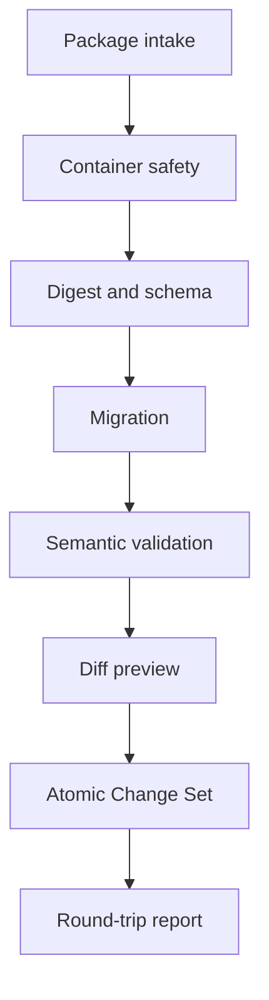

# TS-007 — 반출·복구와 스키마 진화

## TS-007.1 목적

이 명세는 World의 의미 있는 원본과 이력을 제품 외부로 반출하고, 동일하거나 후속 버전의 Moirai에서 검증·복구하며, schema가 발전해도 기존 데이터를 읽는 방식을 정의한다.

화면 캡처, Publication Snapshot 또는 데이터베이스 dump만으로 제품 수준의 반출 요구를 충족했다고 보지 않는다.

## TS-007.2 반출 종류

| 종류 | 목적 | private 정보 |
|---|---|---|
| `owner-full` | 완전한 보관·복구·이전 | Change 이력과 선택한 원자료 포함 |
| `content` | 세계 의미의 이동과 교환 | private origin과 원자료 원문 제외 가능 |
| `public` | 현재 공개본의 재배포 | Publication에 허용된 정보만 포함 |
| `scoped` | Canon·시간·Event 범위의 부분 반출 | 누락 범위와 복구 제한을 manifest에 명시 |

`public` export는 owner backup을 대신하지 않는다. `scoped` export는 원본 World 전체를 손실 없이 복구할 수 있다고 표시하지 않는다.

## TS-007.3 package 형식

기본 반출 artifact는 `.moirai` 확장자의 ZIP64 package다.

- UTF-8 filename과 content
- path는 `/` separator를 사용한 relative path
- symlink, device file과 absolute path 금지
- 압축 전후 size와 file count 제한
- 각 파일 SHA-256 digest
- package root의 `manifest.json`
- JSON은 UTF-8, key 이름은 lower snake case
- 대량 record는 NDJSON
- UUID와 opaque ID는 문자열
- 시각은 RFC 3339 UTC, 세계 내부 시간은 Time System 좌표로 보존

ZIP은 운반 container일 뿐 의미 schema가 아니다. 동일한 논리 document를 directory tree로도 materialize할 수 있어야 한다.

## TS-007.4 package 구조

```text
manifest.json
content/world.json
content/canons.ndjson
content/time-systems.ndjson
content/canon-time-systems.ndjson
content/events.ndjson
content/temporal-placements.ndjson
content/relations.ndjson
content/narratives.ndjson
content/correspondences.ndjson
content/correspondence-members.ndjson
operations/subject-handles.ndjson
history/revisions.ndjson
history/change-sets.ndjson
history/change-operations.ndjson
origins/source-materials.ndjson
origins/change-origins.ndjson
attachments/{digest}/{safe-name}
reports/export-report.json
```

export 종류에 따라 일부 파일이 없을 수 있으며 manifest의 `included_sections`와 `omitted_sections`가 이를 설명한다.

## TS-007.5 manifest

`manifest.json`은 최소한 다음을 포함한다.

| 필드 | 의미 |
|---|---|
| `format` | `moirai-world-package` |
| `format_version` | package schema의 major/minor version |
| `export_id` | UUIDv7 |
| `export_kind` | owner-full, content, public, scoped |
| `created_at` | export 시각 |
| `generator_version` | 생성한 Moirai version |
| `world_id` | 원본 World ID |
| `source_revision` | 일관되게 읽은 World Revision |
| `publication_revision` | public export이면 served Revision |
| `scope` | 포함한 Canon, Event, 시간 범위 |
| `included_sections` | 실제 포함 영역 |
| `omitted_sections` | 제외 영역과 이유 |
| `schema_versions` | content, history, origin별 schema version |
| `files` | path, media type, size, SHA-256 |
| `completeness` | complete, scoped, degraded |

manifest 자체의 digest는 package 밖에 별도 `.sha256` 파일로 제공할 수 있다.

## TS-007.6 의미 보존 대상

### 반드시 보존

- World, Canon과 동등성
- Time System 정의와 Canon의 다대다 사용 관계
- Event, 시간 배치와 실제 precision·uncertainty
- Relation type, 방향과 endpoint
- Narrative, locale와 공개 인용
- 철회 상태와 공개 tombstone 정보
- Canon 간 correspondence와 member
- 안정적인 ID와 slug alias

### owner-full에서 추가 보존

- World Revision
- Change Set의 intent와 Operation before·after
- actor의 portable 식별 표현
- private origin과 원자료 metadata
- 선택한 원자료 attachment와 digest
- Subject Handle과 redirect history

인증 token, database credential, 암호화 key, 내부 absolute path와 LLM chain-of-thought는 반출하지 않는다.

## TS-007.7 일관된 export

- export는 시작할 때 하나의 `source_revision`을 고정한다.
- 현재 table을 순차적으로 읽으며 여러 Revision을 섞지 않는다.
- history를 포함할 때 source Revision 이후의 Change Set은 포함하지 않는다.
- file 생성이 끝나면 참조 무결성과 digest를 다시 검증한다.
- 일부 파일 생성 실패 시 완전한 package처럼 반환하지 않는다.
- 실패한 임시 artifact는 공개 download 경로에 놓지 않는다.

큰 World는 streaming NDJSON과 ZIP streaming을 사용하되 manifest file index는 최종화 후 확정한다.

## TS-007.8 원자료와 attachment

- `source_materials`는 source ID, media type, original label, digest, license·access metadata와 attachment 상대 경로를 가진다.
- 원자료를 포함하지 않을 경우 digest와 omission reason은 보존한다.
- 외부 URL은 참고 정보이며 복구에 필요한 유일한 원본으로 간주하지 않는다.
- 동일 digest attachment는 package 안에서 한 번만 저장한다.
- attachment filename은 표시용이며 참조는 digest로 한다.
- private 원자료가 포함된 package는 생성 전에 사용자에게 포함 범위를 명확히 보여준다.

## TS-007.9 import mode

### `restore-in-place`

같은 설치의 기존 World에 package 상태를 복구한다.

- package `world_id`와 대상 World가 같아야 한다.
- caller가 현재 `expected_revision`을 제공한다.
- package와 현재 상태의 diff를 preview한다.
- 승인된 복구는 일반 Change Set으로 반영해 새 Revision을 만든다.
- 현재 Revision을 과거 번호로 되돌리지 않는다.

### `preserve-ids`

빈 설치 또는 재해 복구 환경에서 원본 ID를 유지한다.

- 같은 ID가 없거나 의미가 동일함을 검증한다.
- 충돌을 자동 덮어쓰지 않는다.
- World와 안정적 public reference의 연속성을 유지한다.

### `clone`

같은 설치에 독립적인 새 World 복사본을 만든다.

- 모든 지속 ID를 새 UUIDv7로 remap한다.
- 내부 참조와 correspondence member도 같은 mapping으로 바꾼다.
- 원본→새 ID mapping report를 반환한다.
- clone은 원본과 같은 World 또는 같은 Publication이라고 주장하지 않는다.

## TS-007.10 import 단계



1. package size, file count, path와 compression ratio를 검사한다.
2. manifest와 모든 file digest를 확인한다.
3. format과 section schema version을 확인한다.
4. 필요한 순차 migration을 메모리 또는 임시 작업공간에서 수행한다.
5. ID, Canon, Time System, Event, Relation과 철회 불변식을 검증한다.
6. 대상 모드의 ID collision과 현재 World 차이를 계산한다.
7. 사용자에게 생성·변경·철회·누락과 손실 가능성을 preview한다.
8. 하나의 World Change Set 또는 복구 전용 원자적 bootstrap transaction으로 적용한다.
9. 적용한 Revision을 다시 export 가능한 논리 모델로 읽어 의미 비교 report를 만든다.

검증 전에는 정본 table에 어떤 row도 쓰지 않는다.

## TS-007.11 schema versioning

### 버전 규칙

- major: 기존 reader가 의미를 안전하게 해석할 수 없는 변경
- minor: 기존 의미를 보존하는 optional field와 record 추가
- patch는 package format에 사용하지 않는다.

content, history, origin과 Publication format은 독립적으로 version한다.

### migration

- migration은 `vN → vN+1`의 순차적이고 결정적인 변환이다.
- 입력 package를 직접 덮어쓰지 않고 새 작업 결과를 만든다.
- 제거·합성·precision 변화는 migration report에 기록한다.
- 변환할 수 없는 record를 조용히 버리지 않는다.
- 일부 record를 보존할 수 없으면 import를 중단하거나 사용자가 명시적으로 degraded import를 선택하게 한다.
- degraded import는 `completeness = degraded`와 손실 목록을 영구 운영 기록에 남긴다.

## TS-007.12 의미 비교

round-trip 검증은 JSON byte equality만 검사하지 않는다. 다음 semantic fingerprint를 비교한다.

- Canon별 활성·철회 Event 집합
- Relation type, endpoint와 Canon 경계
- Time System 정의와 시간 배치 precision
- 포함 graph와 Process 역할
- Narrative scope·locale·body digest
- correspondence member
- Subject Handle redirect 가능성
- Revision과 Change 순서

ID remap이 있는 clone mode에서는 mapping을 적용한 뒤 비교한다.

## TS-007.13 backup과 export의 차이

| 수단 | 목적 |
|---|---|
| World export | 사용자 소유, 제품 교체, 선택적 복구와 장기 접근 |
| PostgreSQL backup/PITR | 운영 장애와 전체 서비스 복구 |
| Publication Snapshot | 공개 읽기 지속성과 cache 재사용 |

세 수단은 서로 대체하지 않는다. 특히 Publication Snapshot에는 private 이력과 정본 전체가 없으므로 backup이 아니다.

## TS-007.14 개인정보와 암호화

- export download는 인증된 owner에게만 일회성 또는 짧은 만료 URL로 제공한다.
- 서버의 임시 package는 제한된 시간 뒤 제거한다.
- object storage에서는 server-side encryption을 사용한다.
- owner-full package의 client-side encryption은 후속 확장으로 제공할 수 있다.
- 암호화하지 않은 owner-full package에는 private 원자료가 포함될 수 있음을 명시한다.
- export audit에는 content 본문이 아니라 export ID, World, Revision, 범위와 결과만 기록한다.

## TS-007.15 수용 기준

1. 같은 Revision의 반복 export가 record 순서와 의미에서 결정적이다.
2. export 도중 새 Change Set이 commit되어도 package에 두 Revision이 섞이지 않는다.
3. owner-full package로 빈 시스템에 ID를 유지해 복구할 수 있다.
4. restore-in-place가 기존 이력을 삭제하지 않고 새 Revision을 만든다.
5. clone import가 모든 내부 참조를 새 ID로 일관되게 remap한다.
6. 오래된 schema package가 순차 migration과 report를 거쳐 import된다.
7. 손실되는 field가 있을 때 성공으로 조용히 처리되지 않는다.
8. path traversal, symlink와 zip bomb package가 정본 write 전에 거부된다.
9. public export에 private origin과 원자료가 포함되지 않는다.
10. export→import→export의 semantic fingerprint가 허용된 변환 밖에서 동일하다.
